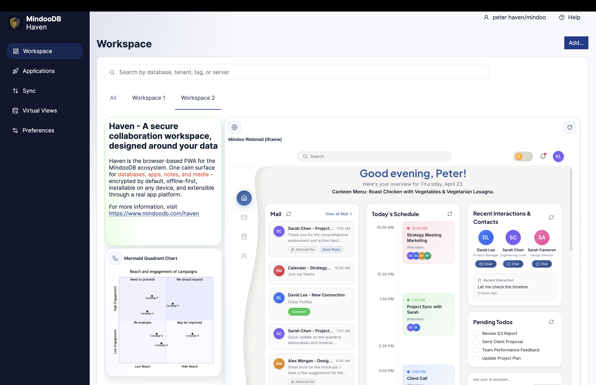

# MindooDB - Your Data. Your Control.

**Sleep well, even if your hosting service gets hacked.** 🔒

MindooDB is an **end-to-end encrypted, local-first sync database**.
It lets apps collaborate and sync data without giving servers access to the contents.

Even if someone has full access to your infrastructure — database dumps, backups, logs — all they get is ciphertext.

Your data is encrypted on the client before it ever touches a server. No plaintext. No server-side keys. No trust required.

> ⚠️ **Beta software**: This project is in early development and not yet recommended for production use. APIs may change without notice.

Use AI to explore this repository:

[](https://deepwiki.com/klehmann/MindooDB)

## The Problem

Traditional databases trust the server. If your hosting provider is compromised, your data is exposed. Even "encrypted at rest" solutions decrypt data server-side for queries. **MindooDB takes a different approach**: encryption keys never leave your clients.

## How It Works

```
┌──────────────────────────────────────────────────────────────────┐
│                         Your Clients                             │
│  ┌─────────────┐  ┌─────────────┐  ┌─────────────┐               │
│  │   Alice's   │  │    Bob's    │  │  Charlie's  │               │
│  │   Device    │  │   Device    │  │   Device    │               │
│  │ ┌─────────┐ │  │ ┌─────────┐ │  │ ┌─────────┐ │               │
│  │ │  Keys   │ │  │ │  Keys   │ │  │ │  Keys   │ │ ← Keys stay   │
│  │ │(private)│ │  │ │(private)│ │  │ │(private)│ │   on devices  │
│  │ └─────────┘ │  │ └─────────┘ │  │ └─────────┘ │               │
│  └──────┬──────┘  └──────┬──────┘  └──────┬──────┘               │
└─────────┼────────────────┼────────────────┼──────────────────────┘
          │ encrypted      │ encrypted      │ encrypted
          ▼                ▼                ▼
┌──────────────────────────────────────────────────────────────────┐
│                     Server (or P2P Peers)                        │
│                                                                  │
│   ┌─────────────────────────────────────────────────────────┐    │
│   │           Encrypted Blobs (unreadable)                  │    │
│   │     🔒 🔒 🔒 🔒 🔒 🔒 🔒 🔒 🔒 🔒 🔒 🔒 🔒 🔒 🔒             │    │
│   └─────────────────────────────────────────────────────────┘    │
│                                                                  │
│   Server can sync & store data, but CANNOT read it               │
└──────────────────────────────────────────────────────────────────┘
```

**Sync happens through content-addressed stores**: clients exchange only the encrypted entries they're missing. Works peer-to-peer, client-server, or any combination - for documents and attached files.

## Key Features

| Feature | What It Means |
|---------|---------------|
| 🛡️ **End-to-End Encrypted** | Data encrypted on client before sync. Servers can't decrypt. |
| 📴 **Local-First** | Create and edit documents without network. Sync when online. |
| ✍️ **Signed Changes** | Every change is digitally signed. Proves authorship, prevents tampering. |
| 🔗 **Tamperproof History** | Append-only, cryptographically chained. Like a blockchain for your docs. |
| 🤝 **Real-time Collaboration** | Built on [Automerge](https://automerge.org/) CRDTs. Conflicts resolve automatically. |
| 🔑 **Fine-grained Access** | Named encryption keys for sensitive documents. Share with specific users. |

## MindooDB Haven — the graphical client

MindooDB is the database engine. **[Haven](https://haven.mindoodb.com)** is the graphical workspace you actually look at — a browser-based, installable PWA that turns MindooDB into a calm, end-to-end encrypted collaboration client you can use without writing any code.



Haven is the fastest way to see MindooDB in action, and a real home for day-to-day work:

- **Local-first & offline** — everything is served from a browser-local replica, so browsing, editing, and searching stay instant and keep working with no network. The server is only contacted on sync, and only ever sees ciphertext.
- **Workspace of tiles** — arrange databases, apps, notes, web pages, videos, and live diagrams as draggable tiles across multiple pages, like home screens on a phone.
- **App runtime** — launches MindooDB apps (built with the [App SDK](https://github.com/klehmann/mindoodb-app-sdk)) inside a sandboxed iframe, brokering every read and write through a permissioned bridge. Hosted apps can even run offline from Haven's own service worker.
- **Virtual Views** — spreadsheet-like trees that filter, categorize, sort, and total documents across one database, several databases, or even several tenants — exportable to `.xlsx`.
- **Database Browser & history** — inspect documents, compare any two revisions side by side, and explore the full signed change graph (DAG) of every edit.
- **Multi-tenant by design** — run work, personal, and cross-company tenants side by side, each cryptographically independent, all in one browser.
- **Installable PWA** — add it to an iPhone, iPad, or Android home screen and launch it in standalone mode; encrypted `.mdbhaven-backup` files move a whole environment between browsers.

Haven Community is **free** (in beta) and is the same client the MindooDB team uses in-house. Try it at **[haven.mindoodb.com](https://haven.mindoodb.com)**, read the full [Haven Handbook](./docs/haven-handbook.md), or explore more at [mindoodb.com](https://www.mindoodb.com).

> Prefer to build directly on the engine? Keep reading — the Quick Start below is all code.

## Quick Start

### Installation

```bash
pnpm add mindoodb
```

> 📦 **Published regularly on npm.** We ship new versions frequently to [npmjs.com/package/mindoodb](https://www.npmjs.com/package/mindoodb), so pull updates often to stay current with fixes and API changes during the beta.

> 📱 **React Native / Expo?** See the [React Native setup guide](./docs/reactnative.md) for mobile-specific instructions with native performance.

### Pick Your Runtime

| Runtime | Fastest start | Recommended path |
|---------|---------------|------------------|
| Node.js | Use `mindoodb` directly in a Node script | [Getting Started](./docs/getting-started.md#nodejs) |
| Web | Import from `mindoodb/browser` | [Getting Started](./docs/getting-started.md#web-browser) |
| React Native / Expo | Run `pnpm dlx mindoodb setup-react-native` in your app root | [React Native Guide](./docs/reactnative.md) |

### React Native Recommendation

- Use **native Automerge** (`react-native-automerge-generated`) and native crypto for production.
- Treat Expo Go / JS fallback as a convenience path for prototyping, not the default production runtime.

### Create a Tenant and Start Working

```typescript
import { 
  BaseMindooTenantFactory, 
  InMemoryContentAddressedStoreFactory,
} from "mindoodb";

// 1. Set up storage (in-memory for demo; use file/server-backed for production)
const storeFactory = new InMemoryContentAddressedStoreFactory();
const factory = new BaseMindooTenantFactory(storeFactory);

// 2. Create tenant (generates all keys, opens tenant, registers user — single call)
const { tenant, adminUser, appUser, keyBag } = await factory.createTenant({
  tenantId: "acme-corp",
  adminName: "cn=admin/o=acme",
  adminPassword: "admin-password",
  userName: "cn=alice/o=acme",
  userPassword: "user-password",
});

// 3. Open a database and create documents
const db = await tenant.openDB("contacts");
const doc = await db.createDocument();

await db.changeDoc(doc, async (d) => {
  const data = d.getData();
  data.name = "John Doe";
  data.email = "john@example.com";
});

// 4. Read it back
const contacts = await db.getAllDocumentIds();
const loaded = await db.getDocument(contacts[0]);
console.log(loaded.getData()); // { name: "John Doe", email: "john@example.com" }
```

### Sync Between Users

```typescript
// Alice creates a document
const aliceDB = await aliceTenant.openDB("projects");
const project = await aliceDB.createDocument();
await aliceDB.changeDoc(project, (d) => { d.getData().title = "Secret Project"; });

// Bob pulls Alice's changes
const bobDB = await bobTenant.openDB("projects");
await bobDB.pullChangesFrom(aliceDB.getStore());

// Bob edits the document
const projectDoc = await bobDB.getDocument(project.id);
await bobDB.changeDoc(projectDoc, (d) => { d.getData().status = "In Progress"; });

// Alice pulls Bob's changes
await aliceDB.pullChangesFrom(bobDB.getStore());
// Alice now sees: { title: "Secret Project", status: "In Progress" }
```

## Core Concepts

### Tenants
An organization or team that shares access. Created client-side—no server registration needed.
- Has a **default encryption key** (a regular KeyBag key shared with all members)
- Has an **admin key** (for registering/revoking users)
- Contains multiple databases

### Users
Identified by cryptographic key pairs, registered by an admin:
- **Signing key** (Ed25519): Proves authorship of changes
- **Encryption key** (RSA-OAEP): Protects local key storage
- Keys generated locally; only public keys shared with admin

### Databases
Each tenant can have multiple databases, created on-demand:
```typescript
const contacts = await tenant.openDB("contacts");
const invoices = await tenant.openDB("invoices");
```
A special **directory** database stores user registrations (admin-only).

### Documents
[Automerge](https://automerge.org/) CRDTs with full history:
- Every change is signed and encrypted
- Automatic conflict resolution for concurrent edits
- Time travel: reconstruct any historical state of documents (e.g. run queries on historic data) — see [Time Travel Documentation](./docs/timetravel.md)

### Attachments
Files attached to documents:
- Chunked (256KB) and encrypted
- Streaming upload/download for large files
- Deduplication across the tenant

See: [Attachments Documentation](./docs/attachments.md)

### Document Indexing
MindooDB provides a flexible, **incremental indexing** facility:
- **Cursor-based processing**: Only index documents that changed since the last run—no full rescans
- **Pluggable indexers**: Add any indexer you need (fulltext search, aggregations, custom queries)
- **Built-in [Virtual Views](./docs/virtualview.md)**: Spreadsheet-like views that categorize, sort, and aggregate documents
- **Cross-boundary queries**: Virtual Views can span multiple databases, mix local and remote data, or even query across tenants

```typescript
// Incremental indexing: process only what's new
let cursor = null;
while (true) {
  for await (const { doc, cursor: newCursor } of db.iterateChangesSince(cursor)) {
    if (doc.isDeleted()) {
      mySearchIndex.remove(doc.getId());
    } else {
      mySearchIndex.update(doc);  // Flexsearch, Lunr, or custom
    }
    cursor = newCursor;
  }
  await sleep(1000);
}
```

### Encryption Model

All encryption keys are stored in the **KeyBag**—a local, password-protected key store.

| Key Type | Purpose | Who Has It |
|----------|---------|------------|
| **`default` key** | Used when no other key is specified | All tenant members |
| **Named keys** | Fine-grained access for sensitive docs | Only users you share it with |

Keys are distributed offline (e.g. password protected via email or a shared drive). The `default` key is typically shared during onboarding; named keys are shared as needed for specific documents.

## Security

### Cryptographic Guarantees
- **Signatures**: Ed25519 on every change - proves who wrote it
- **Encryption**: AES-256-GCM - servers see only ciphertext
- **Integrity**: Changes are hash-chained - tampering breaks the chain
- **Trusted time**: when a sync server accepts an entry it signs a **witness receipt** attesting *when* it was accepted - a clock no client can rewind

### Encryption-based Access Control
Read access is governed by **key possession**, not server-side permissions. If you hold the key you can decrypt; if you don't, the document stays ciphertext wherever it travels (server, peer, or relay):

| Key | Scope |
|-----|-------|
| **`default` key** | Tenant-wide data; shared with every member during onboarding |
| **Named keys** | Need-to-know documents; shared only with the users you choose |
| **`$publicinfos` key** | Encrypts directory access-control metadata so servers can validate signing keys without seeing usernames or business data |

Rotating a named key is the cryptographic cutoff for read access: re-encrypt under a new key and withhold it from anyone who should no longer see the data.

### Write Governance (opt-in)
On top of the encryption model, MindooDB adds fine-grained, **admin-signed** control over write operations (`doc_create`, `doc_change`, `doc_delete`, `doc_undelete`, `doc_snapshot`). Policies, rules, groups, and grants are append-only documents in the directory database that every participant already syncs:
- **Two tiers**: identity / database / operation rules are cryptographically enforced by the server *and* clients (Tier 1); document-content rules are re-checked by every honest client on receipt and a violation is quarantined, never materialized (Tier 2).
- **Offline-honest**: every change is judged against the policy in force at its **trusted time** (from the witness receipt), so replicas always agree and an offline client cannot rewind its clock to slip a change past a rule.
- **Reproducible & auditable**: because policy is versioned, append-only data, you can replay *who was allowed to do what, and when* for any point in the past.

Governance stays **opt-in and backward-compatible**: a tenant behaves exactly as before until an admin writes a policy, and pre-existing data is never retroactively invalidated. See: [Access Control & Governance](./docs/accesscontrol.md)

### User Revocation
Revocation is performed by **removing a user's keys** from the admin-signed grant document — there are no separate revocation records. Revoked users:
- ❌ Cannot sync with peers or servers
- ❌ Cannot make new changes (signatures rejected; trusted time prevents backdating around the revocation)
- ❌ Stop receiving future documents encrypted with keys they no longer hold (the server withholds them; honest clients drop revoked keys on the next directory pull)
- ⚠️ May still hold previously-synced local data — mitigate with named keys (smaller blast radius) and key rotation, or issue an explicit **remote device wipe** that drops the tenant from a device the next time it connects

### Audit Trail
Append-only storage means nothing is silently lost:
- Complete, hash-chained history of who changed what and when
- Cryptographic proof of all operations, reproducible for any point in time
- GDPR-style erasure via `purgeDocHistory()` when legally required

## Supported Platforms

- ✅ **Node.js** - Server-side and desktop apps
- ✅ **Web Browsers** - Progressive web apps with Web Crypto API
- ✅ **React Native / Expo** - iOS and Android with native Automerge (Rust via JSI)
- ✅ **Electron** - Cross-platform desktop apps

## Use Cases

- **Multi-Tenant SaaS**: Each customer isolated with encrypted data
- **Collaborative Editing**: Real-time co-editing with signed changes
- **Secure File Sharing**: Named keys for need-to-know access
- **Audit-Critical Systems**: Tamperproof history meets compliance requirements
- **Local-First Apps**: Full functionality without network; sync when connected
- **Mobile Apps**: End-to-end encrypted sync with native performance
- **Data Migration**: Import existing records with their original creation dates so [Time Travel](./docs/timetravel.md) reflects real history — see the [mindoodb-data-import](https://github.com/klehmann/mindoodb-data-import) example CLI (backdated import + server push)

See: [Use Cases Documentation](./docs/usecases/README.md)

## Documentation

- [Haven Handbook](./docs/haven-handbook.md) — Complete guide to Haven, the graphical MindooDB collaboration client
- [Getting Started](./docs/getting-started.md) — Fast setup for Node.js, Web, and React Native
- [Example Snippets](./docs/examples/README.md) — Copy-paste Todo starters for all runtimes
- [Architecture Specification](./docs/specification.md) — Full technical details
- [React Native Guide](./docs/reactnative.md) — Native Automerge setup and troubleshooting
- [Virtual Views](./docs/virtualview.md) — Aggregations and cross-database views
- [Ad-hoc Queries & Reactive Updates](./docs/adhoc-queries.md) — Summary buffer, `db.query()`, ephemeral views, live queries and change listeners
- [Full-Text Search](./docs/fulltext-search.md) — Client-side encrypted full-text index, `db.searchText()`, the query `text` clause, attachment text extraction
- [Data Indexing](./docs/dataindexing.md) — Incremental indexing and search integration
- [Time Travel](./docs/timetravel.md) — Historical document retrieval and history traversal
- [Access Control & Governance](./docs/accesscontrol.md) — Encryption-key read access, admin-signed write policies, the two-tier model, witness receipts and trusted-time enforcement
- [P2P Sync](./docs/p2psync.md) — Peer-to-peer synchronization
- [Attachments](./docs/attachments.md) — File storage and streaming
- [Data Import Example](https://github.com/klehmann/mindoodb-data-import) — CLI tool that imports external data into MindooDB with historical `createdAt` timestamps for Time Travel

## Testing

Run tests from the command line:

```bash
# Node.js unit/integration tests (Jest)
pnpm test

# Install Chromium once for browser tests
pnpm test:browser:install

# Real browser runtime tests (Playwright + headless Chromium)
pnpm test:browser

# Run Node + browser lanes
pnpm test:all
```

### Test coverage by environment

| Environment | Command | What is covered today |
|-------------|---------|------------------------|
| Node.js | `pnpm test` | Full Jest suite for core APIs (documents, sync logic, indexing, virtual views, settings, trust model, attachments, etc.) |
| Browser | `pnpm test:browser` | Real Chromium runtime via Playwright, including browser entrypoint usage, document lifecycle, real HTTP sync endpoint flows, and browser Virtual View update behavior |
| React Native / Expo | `pnpm test -- ReactNativeCrypto.test.ts` | Crypto adapter behavior in Jest (uses `src/__mocks__/expo-standard-web-crypto.ts`), not a device/simulator E2E run |

### Browser sync test behavior

- Browser tests run in headless Chromium and execute MindooDB browser code in a real page runtime.
- During test setup, an ephemeral HTTP server is started automatically and exposes the real sync endpoints.
- Sync assertions use real HTTP requests against that temporary endpoint (no mocked transport for sync tests).
- The server binds to an OS-assigned free port and is shut down after the suite completes.

### Current parity status

- The package exports and core API shape are aligned across Node.js, browser, and React Native entrypoints.
- Node and browser now have executable CLI lanes with runtime validation.
- React Native coverage is currently adapter-focused in Jest and does not yet validate full app-level behavior inside a real React Native runtime.
- For high confidence in three-environment parity, add a React Native integration lane (Expo/Detox or RN test app) that exercises document lifecycle, sync, and virtual view updates on device/simulator.
- For Expo Go / JS fallback scenarios, PBKDF2 iterations can be tuned at runtime; native RN builds should keep strong defaults.

## Support

Need commercial support, have questions, or want to request a feature? We're here to help! :-)

- 🐛 **Bug Reports**: [Open an issue on GitHub](https://github.com/klehmann/mindoodb/issues)
- 💬 **Questions & Discussions**: [GitHub Discussions](https://github.com/klehmann/mindoodb/discussions)
- ✨ **Feature Requests**: [Create a feature request](https://github.com/klehmann/mindoodb/issues/new?template=feature_request.md)

## License

MindooDB is released under the [Apache License 2.0](./LICENSE). See the [`LICENSE`](./LICENSE) file for the full text.

Copyright (c) 2026 Mindoo GmbH.

## Author

Mindoo GmbH

---

**Your data. Your keys. Your control.** With MindooDB, even a complete server breach doesn't expose your documents. Sleep well! 😴🔒
