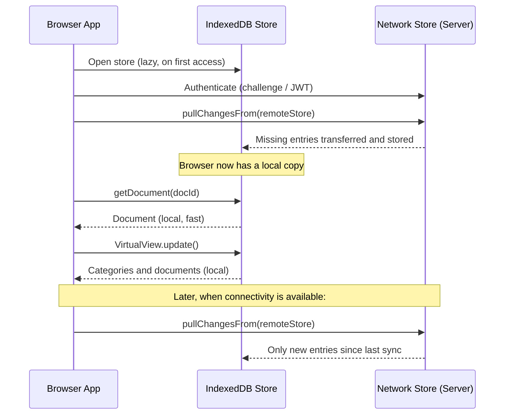
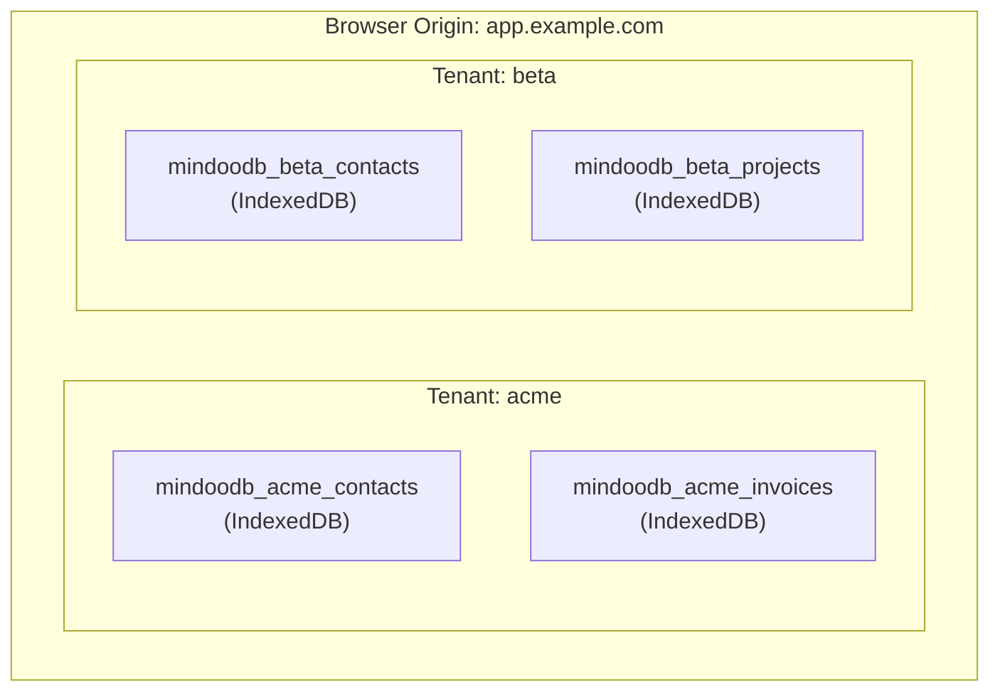
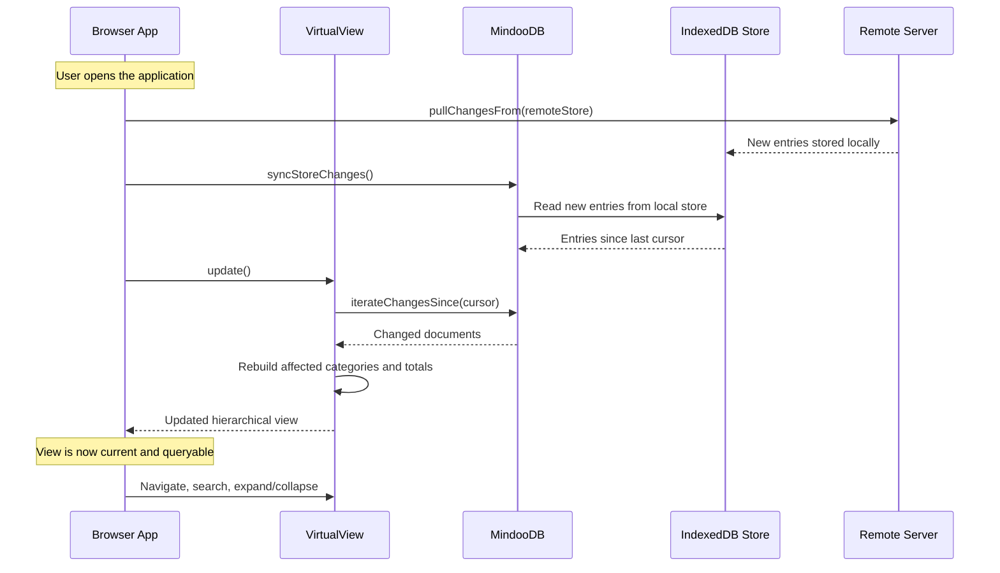
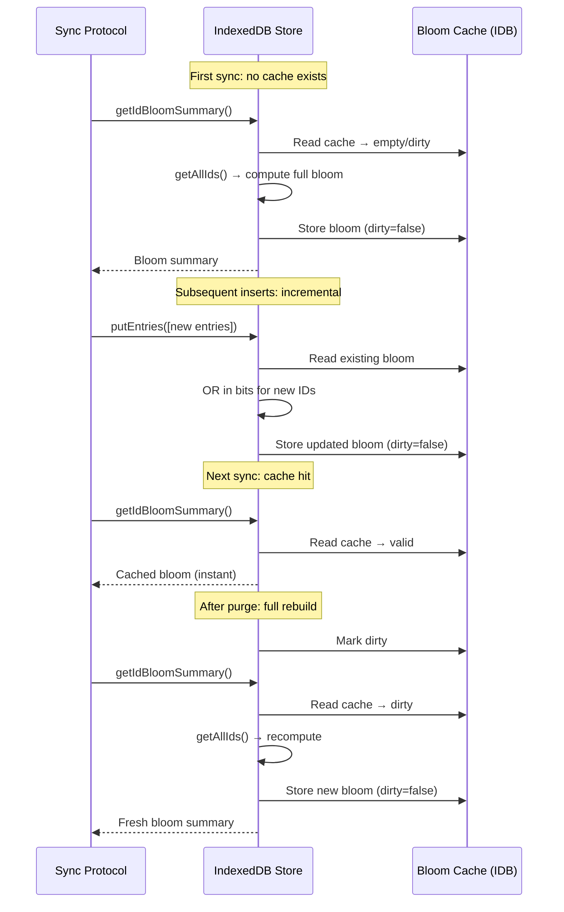

# MindooDB in the Browser: The IndexedDB Store

MindooDB was designed as an offline-first, end-to-end encrypted database from the start. On Node.js, `BasicOnDiskContentAddressedStore` provides durable, filesystem-backed persistence for server and CLI environments. In-memory stores serve testing and short-lived scenarios. But the browser is where users live. If your application can keep a full, encrypted copy of its data in the browser itself — synced from one or more servers and available instantly whether the network is up or not — the user experience changes fundamentally. Searches become local lookups instead of remote round trips. The application continues working on a train, on a plane, or in a basement with no signal. And when connectivity returns, synchronization catches up quietly in the background.

`IndexedDBContentAddressedStore` brings this capability to the browser. It implements the same `ContentAddressedStore` interface that powers every other MindooDB store, backed by the browser's native IndexedDB API. Data is persistent, survives page reloads and browser restarts, and is isolated per tenant and database. Combined with MindooDB's sync protocol, it enables a class of applications where the browser is a first-class participant in the data network — not just a thin client waiting for server responses.

This document explains why IndexedDB is the right storage choice for browser environments, walks through the store's design and schema, covers the sync and query patterns it enables, and discusses the practical limitations of running a database inside a browser.

**What this document covers:**

- Why browser-local persistence matters for MindooDB applications
- The IndexedDB store's schema and design decisions
- Multi-tenant and multi-database isolation
- How data flows from servers to the browser and back
- Virtual views powered by browser-local data
- Progressive Web App (PWA) considerations
- The incremental bloom filter cache
- Known limitations of the browser environment
- Integration quickstart and configuration

---

## 1) Why browser-local persistence matters

Most web applications treat the browser as a display layer. Data lives on the server, every interaction requires a network round trip, and going offline means going dark. This model works until it doesn't — and it stops working more often than developers tend to assume.

Consider a field service application where technicians inspect equipment at remote sites. Or a medical records system used by doctors who move between consultation rooms with spotty WiFi. Or an internal business tool used by sales teams on international flights. In all of these scenarios, the application needs to work without a reliable network connection, and it needs to feel fast even when the network is available.

MindooDB's architecture already supports offline-first operation: every client holds a full, encrypted copy of the data it needs and can read and write without contacting a server. The missing piece was a persistent storage layer for the browser. In-memory stores work for demos and testing, but a page reload wipes everything. The `IndexedDBContentAddressedStore` fills this gap by giving the browser the same durable, indexed storage that Node.js applications get from the filesystem.

### Performance benefits even when online

Storing data locally in IndexedDB is not only about offline resilience. Even when the network is available, local queries are dramatically faster than remote ones. A `findNewEntriesForDoc` call against a local IndexedDB store completes in milliseconds, while the same call over the network involves DNS resolution, TCP setup, TLS negotiation, server processing, and response transfer — easily adding hundreds of milliseconds or more.

For applications that support features like search, filtering, sorting, and hierarchical views (via MindooDB's VirtualView API), this performance difference is not marginal. It is the difference between a responsive application and one that feels sluggish on every interaction. By syncing data into the browser once and querying it locally, your application gets the responsiveness of a native desktop application with the deployment convenience of the web.

### The PWA connection

Progressive Web Apps (PWAs) are designed to work offline, load instantly on repeat visits, and feel like native applications. But a PWA without persistent local data is just a cached UI shell — it can display its interface, but it has nothing to show. By storing MindooDB data in IndexedDB, a PWA can serve a fully functional, data-rich experience even when the Service Worker is the only thing standing between the user and an empty screen. This makes IndexedDB persistence a natural complement to the PWA architecture: the Service Worker caches the application code, and IndexedDB stores the application data.

---

## 2) How data flows between servers and the browser

A browser running MindooDB does not operate in isolation. It participates in the same sync network as server nodes and other clients, using the same protocol described in [network-sync-protocol.md](network-sync-protocol.md). The IndexedDB store acts as the browser's local persistence layer, receiving entries from remote servers and serving them to the application for local queries, document loading, and view construction.

### The typical sync lifecycle

When a browser-based MindooDB application starts, it opens its local IndexedDB store and checks what data it already has. It then connects to one or more servers, authenticates, and performs incremental synchronization to bring its local store up to date. Once sync is complete, all subsequent reads — document lookups, searches, virtual view updates — are served from IndexedDB without touching the network.



The key insight is that after the initial sync, the browser operates independently. The application reads from IndexedDB, which is local and fast. Periodic re-syncs pull only the entries that have changed since the last sync cursor, keeping bandwidth usage proportional to the rate of change rather than the total data size.

### Syncing from multiple servers

MindooDB's sync protocol does not assume a single upstream server. A browser can sync from multiple servers — for example, a primary server for everyday changes and a regional backup for disaster recovery. Because entries are content-addressed and deduplicated by `id` and `contentHash`, entries that arrive from multiple sources are stored only once. The IndexedDB store handles deduplication transparently, just like the Node.js on-disk store does.

### Bidirectional sync

If the application creates or modifies documents locally in the browser (which is a natural pattern for offline-capable applications), those changes are stored in IndexedDB first. When connectivity is available, the application pushes local entries to the server using `pushChangesTo()`. The server receives the entries, validates their signatures, and makes them available to other clients. This bidirectional flow means the browser is a full peer in the data network, not just a consumer.

---

## 3) IndexedDB schema and design decisions

The `IndexedDBContentAddressedStore` uses the browser's native IndexedDB API for persistence. IndexedDB was chosen over alternatives like `localStorage` (which has a 5-10MB size limit and only stores strings) and the Cache API (which is designed for HTTP responses, not structured data) because it provides the right combination of capacity, performance, and query capabilities for a database store that may hold hundreds of thousands of entries.

### One IndexedDB database per store instance

Each `IndexedDBContentAddressedStore` instance maps to a single IndexedDB database with a deterministic name: `mindoodb_<prefix>_<storeId>`. The `prefix` (set via `basePath` in the store options) typically encodes the tenant identity, while the `storeId` is the MindooDB database ID. This naming convention ensures that data from different tenants and different databases within the same tenant is fully isolated at the IndexedDB level.

For example, if tenant `acme-corp` has two databases (`contacts` and `invoices`), the browser will contain two IndexedDB databases: `mindoodb_acme-corp_contacts` and `mindoodb_acme-corp_invoices`. If a second tenant `beta-inc` uses the same domain, its databases will be named `mindoodb_beta-inc_contacts` and so on. There is no cross-contamination, and deleting one store does not affect any other.

### Object store layout

Inside each IndexedDB database, data is organized into three object stores:

**`entries`** holds the metadata for every store entry, keyed by `id`. This is the primary data structure and carries the same fields as any other MindooDB store entry: `entryType`, `docId`, `contentHash`, `dependencyIds`, `createdAt`, `signature`, and so on. Four indexes accelerate the most common query patterns:

| Index | Key path | Purpose |
|---|---|---|
| `by_docId` | `docId` | Fast lookup of all entries belonging to a document |
| `by_entryType_createdAt` | `[entryType, createdAt]` | Efficient `findEntries` queries filtered by type and date range |
| `by_createdAt_id` | `[createdAt, id]` | Cursor-based scanning for sync reconciliation |
| `by_contentHash` | `contentHash` | Content deduplication lookups |

**`content`** stores the encrypted payload bytes, keyed by `contentHash`. Each record includes a `refCount` field that tracks how many entry metadata records reference this content hash. When entries are purged and the reference count drops to zero, the content record is deleted. This deduplication means that if multiple entries share the same encrypted payload (which happens when the same document change is received from multiple sync sources), the bytes are stored only once.

**`bloom_cache`** holds a single cached bloom filter summary under the key `"current"`. This cache avoids recomputing the bloom filter on every sync negotiation. The caching strategy is described in detail in Section 6.

### Why indexes live in IndexedDB, not in memory

The Node.js on-disk store builds in-memory indexes at startup (a `Map` for entries, a `Map` for the document index, and a sorted array for cursor scans). This works well when the store runs in a long-lived process with plenty of RAM. In the browser, the situation is different. Browser tabs are memory-constrained, can be suspended or evicted by the operating system at any time, and may share memory pressure with dozens of other tabs.

The IndexedDB store delegates all indexing to IndexedDB itself. The four indexes listed above are maintained by the browser's IndexedDB engine, which stores them on disk and pages them into memory on demand. This means the store's JavaScript memory footprint stays low regardless of how many entries it contains. A store with 100,000 entries uses roughly the same amount of JavaScript heap as a store with 100 entries — the difference is in IndexedDB's internal storage, which the browser manages independently.

### Uint8Array storage without encoding overhead

IndexedDB supports the structured clone algorithm, which means `Uint8Array` values can be stored directly without base64 encoding. This is a significant advantage over JSON-based storage approaches (like the Node.js on-disk store, which must encode binary data as base64 strings in JSON files). Encrypted payloads, signatures, and other binary fields are stored and retrieved as raw bytes, avoiding the ~33% size overhead and CPU cost of base64 encoding and decoding.

---

## 4) Multi-tenant isolation

MindooDB supports multiple tenants per domain, and each tenant can have multiple databases. The IndexedDB store provides isolation at two levels.

### Namespace isolation via the database name

The `IndexedDBContentAddressedStoreFactory` accepts a `defaultBasePath` parameter (typically the tenant identifier) that becomes the namespace prefix for all IndexedDB databases created by that factory. This means that `IndexedDBContentAddressedStoreFactory("acme")` and `IndexedDBContentAddressedStoreFactory("beta")` create stores in completely separate IndexedDB databases, even though they share the same browser origin.



### Complete data cleanup

When a tenant is removed or a store needs to be reset, `clearAllLocalData()` deletes the entire IndexedDB database for that store instance. This is a clean, atomic operation — there are no leftover index files or orphaned records to worry about. The store closes its connection first, then issues `indexedDB.deleteDatabase()`, which removes all object stores, indexes, and data in one step.

---

## 5) Virtual views in the browser

One of the most compelling reasons to store MindooDB data locally in the browser is the ability to run the VirtualView API entirely on local data. VirtualView (documented in [virtualview.md](virtualview.md)) creates hierarchical, categorized, sorted views of documents — the kind of rich browsing experience that typically requires a server-side query engine.

When backed by an IndexedDB store, virtual views are built and updated from local data. The application syncs entries from the server into IndexedDB, then constructs a VirtualView that reads from the local MindooDB instance. All categorization, sorting, totaling, and navigation happens in the browser, with no network calls.

### The update cycle

Virtual views use MindooDB's `iterateChangesSince()` method to perform incremental updates. This method returns only the documents that have changed since the last cursor position, which means view updates are proportional to the number of changes — not the total number of documents.

In a browser application, a typical update cycle looks like this:



The entire data flow after the initial `pullChangesFrom` is local. The VirtualView reads from the MindooDB instance, which reads from the IndexedDB store. No network requests are involved in building or navigating the view.

### What this means for the user experience

Consider a CRM application with 50,000 contacts categorized by region, industry, and account status. Without local data, every filter change or category expansion would require a server round trip, with latency measured in hundreds of milliseconds or more. With the IndexedDB store, the same operations complete in single-digit milliseconds because they read from a local IndexedDB index. The user can expand categories, sort columns, search by name, and drill into accounts without waiting for the network. When new contacts are added by other users, a background sync pulls the changes and a view update integrates them — all without disrupting the user's current navigation state.

---

## 6) The incremental bloom filter cache

The bloom filter is a core optimization in MindooDB's sync protocol. It allows two parties to quickly determine which entries the other side is missing, without exchanging full ID lists. The `getIdBloomSummary()` method returns a compact probabilistic summary of all entry IDs in the store, which the sync protocol uses to classify remote IDs as "definitely not present locally" or "maybe present."

Computing a bloom filter from scratch requires iterating over every entry ID in the store. For a store with 100,000 entries, this is a noticeable cost — especially in the browser, where the iteration happens over IndexedDB cursors rather than in-memory arrays.

### How the cache works

The IndexedDB store maintains a cached bloom filter in the `bloom_cache` object store. The caching strategy uses two mechanisms depending on the operation:

**On insert (`putEntries`),** the store performs an incremental update. Because bloom filters only set bits to 1 (never clear them), adding a new ID is safe without a full recompute: the store decodes the existing bitset, ORs in the hash bits for the new IDs, increments the `totalIds` counter, and writes the updated filter back. This makes the common case (adding entries during sync) extremely fast — the cost is proportional to the number of new entries, not the total store size.

**On purge (`purgeDocHistory`),** the store marks the cache as dirty. Removing IDs from a bloom filter would require clearing bits, but those bits might also be set by other IDs that hash to the same positions. The only safe option is a full rebuild, which happens lazily on the next `getIdBloomSummary()` call. Since purge operations are rare (they typically correspond to GDPR deletion requests), this tradeoff is appropriate.



### Automatic rebuild threshold

As entries accumulate, the bloom filter's false-positive rate degrades because the filter was sized for a smaller entry count. When the total number of IDs exceeds twice the count the filter was originally dimensioned for, the incremental update returns a signal to rebuild. The store then marks the cache as dirty, and the next `getIdBloomSummary()` call computes a fresh filter sized for the current entry count. This ensures that the false-positive rate stays within acceptable bounds without requiring manual intervention.

---

## 7) PWA integration patterns

Progressive Web Apps benefit the most from browser-local data persistence. A well-designed PWA with IndexedDB-backed MindooDB storage can serve a fully functional experience regardless of network conditions.

### The two halves of offline readiness

A PWA needs two things to work offline: cached application code (handled by a Service Worker) and cached application data (handled by IndexedDB). The Service Worker ensures that the HTML, JavaScript, CSS, and other assets load without a network connection. The IndexedDB store ensures that the application has data to display and work with.

Neither half is sufficient on its own. A Service Worker without IndexedDB data gives you a pretty loading screen and nothing else. IndexedDB data without a Service Worker means the application cannot even load when offline. Together, they create a seamless offline experience.

### Recommended sync strategy for PWAs

For a PWA, the recommended approach is to sync data in the background immediately after the application loads, and then periodically while the application is active. This ensures that the local data stays reasonably current without blocking the user interface.

A practical pattern is:

1. On application startup, open the IndexedDB store and render the UI from whatever data is already locally available.
2. In the background, authenticate with the server and call `pullChangesFrom()` to fetch any entries added since the last sync.
3. After sync completes, call `syncStoreChanges()` and `virtualView.update()` to refresh any in-memory state.
4. Set up a periodic sync interval (for example, every 60 seconds while the tab is visible) to catch ongoing changes.
5. When the user modifies data locally, store the changes in IndexedDB immediately and push them to the server when connectivity allows.

This pattern gives the user immediate access to existing data, seamless background updates, and full offline capability.

---

## 8) Known limitations of the browser environment

Running a database inside a browser comes with constraints that do not exist in server-side environments. Understanding these limitations helps you design applications that work within them rather than fighting against them.

### Storage quotas

Browsers impose storage quotas on each origin (domain). The exact limits vary by browser and device, but typical values range from a few hundred megabytes to several gigabytes. Browsers may also evict IndexedDB data under storage pressure (when the device is running low on disk space), unless the application has requested persistent storage via `navigator.storage.persist()`. For PWAs that rely on local data, requesting persistent storage is strongly recommended.

For applications that expect to store very large datasets (tens of gigabytes), the browser's storage quota may become a constraint. In these cases, consider syncing only a subset of the data — for example, only recent documents or documents the user has explicitly marked for offline access.

### No background processing

Unlike a Node.js server that runs continuously, a browser tab can be suspended, throttled, or closed at any time. Long-running sync operations should be designed to be resumable: MindooDB's cursor-based sync protocol naturally supports this, because the cursor position tracks exactly where the last sync left off. If the tab is closed mid-sync, the next session picks up from the last committed cursor position.

Service Workers can provide limited background sync capability (via the Background Sync API), but this is primarily useful for pushing locally created entries to the server — not for long-running pull syncs.

### Single-threaded execution

JavaScript in the browser runs on a single thread (unless Web Workers are used). Large sync operations that process thousands of entries can block the UI thread if not managed carefully. For very large initial syncs, consider processing entries in batches with yielding between batches to keep the UI responsive. IndexedDB transactions are inherently asynchronous, which helps, but the JavaScript processing of each entry (validation, decryption, view updates) still runs on the main thread.

### No filesystem access

The Node.js on-disk store uses atomic file operations (write-to-temp, fsync, rename) to guarantee crash safety. IndexedDB provides its own transactional guarantees: operations within an IndexedDB transaction are atomic, and committed transactions are durable. The IndexedDB store relies on these guarantees rather than implementing its own crash recovery protocol. In practice, IndexedDB's transactional model is well-suited for this use case — it was designed specifically for reliable client-side storage.

### Cross-tab coordination

If the same application is open in multiple browser tabs, each tab will create its own connection to the same IndexedDB database. IndexedDB handles concurrent reads correctly, but concurrent writes from multiple tabs require care. The `IndexedDBContentAddressedStore` handles the `versionchange` event (which fires when another tab tries to upgrade the database schema) by closing its connection and clearing its state, so that the other tab can proceed. For normal same-version access, IndexedDB's transaction isolation ensures that concurrent writes do not corrupt data, but applications should be aware that two tabs syncing simultaneously will both write entries — with deduplication ensuring correctness but not preventing redundant work.

---

## 9) Integration quickstart

Getting started with the IndexedDB store requires minimal changes to an existing MindooDB browser application. If you are already using the `InMemoryContentAddressedStoreFactory` for browser development, switching to `IndexedDBContentAddressedStoreFactory` gives you persistent storage with no other code changes.

### Basic setup

```typescript
import {
  BaseMindooTenantFactory,
  IndexedDBContentAddressedStoreFactory,
  KeyBag,
  createCryptoAdapter,
} from "mindoodb/browser";

// Create a crypto adapter for the browser environment
const cryptoAdapter = createCryptoAdapter();

// Use IndexedDB for persistent storage instead of in-memory
const storeFactory = new IndexedDBContentAddressedStoreFactory("my-tenant");
const factory = new BaseMindooTenantFactory(storeFactory, cryptoAdapter);

// From here, the API is identical to any other MindooDB setup
const user = await factory.createUserId("CN=alice/O=acme", "password");
const keyBag = new KeyBag(
  user.userEncryptionKeyPair.privateKey,
  "password",
  cryptoAdapter
);

// ... create or open tenant, open DB, create/read documents
```

The only difference from the in-memory setup is the store factory. Everything else — tenant creation, user management, document operations, sync, virtual views — works identically.

### Syncing data from a server

```typescript
import {
  ClientNetworkContentAddressedStore,
  HttpTransport,
} from "mindoodb/browser";

// Create a network store pointing at your sync server
const transport = new HttpTransport("https://sync.example.com");
const remoteStore = new ClientNetworkContentAddressedStore(
  "contacts",
  transport,
  user,
  "password"
);

// Pull changes from the server into the local IndexedDB store
const db = await tenant.openDB("contacts");
await db.pullChangesFrom(remoteStore);

// All subsequent reads are local and fast
const doc = await db.getDocument(docId);
```

### Building a virtual view from local data

```typescript
import {
  VirtualViewFactory,
  ColumnSorting,
  TotalMode,
} from "mindoodb/browser";

const view = await VirtualViewFactory.createView()
  .addCategoryColumn("department", {
    title: "Department",
    sorting: ColumnSorting.ASCENDING,
  })
  .addSortedColumn("lastName", ColumnSorting.ASCENDING)
  .addTotalColumn("salary", TotalMode.SUM)
  .withDB("employees", db, (doc) => doc.getData().type === "employee")
  .buildAndUpdate();

// Navigate the view — all local, all fast
const nav = VirtualViewFactory.createNavigator(view).expandAll().build();
for await (const entry of nav.entriesForward()) {
  if (entry.isCategory()) {
    console.log(`${entry.getCategoryValue()}: $${entry.getTotalValue("salary")}`);
  }
}
```

### Configuration options

The `IndexedDBContentAddressedStoreFactory` constructor accepts a default base path (the tenant namespace prefix) and an optional logger. Individual stores can override the base path via `OpenStoreOptions.basePath`.

| Option | Default | Description |
|---|---|---|
| `basePath` | `"default"` | Namespace prefix for IDB database names. Typically the tenant ID. |
| `clearLocalDataOnStartup` | `false` | Delete the IDB database on store initialization (useful for testing). |

The store creates its IndexedDB schema automatically on first access. No manual migration or setup is needed.

---

## 10) Validation and testing

The IndexedDB store is covered by a comprehensive Playwright test suite that runs the store inside a real browser (Chromium). The tests verify the full `ContentAddressedStore` contract — the same contract that the in-memory and on-disk stores implement — plus browser-specific concerns like persistence across page navigations and multi-database isolation.

Tests can be run with:

```bash
npx playwright test indexeddb-store.spec.ts
npx playwright test indexeddb-virtual-view.spec.ts
```

The test suite covers:

- Entry storage, retrieval, and deduplication
- Document-scoped queries and cursor-based scanning
- Bloom filter caching and incremental updates
- Dependency resolution
- GDPR purge with orphan content cleanup
- Multi-database isolation (different `dbId` values use separate IDB databases)
- Data persistence across store re-opens and page navigations
- Virtual view construction and incremental updates backed by IndexedDB

A separate virtual view test verifies that the full VirtualView API — categorization, sorting, document filtering, and incremental updates — works correctly when backed by the `IndexedDBContentAddressedStoreFactory` in a real browser environment.

---

## 11) Related documents

- Main architecture and API spec: [specification.md](specification.md)
- Network sync protocol: [network-sync-protocol.md](network-sync-protocol.md)
- Node.js on-disk store: [on-disk-content-addressed-store.md](on-disk-content-addressed-store.md)
- Peer-to-peer sync and topologies: [p2psync.md](p2psync.md)
- Virtual views: [virtualview.md](virtualview.md)
- Getting started guide: [getting-started.md](getting-started.md)
