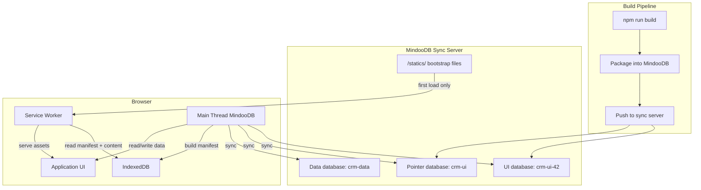
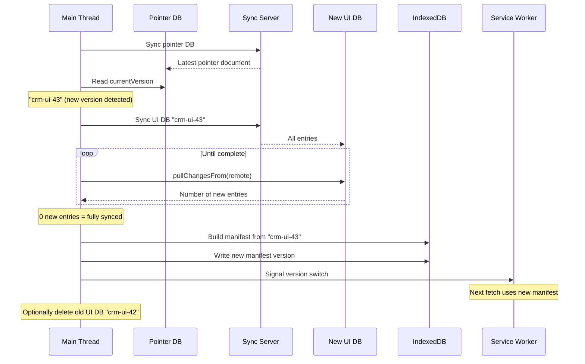

# Distributed Web Applications with MindooDB: MindooDB Apps

## 1) The idea: applications that travel with their data

In 2008, CouchDB introduced a radical concept called [CouchApps](https://couchapp.readthedocs.io/en/latest/intro/what-is-couchapp.html): web applications served directly from the database, replicated alongside their data to any CouchDB instance. The insight was powerful -- if the application code lives in the same database as the application data, replication distributes both at once. A user could install CouchDB on a laptop, replicate a CouchApp from a remote server, and run the full application locally with zero additional infrastructure. The traditional three-tier architecture (browser, application server, database) collapsed into two tiers, and the application became as portable as the data itself.

CouchApps had real limitations. There was no encryption -- anyone with access to the database could read the application code and all its data. There was no integrity verification -- a compromised server could silently alter the application code before serving it. CouchDB had to act as an HTTP server, which meant the application required a running database process to function. And there was no built-in mechanism for versioned releases, atomic upgrades, or rollback.

MindooDB takes the same core idea and rebuilds it with modern security and browser capabilities. Instead of requiring a database process to serve HTTP, a service worker intercepts browser requests and serves the application from IndexedDB. Instead of plaintext replication, every asset is encrypted with AES-256-GCM and signed with Ed25519. Instead of hoping the server hasn't tampered with the code, the browser can cryptographically verify every file before rendering it. And instead of a single database containing both code and data in an unstructured mix, MindooDB uses separate databases with a clean version management scheme that supports atomic upgrades and instant rollback.

The result is a web application that syncs to the browser once, runs entirely offline from that point forward, and updates itself by pulling new versions through MindooDB's existing sync infrastructure. The same replication that keeps application data in sync across devices also keeps the application itself up to date -- code and data travel together, encrypted and signed, through the same channels.

**What this means for different audiences:**

For decision makers, this architecture eliminates the traditional CDN and application server from the deployment stack. The MindooDB sync server replaces both, and the browser becomes a self-sufficient runtime. Deployment is a database operation (push a new version), not a server operation (update files on a CDN, invalidate caches, roll forward/back). The security posture is stronger than traditional web hosting because every asset has a cryptographic chain of custody from the build pipeline to the browser.

For application developers, the integration path is straightforward. You build your web application with any framework (React, Vue, Angular, plain HTML), run your normal build process, and push the output into a MindooDB database. A service worker serves the assets from IndexedDB, and a separate MindooDB instance handles application data. The APIs are the same ones documented in the [getting started guide](getting-started.md) and the [browser IndexedDB store documentation](browser-indexeddb-store.md).

For platform engineers, the system builds on proven primitives. Content-addressed storage provides deduplication. The sync protocol handles incremental updates. IndexedDB provides durable browser-local persistence. Service workers provide offline serving with standard fetch interception. The only new component is the thin layer that maps URL paths to MindooDB documents and their attachments.

---

## 2) How it works

The architecture has three components that work together to deliver a complete offline-capable web application through MindooDB.

The **build pipeline** takes the output of a standard web application build (HTML, JavaScript, CSS, images, fonts) and stores each file as a MindooDB document with the file content as an attachment. The pipeline creates a new MindooDB database for each release version and updates a pointer document in a separate database to advertise the latest version. This is a build-time operation that runs once per release, typically in a CI/CD pipeline or on a developer's machine.

The **service worker** runs in the browser and intercepts all HTTP requests for the application. Instead of fetching from a remote server, it reads the requested file's content from IndexedDB (where MindooDB has stored the synced and decrypted data) and returns it as a standard HTTP response with the correct content type. The service worker is deliberately lightweight -- it reads from a pre-built manifest rather than running the full MindooDB stack, which keeps cold start times low.

The **main-thread MindooDB instance** handles two responsibilities: syncing UI databases from the server into IndexedDB, and providing the application's data layer (reading and writing business data like CRM records, invoices, or whatever the application manages). The main thread does all the heavy lifting -- MindooDB sync, Automerge document processing, decryption, manifest building -- so the service worker can stay fast and simple.



The data flow from build to browser follows a clear path. The build pipeline produces a versioned database containing the application assets and pushes it to the sync server. The browser's main thread syncs this database into IndexedDB. The main thread then processes the MindooDB documents, decrypts the attachments, and writes a manifest that maps URL paths to decrypted content. The service worker reads this manifest to serve assets. Meanwhile, the main thread also syncs the application's data databases, providing the business logic layer that the UI consumes.

---

## 3) Data model

Each file in the build output becomes a single MindooDB document. The document's Automerge data holds the file's metadata (URL path, MIME type, size), and the file's binary content is stored as a MindooDB attachment on that document. This design leverages MindooDB's existing attachment infrastructure -- chunked storage, encryption, deduplication, and sync -- without any special-purpose code.

A build tool that packages web application output into MindooDB would create documents like this:

```typescript
const uiDB = await tenant.openDB("crm-ui-42");

// Store index.html
const indexDoc = await uiDB.createDocument();
await uiDB.changeDoc(indexDoc, async (d) => {
  const data = d.getData();
  data.path = "/index.html";
  data.mimeType = "text/html";
  data.version = "42";
  await d.addAttachment(htmlBytes, "index.html", "text/html");
});

// Store a JavaScript bundle
const jsDoc = await uiDB.createDocument();
await uiDB.changeDoc(jsDoc, async (d) => {
  const data = d.getData();
  data.path = "/assets/app.js";
  data.mimeType = "application/javascript";
  data.version = "42";
  await d.addAttachment(jsBytes, "app.js", "application/javascript");
});

// Store an image
const imgDoc = await uiDB.createDocument();
await uiDB.changeDoc(imgDoc, async (d) => {
  const data = d.getData();
  data.path = "/assets/logo.png";
  data.mimeType = "image/png";
  data.version = "42";
  await d.addAttachment(pngBytes, "logo.png", "image/png");
});
```

### Versioning with separate databases

Each release of the application gets its own MindooDB database. A naming convention like `crm-ui-1`, `crm-ui-2`, `crm-ui-42` keeps versions ordered and identifiable. A separate pointer database (`crm-ui`) contains a single document that names the currently active version:

```typescript
const pointerDB = await tenant.openDB("crm-ui");
const pointerDoc = await pointerDB.createDocument();
await pointerDB.changeDoc(pointerDoc, (d) => {
  const data = d.getData();
  data.currentVersion = "crm-ui-42";
});

// Push both to the server
const remotePointer = await tenant.connectToServer(serverUrl, "crm-ui");
const remoteUI = await tenant.connectToServer(serverUrl, "crm-ui-42");
await pointerDB.pushChangesTo(remotePointer);
await uiDB.pushChangesTo(remoteUI);
```

This design has several advantages. Each version is self-contained and immutable -- once pushed, it never changes. Rollback is a single-document update to the pointer. Old versions can be deleted from the browser to free storage without affecting the current version. And the sync protocol handles each database independently, so syncing a new version does not interfere with the running application.

The tradeoff is that there is no cross-version deduplication. If 90% of files are identical between version 41 and version 42, both versions store them independently. For typical web application builds (5--30 MB), this is a reasonable cost given the simplicity and reliability benefits. Applications with very large assets or frequent releases may want to consider a single-database model with versioned documents, at the cost of more complex version management.

---

## 4) The bootstrap: first load

Every offline-first web application faces a chicken-and-egg problem on the very first load. The service worker that serves the application from IndexedDB does not exist yet, and IndexedDB contains no data. Something has to serve the initial page that registers the service worker and triggers the first sync.

The MindooDB example server solves this with the `--static-dir` option, which serves files from a local directory at the `/statics/` URL prefix. When a user navigates to the server's root URL, the server redirects to `/statics/index.html` if the file exists. This bootstrap page is the only part of the system that requires a traditional server -- after the first sync, the service worker takes over and the bootstrap is never used again.

```bash
MINDOODB_SERVER_PASSWORD=secret npm run dev -- --static-dir ./webapp-bootstrap
```

The bootstrap directory contains a minimal set of files:

```
webapp-bootstrap/
├── index.html          # HTML shell with a loading indicator
├── bootstrap.js        # MindooDB sync logic
├── sw.js               # Service worker that reads from IndexedDB
└── style.css           # Loading indicator styles
```

The bootstrap page performs the following sequence:

1. Register the service worker from `/statics/sw.js`.
2. Initialize a MindooDB instance in the main thread using the browser imports (`mindoodb/browser`).
3. Sync the pointer database to discover the current UI version.
4. Sync the UI database for that version until `pullChangesFrom` returns zero new entries, confirming that all assets are available locally.
5. Build the service worker manifest (URL path to decrypted content mapping) and write it to IndexedDB.
6. Signal the service worker that the UI is ready, then reload the page.

On the reload, the service worker intercepts the request for `/index.html` and serves it from IndexedDB instead of from the server. From this point forward, the application runs entirely from local data.

For the configuration of the `/statics/` endpoint (path traversal protection, dotfile handling, reserved tenant names), see the [server README](../examples/server/README.md#static-file-serving).

---

## 5) Service worker architecture

The service worker's job is conceptually simple: intercept fetch requests, look up the requested URL path in a local index, and return the corresponding content with the correct `Content-Type` header. The question is how much of the MindooDB stack should run inside the service worker.

### Option A: full MindooDB in the service worker

In this approach, the service worker imports `mindoodb/browser`, opens the MindooDB database, loads documents, and reads attachments using the standard API. This gives the service worker full access to MindooDB's document model, sync capabilities, and decryption logic.

The advantage is simplicity of architecture -- the service worker is self-contained and can even perform sync operations independently of the main thread.

The disadvantage is cold start cost. MindooDB uses Automerge for its CRDT layer, and Automerge relies on a WebAssembly module. Browsers terminate idle service workers after 30 seconds to a few minutes. Each time the service worker restarts (on the next fetch event), it must re-initialize the WASM module, which adds 10--50 ms depending on the device. While WASM is fully supported in service workers in all modern browsers, the repeated cold start overhead is avoidable.

### Option B: lightweight manifest reader (recommended)

In this approach, the main thread handles all MindooDB operations: sync, document loading, decryption, and attachment reading. After syncing a UI database, the main thread iterates over all documents, decrypts their attachments, and writes the results into a dedicated IndexedDB object store -- a manifest that maps URL paths to decrypted content and MIME types.

The service worker reads only from this manifest store. It does not import MindooDB, does not load Automerge, and does not perform any cryptographic operations. A fetch handler looks up the requested path in IndexedDB, retrieves the pre-decrypted content, and returns it as a `Response`.

```typescript
// Service worker fetch handler (simplified)
self.addEventListener("fetch", (event) => {
  const url = new URL(event.request.url);

  event.respondWith(
    lookupManifest(url.pathname).then((entry) => {
      if (!entry) return fetch(event.request);
      return new Response(entry.content, {
        headers: { "Content-Type": entry.mimeType },
      });
    })
  );
});

async function lookupManifest(pathname) {
  const db = await openManifestDB();
  const tx = db.transaction("assets", "readonly");
  return tx.objectStore("assets").get(pathname);
}
```

The manifest IndexedDB store is separate from MindooDB's own IndexedDB stores. It contains pre-decrypted content, so it should only be used for assets that are not security-sensitive (which application UI code typically is not -- it is the same code for all users). The application's business data remains encrypted in MindooDB's own stores.

This approach is recommended because the service worker starts instantly (no WASM compilation), the fetch handler completes in a single IndexedDB read, and the architecture cleanly separates the sync/decryption concern (main thread) from the serving concern (service worker).

---

## 6) Version updates and switchover

When a new version of the application is released, the update follows a predictable sequence: discover the new version, download it completely, verify completeness, and switch over. The key property is that the switch only happens after the new version is fully available locally, so the user never sees a partially loaded application.



The version check can run periodically in the background (for example, every 60 seconds while the application is active) or be triggered explicitly by the user. The sync is incremental -- if the connection drops mid-sync, the next attempt picks up where it left off.

The completeness check is simple: when `pullChangesFrom` returns zero new entries, the local IndexedDB store contains every entry the server has for that database. At that point, the main thread rebuilds the manifest from the new database and writes it to the manifest IndexedDB store. The service worker detects the new manifest (via a `postMessage` from the main thread, or by checking a version key in IndexedDB on each fetch) and begins serving from it.

Rollback is equally straightforward. If the new version has a problem, update the pointer document back to the previous version name. The next time the browser syncs the pointer database, it will switch back. If the old version's database is still in IndexedDB (it has not been cleaned up yet), the switch is instant. If it has been deleted, a re-sync pulls it from the server.

---

## 7) Browser storage persistence

A distributed web application that stores both its UI and its data in IndexedDB depends entirely on that storage surviving across browser sessions. By default, browsers treat IndexedDB storage as "best-effort" -- the browser may silently evict it when the device runs low on disk space. For an application whose offline capability depends on IndexedDB, this is unacceptable.

The `navigator.storage.persist()` API requests that the browser treat the origin's storage as persistent, meaning it will not be evicted under storage pressure. The user's data and UI assets remain available until the user explicitly clears them through browser settings.

```javascript
if (navigator.storage && navigator.storage.persist) {
  const granted = await navigator.storage.persist();
  console.log(`Persistent storage: ${granted ? "granted" : "denied"}`);
}
```

The browser may grant or deny the request based on heuristics. Chromium-based browsers auto-grant persistence if the site is installed as a PWA (added to home screen), has push notification permission, or has high site engagement. Firefox shows a permission prompt. Safari auto-grants for "Add to Home Screen" web apps.

You can check the current persistence status and storage quota at any time:

```javascript
const persisted = await navigator.storage.persisted();
const estimate = await navigator.storage.estimate();
console.log(`Persisted: ${persisted}`);
console.log(`Usage: ${(estimate.usage / 1024 / 1024).toFixed(1)} MB`);
console.log(`Quota: ${(estimate.quota / 1024 / 1024).toFixed(0)} MB`);
```

Typical quotas range from several hundred megabytes to several gigabytes depending on the browser and device. A web application build (5--30 MB) plus application data fits comfortably within these limits. If you keep multiple UI versions in IndexedDB simultaneously (current + one previous for rollback), plan for 2--3 times the build size.

The bootstrap page should request persistent storage early in its initialization sequence, ideally before starting the first sync. Both `persist()` and `estimate()` are available in service workers as well as in the main thread.

---

## 8) Security benefits

Traditional web application delivery relies on HTTPS to protect assets in transit and trusts the server to serve unmodified code. If the server is compromised, a CDN cache is poisoned, or a build pipeline is tampered with, the user's browser will execute the modified code without any warning. There is no mechanism in the standard web platform for the browser to verify that the JavaScript it receives matches what the developer intended to ship.

MindooDB-distributed web applications have a stronger security posture. Every file stored in a MindooDB database is both encrypted (AES-256-GCM) and signed (Ed25519) as part of the normal storage process. The signature covers the encrypted payload, and the signer's public key is recorded in the entry metadata. The entry's ID includes a dependency fingerprint that chains entries together, making it impossible to insert, remove, or reorder entries without detection.

This means that when the service worker serves a JavaScript file from IndexedDB, that file has an unbroken cryptographic chain of custody from the build pipeline (where it was signed with the publisher's key) to the browser (where the signature was verified during sync). A compromised sync server cannot alter the application code because it would need the publisher's private signing key to produce a valid signature. The server only ever handles encrypted ciphertext -- it cannot read or modify the application assets it relays.

For applications that handle sensitive data (financial, medical, legal), this property is valuable. The application code itself is protected by the same end-to-end encryption and signing guarantees as the application data. An auditor can verify that the code running in a user's browser is the exact code that was published by the development team, by checking the cryptographic signatures against the publisher's known public key.

---

## 9) Comparison with traditional approaches

| Dimension | MindooDB Distributed Web App | CouchApp (CouchDB) | Traditional CDN + Service Worker PWA |
|---|---|---|---|
| **Offline support** | Full offline after initial sync (UI + data) | Full offline if CouchDB runs locally | UI cached by service worker; data requires server or separate offline layer |
| **Encryption** | End-to-end (AES-256-GCM); server sees only ciphertext | None; plaintext on server and in transit (unless HTTPS added) | HTTPS protects transit only; server has plaintext |
| **Integrity** | Every asset cryptographically signed (Ed25519) | None; server can modify assets silently | Subresource Integrity (SRI) for scripts only; no coverage for HTML, CSS, images |
| **Update mechanism** | Sync new version DB, atomic switchover via pointer | Replicate updated design document | Service worker cache update; varies by implementation |
| **Rollback** | Update pointer document to previous version name | Revert design document or replicate from backup | Redeploy previous build to CDN; cache invalidation delays |
| **Multi-server distribution** | Built-in via MindooDB server-to-server replication | Built-in via CouchDB replication | Requires CDN configuration per region |
| **Version management** | Explicit versioned databases with pointer | No built-in versioning beyond document revisions | Typically handled by build tool (hashed filenames, manifests) |
| **Server requirement** | Sync server for distribution; none for runtime | CouchDB must run to serve the app | CDN + origin server; or service worker cache |
| **Data and code co-distribution** | Same sync infrastructure for both | Same database for both | Separate systems (CDN for code, API server for data) |
| **Tamper detection** | Cryptographic signature verification | None | Limited (SRI hashes for known scripts) |

The most significant difference is the security model. CouchApps and traditional PWAs both trust the server to serve unmodified code. MindooDB's approach treats the server as an untrusted relay -- the server never sees plaintext assets and cannot forge valid signatures. This makes MindooDB-distributed web applications suitable for environments where the server infrastructure is operated by a third party, shared across organizations, or otherwise not fully trusted.

---

## 10) Limitations and practical considerations

**Initial bootstrap requires a server.** The very first load must come from somewhere. The MindooDB server's `/statics/` endpoint (or any static hosting) serves the bootstrap page that registers the service worker and triggers the first sync. After this one-time setup, the application is self-sufficient.

**Storage quotas.** Browsers impose per-origin storage limits, typically several hundred megabytes to several gigabytes. A typical web application build (5--30 MB) fits easily, but applications with large media assets or many retained versions should monitor usage via `navigator.storage.estimate()` and clean up old versions proactively.

**No cross-version deduplication.** The per-database versioning model means each version is self-contained. Files shared across versions (which is common -- most builds change only a fraction of files) are stored independently in each version's database. For small-to-medium builds this is acceptable. Applications with very large builds may want to explore a single-database model with versioned documents, trading simplicity for storage efficiency.

**Service worker cold starts.** Browsers terminate idle service workers after 30 seconds to a few minutes. The recommended manifest-based architecture (Option B in Section 5) avoids WASM initialization on restart, keeping cold starts fast. If you choose Option A (full MindooDB in the service worker), expect 10--50 ms of WASM compilation overhead on each cold start.

**Sync bandwidth.** Each new version requires syncing the full UI database (there is no incremental diff between version databases). For a 10 MB build over a mobile connection, this takes a few seconds. The sync is resumable -- if interrupted, the next attempt picks up from the last committed cursor position.

**Browser compatibility.** This architecture requires IndexedDB, service workers, and the Web Crypto API (`crypto.subtle`). All modern browsers (Chrome, Firefox, Safari, Edge) support these APIs. Internet Explorer is not supported.

---

## 11) Related documents

- [Architecture Specification](specification.md) -- Cryptographic model, store architecture, and security guarantees
- [Getting Started](getting-started.md) -- Tenant creation, user management, and basic sync
- [Browser IndexedDB Store](browser-indexeddb-store.md) -- IndexedDB persistence, virtual views, and PWA integration
- [Attachments](attachments.md) -- Chunked, encrypted file attachments with streaming support
- [Network Sync Protocol](network-sync-protocol.md) -- Endpoint contracts, capability negotiation, and sync optimization
- [Server README](../examples/server/README.md) -- Server setup, static file serving, and `/statics/` configuration
