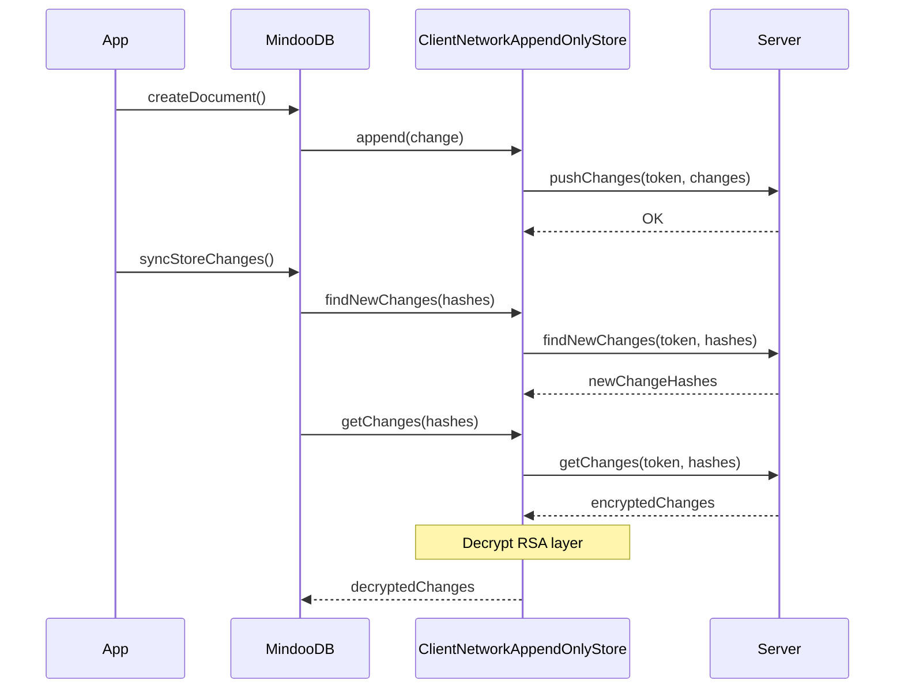
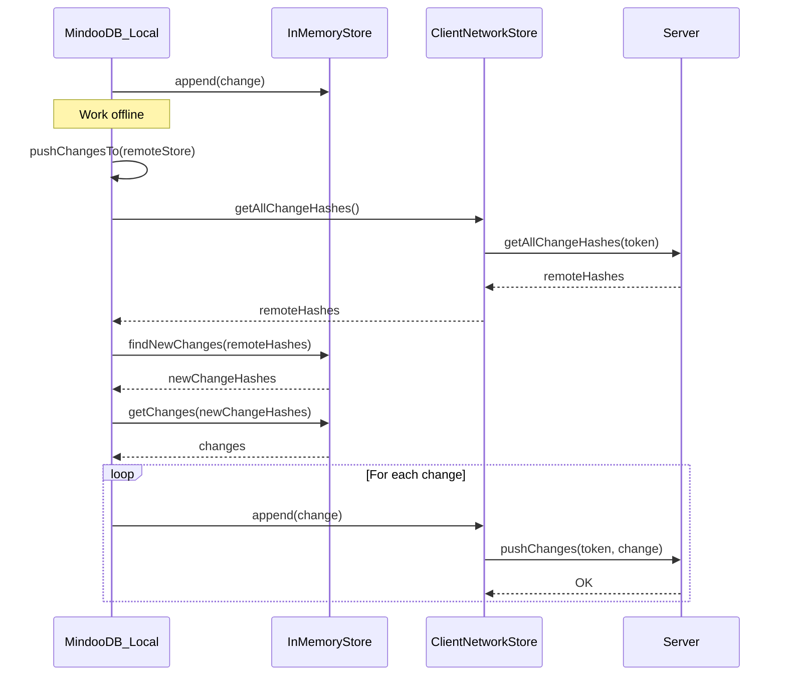
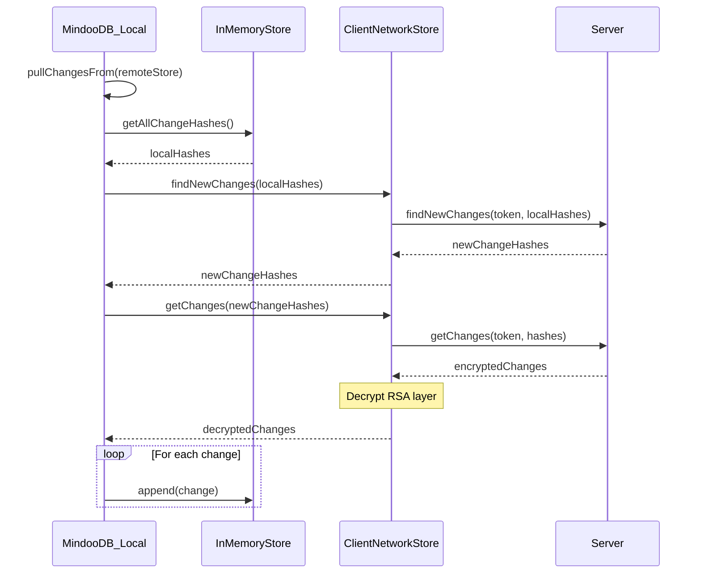

# Network Synchronization Protocol

## Overview

MindooDB's network synchronization protocol enables secure data exchange between clients and servers (or peer-to-peer between clients). The protocol is designed with an end-to-end encrypted, offline-first architecture, ensuring that data remains secure even when transmitted over untrusted networks.

## Architecture

### Components

1. **NetworkTransport**: Abstract interface for network communication (HTTP, WebSocket, WebRTC, etc.)
2. **ClientNetworkAppendOnlyStore**: Client-side store that fetches changes from remote peers
3. **ServerNetworkAppendOnlyStore**: Server-side handler that serves changes to authenticated clients
4. **AuthenticationService**: Handles challenge-response authentication and JWT token management
5. **RSAEncryption**: Utilities for encrypting/decrypting change payloads for network transport

### Data Flow

```
┌──────────────────────────────────────────────────────────────────┐
│                         CLIENT                                   │
│  ┌─────────────────────────────────────────────────────────┐     │
│  │ ClientNetworkAppendOnlyStore                            │     │
│  │  - Pure remote proxy (no local caching)                 │     │
│  │  - Handles authentication                               │     │
│  │  - Decrypts received changes                            │     │
│  │  - Forwards all operations to server                    │     │
│  └────────────────────────┬────────────────────────────────┘     │
│                           │                                      │
│  ┌────────────────────────▼────────────────────────────────┐     │
│  │ NetworkTransport (HttpTransport)                        │     │
│  │  - HTTP/REST communication                              │     │
│  │  - Retry with exponential backoff                       │     │
│  └────────────────────────┬────────────────────────────────┘     │
└───────────────────────────┼──────────────────────────────────────┘
                            │
                    Network │ (TLS)
                            │
┌───────────────────────────▼──────────────────────────────────────┐
│                         SERVER                                   │
│  ┌─────────────────────────────────────────────────────────┐     │
│  │ ServerNetworkAppendOnlyStore                            │     │
│  │  - Validates authentication tokens                      │     │
│  │  - Encrypts changes with client's public RSA key        │     │
│  │    from its local directory                             │     │
│  │  - Serves changes from local store                      │     │
│  │  - Accepts pushed changes from trusted clients          │     │
│  └────────────────────────┬────────────────────────────────┘     │
│                           │                                      │
│  ┌────────────────────────▼────────────────────────────────┐     │
│  │ AuthenticationService                                   │     │
│  │  - Challenge generation (UUID v7)                       │     │
│  │  - Signature verification                               │     │
│  │  - JWT token management                                 │     │
│  └────────────────────────┬────────────────────────────────┘     │
│                           │                                      │
│  ┌────────────────────────▼────────────────────────────────┐     │
│  │ MindooTenantDirectory                                   │     │
│  │  - User public key lookup                               │     │
│  │  - Revocation status check                              │     │
│  └─────────────────────────────────────────────────────────┘     │
└──────────────────────────────────────────────────────────────────┘
```

## Usage Patterns

The `ClientNetworkAppendOnlyStore` acts as a pure remote proxy, enabling two distinct usage patterns:

### 1. Direct Remote Usage

When MindooDB is instantiated directly with `ClientNetworkAppendOnlyStore`, all read/write operations are transparently forwarded to the remote server:



### 2. Sync-Based Usage

A local MindooDB (e.g., with `InMemoryAppendOnlyStore`) can sync with a remote store using `pullChangesFrom` and `pushChangesTo`:

#### pushChangesTo (Local to Remote)

The local DB queries the remote for what it has, then pushes what's missing:



#### pullChangesFrom (Remote to Local)

The local DB tells the remote what it has, then fetches what's missing:



## Authentication Protocol

### Challenge-Response Flow

1. **Client requests challenge**: Client sends username to server
2. **Server generates challenge**: Server creates a UUID v7 challenge, stores it with expiration (5 minutes)
3. **Client signs challenge**: Client signs the challenge with their Ed25519 private signing key
4. **Server verifies signature**: Server retrieves user's public signing key from the tenant directory and verifies the signature
5. **Server issues token**: If valid, server issues a JWT access token with expiration (1 hour)

```
Client                                          Server
  │                                               │
  │  POST /auth/challenge {username}              │
  │──────────────────────────────────────────────>│
  │                                               │ Generate UUID v7 challenge
  │                                               │ Store with 5-minute expiration
  │            {challenge: "uuid-v7"}             │
  │<──────────────────────────────────────────────│
  │                                               │
  │ Sign challenge with                           │
  │ Ed25519 private key                           │
  │                                               │
  │  POST /auth/authenticate                      │
  │  {challenge, signature}                       │
  │──────────────────────────────────────────────>│
  │                                               │ Look up user's public signing key
  │                                               │ Verify Ed25519 signature
  │                                               │ Check user not revoked
  │                                               │ Generate JWT (1-hour expiry)
  │            {success: true, token: "jwt"}      │
  │<──────────────────────────────────────────────│
  │                                               │
```

### JWT Token Structure

```json
{
  "sub": "CN=alice/O=tenant-123",
  "iat": 1704067200,
  "exp": 1704070800,
  "tenantId": "tenant-123"
}
```

### Security Features

- **Single-use challenges**: Each challenge can only be used once
- **Challenge expiration**: Challenges expire after 5 minutes
- **Token expiration**: Tokens expire after 1 hour
- **Signature verification**: Uses Ed25519 for cryptographic proof of identity

## Change Synchronization Protocol

### Finding New Changes

1. Client sends list of change hashes it already has
2. Server returns list of change hashes client doesn't have (metadata only)
   (more advanced comparion, e.g. via bloom filter is planned)

```
Client                                          Server
  │                                               │
  │  POST /sync/findNewChanges                    │
  │  {token, haveChangeHashes: [...]}             │
  │──────────────────────────────────────────────>│
  │                                               │ Validate token
  │                                               │ Find missing changes
  │            {changes: [...metadata]}           │
  │<──────────────────────────────────────────────│
```

### Fetching Changes (with RSA Encryption)

1. Client requests specific changes by hash
2. Server retrieves changes from local store
3. Server looks up client's RSA public encryption key from directory
4. Server encrypts each change's payload with client's RSA key
5. Client decrypts with their RSA private key

```
Client                                          Server
  │                                               │
  │  POST /sync/getChanges                        │
  │  {token, changeHashes: [...]}                 │
  │──────────────────────────────────────────────>│
  │                                               │ Validate token
  │                                               │ Get changes from local store
  │                                               │ Look up client's RSA public key
  │                                               │ Encrypt each payload with RSA
  │            {changes: [...encrypted]}          │
  │<──────────────────────────────────────────────│
  │                                               │
  │ Decrypt each payload with                     │
  │ RSA private key                               │
  │ Store in local cache                          │
```

### NetworkEncryptedChange Structure

Changes transmitted over the network have this structure:

```typescript
interface NetworkEncryptedChange {
  // Metadata (unencrypted for routing/filtering)
  type: "create" | "change" | "snapshot" | "delete";
  docId: string;
  changeHash: string;
  depsHashes: string[];
  createdAt: number;
  createdByPublicKey: string;
  decryptionKeyId: string;
  signature: Uint8Array;
  
  // Payload (RSA-encrypted)
  rsaEncryptedPayload: Uint8Array;
}
```

## Encryption Layers

### Defense in Depth

MindooDB uses multiple encryption layers:

1. **Storage encryption (AES-256-GCM)**: Changes are encrypted with symmetric keys before storage
2. **Transport encryption (RSA-OAEP)**: Changes are additionally RSA-encrypted for network transport
3. **TLS**: Network traffic is encrypted with TLS at the transport layer

### RSA Hybrid Encryption

Because RSA can only encrypt small amounts of data directly, the implementation uses hybrid encryption:

1. Generate a random 256-bit AES key
2. Encrypt the payload with AES-GCM
3. Encrypt the AES key with RSA-OAEP
4. Pack as: `[keyLength][encryptedKey][iv][encryptedData]`

This allows encrypting arbitrarily large payloads while maintaining the security benefits of RSA.

## User Revocation

### How Revocation Works

1. Administrator creates a `revokeaccess` document in the tenant directory
2. This document is signed with the administration key
3. When clients sync the directory, they receive the revocation
4. The revocation takes effect immediately for all operations

### Immediate Effect on Network Sync

When a user is revoked:

1. **Challenge requests fail**: `AuthenticationService.generateChallenge()` checks `directory.isUserRevoked()` and throws `USER_REVOKED` error
2. **Token validation fails**: `AuthenticationService.validateToken()` checks revocation status and returns null
3. **Existing tokens become invalid**: Even if a user has a valid JWT, the revocation check during token validation prevents access

```
Revoked User                                    Server
  │                                               │
  │  POST /auth/challenge {username}              │
  │──────────────────────────────────────────────>│
  │                                               │ Check isUserRevoked(username)
  │                                               │ Returns true
  │            {error: "User has been revoked"}   │
  │<──────────────────────────────────────────────│
```

### Revocation Propagation

1. Admin revokes user on any client/server
2. Revocation document is synced to all peers
3. Each peer's directory now shows user as revoked
4. All sync requests from that user are rejected (even in peer-to-peer scenarios)

### Key Point: No Future Data Access

Once revoked:
- User cannot authenticate to request new challenges
- Existing tokens are invalidated on next validation
- User cannot receive new document changes
- Previously synced data remains on user's device
  Planned feature: device wipe on first connect after revocation

## REST API Endpoints

### Authentication

#### POST /auth/challenge
Request a challenge for authentication.

**Request:**
```json
{
  "username": "CN=alice/O=tenant-123"
}
```

**Response (Success):**
```json
{
  "challenge": "01903e4f-1234-7abc-8def-1234567890ab"
}
```

**Response (Error):**
```json
{
  "error": "User not found"
}
```

#### POST /auth/authenticate
Authenticate with a signed challenge.

**Request:**
```json
{
  "challenge": "01903e4f-1234-7abc-8def-1234567890ab",
  "signature": "base64-encoded-signature"
}
```

**Response (Success):**
```json
{
  "success": true,
  "token": "eyJhbGciOiJIUzI1NiIsInR5cCI6IkpXVCJ9..."
}
```

**Response (Error):**
```json
{
  "success": false,
  "error": "Invalid signature"
}
```

### Synchronization

#### POST /sync/findNewChanges
Find changes that the client doesn't have.

**Headers:**
```
Authorization: Bearer <jwt-token>
```

**Request:**
```json
{
  "tenantId": "tenant-123",
  "dbId": "contacts",
  "haveChangeHashes": ["hash1", "hash2", "hash3"]
}
```

**Response:**
```json
{
  "changes": [
    {
      "type": "change",
      "docId": "doc-456",
      "changeHash": "hash4",
      "depsHashes": ["hash2"],
      "createdAt": 1704067200000,
      "createdByPublicKey": "-----BEGIN PUBLIC KEY-----...",
      "decryptionKeyId": "default",
      "signature": "base64-encoded-signature"
    }
  ]
}
```

#### POST /sync/findNewChangesForDoc
Find changes for a specific document that the client doesn't have (optimized version).

**Headers:**
```
Authorization: Bearer <jwt-token>
```

**Request:**
```json
{
  "tenantId": "tenant-123",
  "dbId": "contacts",
  "haveChangeHashes": ["hash1", "hash2"],
  "docId": "doc-456"
}
```

**Response:**
```json
{
  "changes": [
    {
      "type": "change",
      "docId": "doc-456",
      "changeHash": "hash4",
      "depsHashes": ["hash2"],
      "createdAt": 1704067200000,
      "createdByPublicKey": "-----BEGIN PUBLIC KEY-----...",
      "decryptionKeyId": "default",
      "signature": "base64-encoded-signature"
    }
  ]
}
```

#### POST /sync/getChanges
Get specific changes with RSA-encrypted payloads.

**Headers:**
```
Authorization: Bearer <jwt-token>
```

**Request:**
```json
{
  "tenantId": "tenant-123",
  "dbId": "contacts",
  "changeHashes": [
    {
      "changeHash": "hash4",
      "docId": "doc-456"
    }
  ]
}
```

**Response:**
```json
{
  "changes": [
    {
      "type": "change",
      "docId": "doc-456",
      "changeHash": "hash4",
      "depsHashes": ["hash2"],
      "createdAt": 1704067200000,
      "createdByPublicKey": "-----BEGIN PUBLIC KEY-----...",
      "decryptionKeyId": "default",
      "signature": "base64-encoded-signature",
      "rsaEncryptedPayload": "base64-encoded-encrypted-payload"
    }
  ]
}
```

#### POST /sync/pushChanges
Push changes from client to server.

**Headers:**
```
Authorization: Bearer <jwt-token>
```

**Request:**
```json
{
  "tenantId": "tenant-123",
  "dbId": "contacts",
  "changes": [
    {
      "type": "change",
      "docId": "doc-456",
      "changeHash": "hash5",
      "depsHashes": ["hash4"],
      "createdAt": 1704070800000,
      "createdByPublicKey": "-----BEGIN PUBLIC KEY-----...",
      "decryptionKeyId": "default",
      "signature": "base64-encoded-signature",
      "payload": "base64-encoded-payload"
    }
  ]
}
```

**Response:**
```json
{
  "success": true
}
```

#### GET /sync/getAllChangeHashes
Get all change hashes from the server (used for determining what to push).

**Headers:**
```
Authorization: Bearer <jwt-token>
```

**Query Parameters:**
- `tenantId`: The tenant ID
- `dbId`: (optional) The database ID

**Response:**
```json
{
  "hashes": ["hash1", "hash2", "hash3", "hash4"]
}
```

## Error Handling

### Error Types

| Error Type | HTTP Status | Description |
|------------|-------------|-------------|
| INVALID_TOKEN | 401 | Token is invalid or expired |
| USER_REVOKED | 403 | User has been revoked |
| INVALID_SIGNATURE | 401 | Signature verification failed |
| CHALLENGE_EXPIRED | 401 | Challenge expired or already used |
| USER_NOT_FOUND | 404 | User not found in directory |
| NETWORK_ERROR | varies | Network communication error |
| SERVER_ERROR | 500 | Server-side error |

### Retry Strategy

The HttpTransport implements exponential backoff for transient errors:
- Max 3 retry attempts
- Base delay: 1 second
- Backoff multiplier: 2x

Non-retryable errors (INVALID_TOKEN, USER_REVOKED, INVALID_SIGNATURE) fail immediately.

## Security Considerations

### Threat Model

1. **Man-in-the-middle attacks**: Mitigated by RSA encryption of payloads (even if TLS is compromised)
2. **Replay attacks**: Mitigated by single-use challenges with expiration
3. **Token theft**: Mitigated by short token expiration (1 hour)
4. **Unauthorized access**: Mitigated by directory-based key verification
5. **Revoked user access**: Mitigated by real-time revocation checks

### Cryptographic Algorithms

- **Signing**: Ed25519 (elliptic curve, 128-bit security)
- **Transport encryption**: RSA-OAEP with SHA-256 (3072-bit keys)
- **Payload encryption**: AES-256-GCM (symmetric, 256-bit security)
- **Token signing**: HMAC-SHA256

### Best Practices

1. Always use TLS for network transport
2. Store private keys securely (encrypted with user password)
3. Rotate JWT secrets periodically
4. Monitor for suspicious authentication patterns
5. Implement rate limiting to prevent brute force attacks
