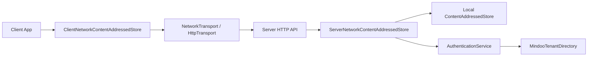

# Network Synchronization Protocol

## Why MindooDB Sync Exists

Most database synchronization protocols force a choice: either you get simple replication that breaks under real-world network conditions, or you get a complex distributed system that takes months to integrate. MindooDB's sync protocol is designed around a different premise: synchronization should be secure by default, work reliably over unreliable networks, and let teams start simple and optimize later without rearchitecting.

The protocol synchronizes encrypted store entries between any combination of clients and servers. Every entry is identified by a unique `id`, carries encrypted payload bytes, and includes metadata that allows two parties to figure out what the other is missing — without ever exposing plaintext data over the wire.

This document explains the design, walks through integration, and provides the full technical reference. It is structured so that different readers can find what they need:

- **Sections 1-2** are for anyone evaluating or starting with MindooDB sync.
- **Section 3** is the quickest path to a working integration.
- **Sections 4-6** cover the deeper protocol mechanics for platform engineers.
- **Section 7** is the reference appendix with types, endpoints, and examples.

---

## 1) The Core Idea

At its heart, MindooDB sync answers one question: "What entries does the other side have that I don't?" Once both sides know the answer, the missing entries are transferred with their payloads encrypted specifically for the requesting user.

This is called **metadata-first reconciliation**. Rather than streaming all data and hoping the receiver can sort it out, MindooDB first exchanges lightweight metadata (entry IDs, timestamps, content hashes) to build a precise picture of what is missing. Only then are the actual encrypted payloads transferred. This keeps bandwidth usage proportional to what has actually changed, not to the total size of the database.

### Entries, not rows or documents

The fundamental sync unit is a `StoreEntry`. Each entry has an `id`, belongs to a `docId`, carries a `contentHash` for deduplication, and includes cryptographic metadata (who created it, when, and a signature proving authenticity). Entries can represent document changes, snapshots, or attachment chunks — the sync protocol treats them all the same way.

### Two sync modes, one data model

MindooDB offers two sync flows that share the same entry model and endpoint set:

**Baseline sync** is the simplest path. The client sends its known entry IDs to the server, the server responds with metadata for entries the client is missing, and the client fetches those entries. This works well for small-to-medium datasets and is the recommended starting point for any new integration.

**Optimized sync** adds two techniques for larger datasets. First, cursor-based scanning lets the client page through remote metadata incrementally instead of sending a potentially huge list of known IDs. Second, a Bloom filter summary lets the client quickly classify remote IDs as "definitely not present locally" or "maybe present" — reducing the number of exact existence checks needed. These optimizations are negotiated at runtime through capability discovery, so a client built for optimized sync still works correctly against a server that only supports baseline.

### Security is not optional

Every sync operation requires authentication. The protocol uses a challenge-response flow where the client proves identity by signing a server-generated challenge with its Ed25519 private key. The server issues a short-lived JWT token that authorizes subsequent sync requests.

Beyond authentication, entry payloads returned by the server are additionally RSA-encrypted for the specific requesting user. This means that even if someone intercepts the response (or if TLS is somehow compromised), they cannot read the payload without the recipient's private RSA key. Combined with the fact that entries are already encrypted at the application layer before they enter the store, MindooDB provides three independent layers of data protection.

User access can be revoked at any time. Revocation is checked both when issuing authentication challenges and when validating tokens, so a revoked user is locked out promptly — even if they hold a previously valid token.

---

## 2) Deciding Whether MindooDB Sync Fits Your Needs

This section is for engineering leaders and architects evaluating platform options.

### What you get

- **Offline-first by design.** Clients work independently and sync when connectivity is available. There is no requirement for always-on server access.
- **End-to-end encryption.** Data is encrypted before it enters the store and again during transport. The server never sees plaintext.
- **Progressive optimization.** Start with baseline sync for fast time-to-market. Enable cursor scanning and Bloom filters later when data volume justifies it — no protocol changes required.
- **Immediate user revocation.** Access can be cut off without waiting for token expiry or cache invalidation.
- **Capability negotiation.** Clients and servers discover each other's supported features at runtime, so mixed deployments (e.g., newer clients against older servers) work without coordination.

### What it costs to adopt

A minimal production integration requires implementing:

- Two authentication endpoints (challenge + authenticate)
- One capability discovery call
- Three sync endpoints (findNewEntries, hasEntries, getEntries)
- Basic error handling and retry logic

This is typically a few days of integration work for a team familiar with REST APIs. The optimized sync features (cursor scan, Bloom filter) can be added later as independent improvements.

### Key questions to consider

- Does your application need to work offline and sync later? MindooDB is built for this.
- Is end-to-end encryption a requirement? MindooDB encrypts at rest and in transit, with per-user transport encryption.
- Will your dataset grow beyond tens of thousands of entries? The optimized sync path handles large datasets efficiently without protocol changes.
- Do you need to revoke user access immediately? MindooDB enforces revocation at the authentication layer.

---

## 3) Integration Guide

This section walks through the fastest path from zero to working sync.

### 3.1 Step 1: Authenticate

Before any sync operation, the client must prove its identity. The flow works like this:

1. The client sends its username to `POST /auth/challenge`. The server returns a unique challenge string.
2. The client signs the challenge with its Ed25519 private signing key and sends the signature to `POST /auth/authenticate`.
3. If the signature is valid and the user is not revoked, the server returns a JWT token. This token is included as a Bearer token in all subsequent sync requests.

Tokens have a limited lifetime (typically one hour). Long-running sync sessions should handle token expiry by re-authenticating when a `401` response is received.

### 3.2 Step 2: Discover capabilities

Before starting sync, the client calls `GET /sync/capabilities` to learn what the server supports. The response indicates which optional features are available:

- `supportsCursorScan` — whether `scanEntriesSince` is available for incremental metadata paging
- `supportsIdBloomSummary` — whether `getIdBloomSummary` is available for probabilistic set comparison
- `supportsCompactionStatus` — whether `getCompactionStatus` is available for operational monitoring

If this endpoint is unavailable (e.g., the server is an older version), the client should assume no optional features are supported and use the baseline flow.

### 3.3 Step 3: Find out what is missing

This is the core of the sync algorithm. The goal is to figure out which entries exist on the remote side but not locally.

**Baseline approach:** Call `POST /sync/findNewEntries` with the list of entry IDs the client already has. The server responds with metadata for all entries the client is missing. For targeted sync of a specific document, use `POST /sync/findNewEntriesForDoc` instead.

**Optimized approach (when capabilities allow):** Instead of sending all known IDs upfront, use `POST /sync/scanEntriesSince` to page through remote metadata incrementally using a cursor. This avoids sending large ID lists over the wire. Optionally, request a Bloom filter summary via `POST /sync/getIdBloomSummary` to quickly classify which remote IDs are definitely missing locally versus which might already be present.

### 3.4 Step 4: Confirm exact presence

Call `POST /sync/hasEntries` with the candidate IDs from the previous step. The server returns exactly which of those IDs it has. This step eliminates false positives from the Bloom filter (in optimized mode) and confirms the precise set of entries to fetch.

### 3.5 Step 5: Fetch missing entries

Call `POST /sync/getEntries` with the final list of missing IDs. The server returns each entry's full metadata plus its payload, RSA-encrypted specifically for the requesting user. The client decrypts the payload with its private RSA key and stores the entry locally.

### 3.6 Step 6: Push local entries (optional)

If the client has entries that the server is missing (bidirectional sync), use `POST /sync/putEntries` to push them upstream. The same reconciliation logic applies in reverse.

### 3.7 Handling errors

The protocol defines structured error types that map to standard HTTP status codes:

| Error | HTTP Status | What to do |
|---|---|---|
| `INVALID_TOKEN` | 401 | Re-authenticate and retry the request |
| `USER_REVOKED` | 403 | Stop sync; the user's access has been removed |
| `INVALID_SIGNATURE` | 401 | Check client key configuration |
| `CHALLENGE_EXPIRED` | 401 | Request a new challenge and re-authenticate |
| `USER_NOT_FOUND` | 404 | Verify the username is correct |
| `NETWORK_ERROR` | varies | Retry with exponential backoff |
| `SERVER_ERROR` | 500 | Retry cautiously; alert if persistent |

Transient errors (network failures, server errors) should be retried with exponential backoff. Authentication and authorization failures should not be retried as transient — they indicate a real access problem that needs resolution.

---

## 4) Architecture

The sync layer is structured as a pipeline of components, each with a clear responsibility. This separation makes it possible to swap transport mechanisms (e.g., HTTP, WebSocket, or peer-to-peer) without changing the sync logic itself.



**ClientNetworkContentAddressedStore** is the client-side entry point. It implements the same `ContentAddressedStore` interface as a local store, so application code can treat it as a transparent remote proxy. Internally, it handles authentication, capability negotiation, request orchestration, and RSA payload decryption.

**NetworkTransport / HttpTransport** handles the actual wire communication. The `HttpTransport` implementation provides REST-based communication with automatic retry and exponential backoff for transient failures. Other transport implementations (WebSocket, WebRTC) can be plugged in by implementing the `NetworkTransport` interface.

**ServerNetworkContentAddressedStore** is the server-side handler. It validates JWT tokens, checks user revocation status, maps incoming requests to operations on the local store, and encrypts response payloads with the requesting user's RSA public key.

**AuthenticationService** manages the challenge-response flow: generating challenges, verifying Ed25519 signatures, and issuing/validating JWT tokens.

**MindooTenantDirectory** is the source of truth for user public keys and revocation status. The server consults this directory during authentication and on every sync request to ensure only authorized, non-revoked users can access data.

---

## 5) Protocol Semantics

This section is for platform engineers who need to understand the exact behavior of the protocol under various conditions.

### 5.1 Capability negotiation

Before starting a sync session, the client queries `GET /sync/capabilities?dbId=<optional>` to discover what the server supports. The response contains:

```typescript
interface NetworkSyncCapabilities {
  protocolVersion: string;           // e.g. "sync-v2"
  supportsCursorScan: boolean;       // scanEntriesSince available
  supportsIdBloomSummary: boolean;   // getIdBloomSummary available
  supportsCompactionStatus: boolean; // getCompactionStatus available
}
```

If the endpoint is unreachable or returns an error, the client falls back to conservative defaults where all optional features are disabled. This ensures that a client built for optimized sync still works correctly against any server, regardless of version.

### 5.2 Reconciliation invariants

The sync protocol maintains several important guarantees:

**Completeness.** After a full sync cycle, the client will have metadata awareness of every entry the server has. Whether the client fetches all payloads or only a subset is an application-level decision.

**Idempotency.** Every sync endpoint can be called multiple times with the same input without side effects. Fetching the same entry twice produces the same result. Pushing an entry that already exists on the server is a no-op.

**Order independence.** Entries can be synced in any order. The protocol does not require entries to arrive in causal or chronological order. Dependency resolution (via `dependencyIds`) is an application-layer concern handled after sync.

**Deduplication.** Entries are identified by `id` and deduplicated by `contentHash`. If two clients create entries with identical content, only one copy is stored.

### 5.3 Why cursor scanning improves performance

In the baseline flow, the client sends all of its known entry IDs to the server so the server can compute what is missing. As the local store grows to tens or hundreds of thousands of entries, this ID list becomes a significant payload in itself.

Cursor-based scanning (`scanEntriesSince`) inverts this approach. Instead of the client telling the server everything it knows, the server pages through its own metadata and the client checks each page against its local index. The cursor is a `(createdAt, id)` pair that allows resumable, deterministic pagination. This keeps request sizes small and constant regardless of total store size.

### 5.4 Why Bloom filters reduce round trips

Even with cursor scanning, the client still needs to determine which of the server's entries it already has locally. Checking each ID individually would require many round trips.

A Bloom filter summary (`getIdBloomSummary`) lets the client download a compact probabilistic representation of the server's entire ID set. The client can then test each of its local IDs against this filter. IDs that the filter says are "definitely not present" on the server can be skipped immediately. Only the "maybe present" IDs need an exact existence check via `hasEntries`. For typical datasets, this eliminates 90-99% of individual existence checks.

### 5.5 Authentication and revocation in detail

Authentication uses a two-step challenge-response flow:

1. `POST /auth/challenge` — the server generates a unique challenge and stores it with a short expiration (typically 5 minutes). Challenges are single-use.
2. `POST /auth/authenticate` — the client submits its signature of the challenge. The server verifies the signature against the user's Ed25519 public key from the tenant directory, checks that the user is not revoked, and issues a JWT token.

Revocation is enforced at two points: during challenge generation (a revoked user cannot even start the auth flow) and during token validation (existing tokens become invalid once revocation is detected). This means revocation takes effect quickly — a revoked user cannot complete any sync operation, even if they somehow hold a valid-looking token.

### 5.6 Compaction telemetry

The `POST /sync/getCompactionStatus` endpoint provides operational insight into the server's on-disk store health. It returns metrics like total compactions performed, bytes compacted, and timing information. This is purely informational — it does not affect sync correctness — but is useful for monitoring deployments and detecting storage maintenance issues before they impact performance.

---

## 6) Security Model

MindooDB's sync protocol provides defense in depth through multiple independent protection layers. Even if one layer is compromised, the others continue to protect data confidentiality and access control.

### Layer 1: Application-level encryption

Before an entry ever enters the store, its payload is encrypted with a symmetric key (AES-256-GCM). This encryption is part of the MindooDB data model, not the sync protocol. It means that the server storing entries cannot read their contents — it only sees encrypted bytes.

### Layer 2: Transport-level payload encryption

When the server responds to a `getEntries` request, it does not return the stored encrypted bytes directly. Instead, it wraps them in an additional RSA encryption layer using the requesting user's public key. This means that even if an attacker captures the server's HTTP response, they cannot decrypt the payload without the recipient's private RSA key.

### Layer 3: Channel encryption

All communication happens over TLS. This protects metadata (entry IDs, timestamps, request parameters) that is not covered by the payload encryption layers.

### Revocation guarantees

When a user is revoked:

- They cannot request new authentication challenges.
- Any existing JWT tokens are rejected on the next server-side validation.
- They cannot receive new entry data.
- Previously synced data on their device is unaffected (planned: remote wipe on next connect attempt).

---

## 7) Reference Appendix

### 7.1 Data types

**StoreEntryMetadata** — the metadata for a single store entry, transmitted during reconciliation. The `signature` field is serialized as base64 on the wire.

```typescript
interface StoreEntryMetadata {
  entryType: StoreEntryType;
  id: string;
  contentHash: string;
  docId: string;
  dependencyIds: string[];
  createdAt: number;
  createdByPublicKey: string;
  decryptionKeyId: string;
  signature: Uint8Array;
  originalSize: number;
  encryptedSize: number;
}
```

**NetworkEncryptedEntry** — a full entry as returned by `getEntries`, including the RSA-encrypted payload.

```typescript
interface NetworkEncryptedEntry extends StoreEntryMetadata {
  rsaEncryptedPayload: Uint8Array;
}
```

**StoreScanCursor / StoreScanResult** — used for cursor-based pagination through metadata.

```typescript
interface StoreScanCursor {
  createdAt: number;
  id: string;
}

interface StoreScanResult {
  entries: StoreEntryMetadata[];
  nextCursor: StoreScanCursor | null;
  hasMore: boolean;
}
```

**StoreIdBloomSummary** — a compact probabilistic representation of the server's entry ID set, used to reduce reconciliation round trips.

```typescript
interface StoreIdBloomSummary {
  version: "bloom-v1";
  totalIds: number;
  bitCount: number;
  hashCount: number;
  salt: string;
  bitsetBase64: string;
}
```

**StoreCompactionStatus** — operational metrics for the server's on-disk store maintenance process.

```typescript
interface StoreCompactionStatus {
  enabled: boolean;
  compactionMinFiles: number;
  compactionMaxBytes: number;
  totalCompactions: number;
  totalCompactedFiles: number;
  totalCompactedBytes: number;
  totalCompactionDurationMs: number;
  lastCompactionAt: number | null;
  lastCompactedFiles: number;
  lastCompactedBytes: number;
  lastCompactionDurationMs: number;
}
```

### 7.2 Endpoint reference

All `/sync/*` endpoints require `Authorization: Bearer <jwt>`.

| Method | Path | Purpose |
|---|---|---|
| `POST` | `/auth/challenge` | Request a single-use authentication challenge |
| `POST` | `/auth/authenticate` | Submit signed challenge to receive a JWT token |
| `GET` | `/sync/capabilities` | Discover which optional sync features the server supports |
| `POST` | `/sync/findNewEntries` | Send known IDs, receive metadata for entries the client is missing |
| `POST` | `/sync/findNewEntriesForDoc` | Same as above, but filtered to a specific document |
| `POST` | `/sync/findEntries` | Query entry metadata by type and date range |
| `POST` | `/sync/scanEntriesSince` | Page through remote metadata using a cursor (optimized sync) |
| `POST` | `/sync/getIdBloomSummary` | Get a Bloom filter summary of all remote entry IDs (optimized sync) |
| `POST` | `/sync/hasEntries` | Check exactly which of a set of IDs exist on the server |
| `POST` | `/sync/getEntries` | Fetch full entries with RSA-encrypted payloads |
| `POST` | `/sync/putEntries` | Push entries from client to server |
| `GET` | `/sync/getAllIds` | Fetch all entry IDs from the server |
| `POST` | `/sync/resolveDependencies` | Ask the server to traverse entry dependency chains |
| `POST` | `/sync/getCompactionStatus` | Retrieve on-disk store compaction metrics |

### 7.3 Request/response examples

All examples use the same scenario: syncing a database called `contacts`.

#### Authenticating

Request:
```json
{ "username": "CN=alice/O=acme-corp" }
```

Response:
```json
{ "challenge": "019abc12-3456-7def-8901-234567890abc" }
```

Request:
```json
{
  "challenge": "019abc12-3456-7def-8901-234567890abc",
  "signature": "base64-encoded-ed25519-signature"
}
```

Response:
```json
{ "success": true, "token": "eyJhbGciOiJIUzI1NiIs..." }
```

#### Scanning metadata with a cursor

Request:
```json
{
  "dbId": "contacts",
  "cursor": { "createdAt": 1700000000000, "id": "id-123" },
  "limit": 500
}
```

Response:
```json
{
  "entries": [
    {
      "entryType": "doc_change",
      "id": "id-124",
      "contentHash": "sha256-abc...",
      "docId": "doc-1",
      "dependencyIds": ["id-100"],
      "createdAt": 1700000001000,
      "createdByPublicKey": "-----BEGIN PUBLIC KEY-----...",
      "decryptionKeyId": "default",
      "signature": "base64...",
      "originalSize": 256,
      "encryptedSize": 280
    }
  ],
  "nextCursor": { "createdAt": 1700000001000, "id": "id-124" },
  "hasMore": true
}
```

#### Fetching entries

Request:
```json
{
  "dbId": "contacts",
  "ids": ["id-124", "id-125"]
}
```

Response:
```json
{
  "entries": [
    {
      "entryType": "doc_change",
      "id": "id-124",
      "contentHash": "sha256-abc...",
      "docId": "doc-1",
      "dependencyIds": ["id-100"],
      "createdAt": 1700000001000,
      "createdByPublicKey": "-----BEGIN PUBLIC KEY-----...",
      "decryptionKeyId": "default",
      "signature": "base64...",
      "originalSize": 256,
      "encryptedSize": 280,
      "rsaEncryptedPayload": "base64..."
    }
  ]
}
```

---

## 8) Related Documents

- Main system spec: `docs/specification.md`
- On-disk store deep dive: `docs/on-disk-content-addressed-store.md`
- Audience outline for this doc: `docs/network-sync-protocol-audience-outline.md`
