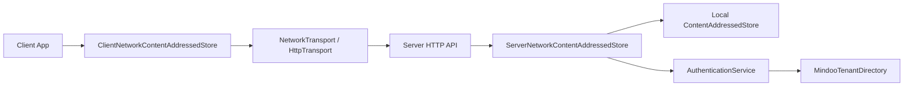

# Network Synchronization Protocol

## Why MindooDB Sync Exists

Most database synchronization protocols force a choice: either you get simple replication that breaks under real-world network conditions, or you get a complex distributed system that takes months to integrate. MindooDB's sync protocol is designed around a different premise: synchronization should be secure by default, work reliably over unreliable networks, and let teams start simple and optimize later without rearchitecting.

The protocol synchronizes encrypted store entries between any combination of clients and servers. Every entry is identified by a unique `id`, carries encrypted payload bytes, and includes metadata that allows two parties to figure out what the other is missing — without ever exposing plaintext data over the wire.

This document explains the design, walks through integration, and provides the full technical reference. It is structured so that different readers can find what they need:

- **Sections 1-2** are for anyone evaluating or starting with MindooDB sync.
- **Section 3** is the quickest path to a working integration.
- **Sections 4-6** cover the deeper protocol mechanics for platform engineers.
- **Section 7** is the reference appendix with types, endpoints, and examples.

---

## 1) The Core Idea

At its heart, MindooDB sync answers one question: "What entries does the other side have that I don't?" Once both sides know the answer, the missing entries are transferred with their payloads encrypted specifically for the requesting user.

This is called **metadata-first reconciliation**. Rather than streaming all data and hoping the receiver can sort it out, MindooDB first exchanges lightweight metadata (entry IDs, timestamps, content hashes) to build a precise picture of what is missing. Only then are the actual encrypted payloads transferred. This keeps bandwidth usage proportional to what has actually changed, not to the total size of the database.

### Entries, not rows or documents

The fundamental sync unit is a `StoreEntry`. Each entry has an `id`, belongs to a `docId`, carries a `contentHash` for deduplication, and includes cryptographic metadata (who created it, when, and a signature proving authenticity). Entries can represent document changes, snapshots, or attachment chunks — the sync protocol treats them all the same way.

### Three sync modes, one data model

MindooDB offers three sync flows that share the same entry model and endpoint set:

**Baseline sync** is the simplest path. The client sends its known entry IDs to the server, the server responds with metadata for entries the client is missing, and the client fetches those entries. This works well for small-to-medium datasets and is the recommended starting point for any new integration.

**Optimized sync** adds two techniques for larger datasets. First, cursor-based scanning lets the client page through remote metadata incrementally instead of sending a potentially huge list of known IDs. Second, a Bloom filter summary lets the client quickly classify remote IDs as "definitely not present locally" or "maybe present" — reducing the number of exact existence checks needed. These optimizations are negotiated at runtime through capability discovery, so a client built for optimized sync still works correctly against a server that only supports baseline.

**Dense sync** transfers only the entries needed to reconstruct the latest state of each document rather than the full history. The client asks the server for a batch materialization plan that identifies the best snapshot and the minimal set of uncovered change entries per document. Historical entries that are already superseded by a snapshot are skipped, and attachment chunks are deferred for on-demand fetching. This mode is activated by passing `mode: "dense"` in `SyncOptions` and is especially valuable for initial device setup over bandwidth-constrained connections. See [db-open-and-sync-optimization.md](db-open-and-sync-optimization.md) for details on the underlying planner algorithm.

### Security is not optional

Every sync operation requires authentication. The protocol uses a challenge-response flow where the client proves identity by signing a server-generated challenge with its Ed25519 private key. The server issues a short-lived JWT token that authorizes subsequent sync requests.

Beyond authentication, entry payloads returned by the server are additionally RSA-encrypted for the specific requesting user. This means that even if someone intercepts the response (or if TLS is somehow compromised), they cannot read the payload without the recipient's private RSA key. Combined with the fact that entries are already encrypted at the application layer before they enter the store, MindooDB provides three independent layers of data protection.

User access can be revoked at any time. Revocation is checked both when issuing authentication challenges and when validating tokens, so a revoked user is locked out promptly — even if they hold a previously valid token.

---

## 2) Deciding Whether MindooDB Sync Fits Your Needs

This section is for engineering leaders and architects evaluating platform options.

### What you get

- **Local-first by design.** Clients work independently and sync when connectivity is available. There is no requirement for always-on server access.
- **End-to-end encryption.** Data is encrypted before it enters the store and again during transport. The server never sees plaintext.
- **Progressive optimization.** Start with baseline sync for fast time-to-market. Enable cursor scanning and Bloom filters later when data volume justifies it — no protocol changes required.
- **Immediate user revocation.** Access can be cut off without waiting for token expiry or cache invalidation.
- **Capability negotiation.** Clients and servers discover each other's supported features at runtime, so mixed deployments (e.g., newer clients against older servers) work without coordination.
- **Cheap steady-state sync.** With sync-v5, an idle re-sync costs one head check per store (persisted cursors), servers push live change notifications over SSE instead of clients polling, and transfers use session-key encryption, compression, binary framing, and parallel batches (see section 5.7).

### What it costs to adopt

A minimal production integration requires implementing:

- Two authentication endpoints (challenge + authenticate)
- One capability discovery call
- Three sync endpoints (findNewEntries, hasEntries, getEntries)
- Basic error handling and retry logic

This is typically a few days of integration work for a team familiar with REST APIs. The optimized sync features (cursor scan, Bloom filter) can be added later as independent improvements.

### Key questions to consider

- Does your application need to work offline and sync later? MindooDB is built for this.
- Is end-to-end encryption a requirement? MindooDB encrypts at rest and in transit, with per-user transport encryption.
- Will your dataset grow beyond tens of thousands of entries? The optimized sync path handles large datasets efficiently without protocol changes.
- Do you need to revoke user access immediately? MindooDB enforces revocation at the authentication layer.

---

## 3) Integration Guide

This section walks through the fastest path from zero to working sync.

### 3.1 Step 1: Authenticate

Before any sync operation, the client must prove its identity. The flow works like this:

1. The client sends its username to `POST /auth/challenge`. The server returns a unique challenge string.
2. The client signs the challenge with its Ed25519 private signing key and sends the signature to `POST /auth/authenticate`.
3. If the signature is valid and the user is not revoked, the server returns a JWT token. This token is included as a Bearer token in all subsequent sync requests.

Tokens have a limited lifetime (typically one hour). Long-running sync sessions should handle token expiry by re-authenticating when a `401` response is received.

### 3.2 Step 2: Discover capabilities

Before starting sync, the client calls `GET /sync/capabilities` to learn what the server supports. The response indicates which optional features are available:

- `supportsCursorScan` — whether `scanEntriesSince` is available for incremental metadata paging
- `supportsIdBloomSummary` — whether `getIdBloomSummary` is available for probabilistic set comparison
- `supportsCompactionStatus` — whether `getCompactionStatus` is available for operational monitoring
- `supportsMaterializationPlanning` — whether `planDocumentMaterialization` is available for causal replay planning
- `supportsBatchMaterializationPlanning` — whether `planDocumentMaterializationBatch` is available for batch planning (required for dense sync)
- `supportsStoreHead` — whether `getStoreHead` is available for persisted-cursor sync (sync-v5)
- `supportsSessionKeyWrap` — whether `getEntries` can return the session-key transport format (sync-v5)
- `supportsBinaryEntries` — whether the binary wire format v2 endpoints (`getEntriesBinary` / `putEntriesBinary`) are available (sync-v5)
- `supportsChangeEvents` — whether the SSE live change feed (`GET /sync/:storeKind/events`) is available (sync-v5)

If this endpoint is unavailable (e.g., the server is an older version), the client should assume no optional features are supported and use the baseline flow. Clients that require dense sync must check for `supportsBatchMaterializationPlanning`; if the server does not report this capability, the client should fall back to full sync or raise a clear error. All sync-v5 fast paths (see section 5.7) are strictly optional — a client simply falls back to the previous behavior when a capability is absent.

### 3.3 Step 3: Find out what is missing

This is the core of the sync algorithm. The goal is to figure out which entries exist on the remote side but not locally.

**Baseline approach:** Call `POST /sync/findNewEntries` with the list of entry IDs the client already has. The server responds with metadata for all entries the client is missing. For targeted sync of a specific document, use `POST /sync/findNewEntriesForDoc` instead.

**Optimized approach (when capabilities allow):** Instead of sending all known IDs upfront, use `POST /sync/scanEntriesSince` to page through remote metadata incrementally using a cursor. This avoids sending large ID lists over the wire. Optionally, request a Bloom filter summary via `POST /sync/getIdBloomSummary` to quickly classify which remote IDs are definitely missing locally versus which might already be present.

### 3.4 Step 4: Confirm exact presence

Call `POST /sync/hasEntries` with the candidate IDs from the previous step. The server returns exactly which of those IDs it has. This step eliminates false positives from the Bloom filter (in optimized mode) and confirms the precise set of entries to fetch.

### 3.5 Step 5: Fetch missing entries

Call `POST /sync/getEntries` with the final list of missing IDs. The server returns each entry's full metadata plus its payload, RSA-encrypted specifically for the requesting user. The client decrypts the payload with its private RSA key and stores the entry locally.

When the server advertises `supportsSessionKeyWrap`, the client can add `"sessionKeyWrap": true` to the request to receive the batch in the session-key format instead (one RSA operation per batch rather than per entry — see section 5.7.2). When it advertises `supportsBinaryEntries`, the client can use `POST /sync/getEntriesBinary` to skip base64/JSON overhead entirely (section 5.7.3). Both are pure performance variants of the same operation.

### 3.6 Step 6: Push local entries (optional)

If the client has entries that the server is missing (bidirectional sync), use `POST /sync/putEntries` to push them upstream. The same reconciliation logic applies in reverse.

The response carries witness receipts for the accepted entries plus a `rejected` list for entries the server refused on signature-class validation grounds (see section 5.7.6). A rejection does not fail the push: the client skips the entry, reports it as a warning, and keeps syncing.

### 3.7 Handling errors

The protocol defines structured error types that map to standard HTTP status codes:

| Error | HTTP Status | What to do |
|---|---|---|
| `INVALID_TOKEN` | 401 | Re-authenticate and retry the request |
| `USER_REVOKED` | 403 | Stop sync; the user's access has been removed |
| `INVALID_SIGNATURE` | 401 | Check client key configuration. On `putEntries`, signature-class failures of individual entries are reported per entry in the response (`rejected`, section 5.7.6) instead of raising this error; the batch-level error remains for authentication-level signature problems and pre-sync-v5 servers |
| `CHALLENGE_EXPIRED` | 401 | Request a new challenge and re-authenticate |
| `USER_NOT_FOUND` | 404 | Verify the username is correct |
| `NETWORK_ERROR` | varies | Retry with exponential backoff |
| `SERVER_ERROR` | 500 | Retry cautiously; alert if persistent |

Transient errors (network failures, server errors) should be retried with exponential backoff. Authentication and authorization failures should not be retried as transient — they indicate a real access problem that needs resolution.

---

## 4) Architecture

The sync layer is structured as a pipeline of components, each with a clear responsibility. This separation makes it possible to swap transport mechanisms (e.g., HTTP, WebSocket, or peer-to-peer) without changing the sync logic itself.


```mermaid
flowchart LR
  A[Client App] --> B[ClientNetworkContentAddressedStore]
  B --> C[NetworkTransport / HttpTransport]
  C --> D[Server HTTP API]
  D --> E[ServerNetworkContentAddressedStore]
  E --> F[Local ContentAddressedStore]
  E --> G[AuthenticationService]
  G --> H[MindooTenantDirectory]
```

**ClientNetworkContentAddressedStore** is the client-side entry point. It implements the same `ContentAddressedStore` interface as a local store, so application code can treat it as a transparent remote proxy. Internally, it handles authentication, capability negotiation, request orchestration, and RSA payload decryption.

**NetworkTransport / HttpTransport** handles the actual wire communication. The `HttpTransport` implementation provides REST-based communication with automatic retry and exponential backoff for transient failures. Other transport implementations (WebSocket, WebRTC) can be plugged in by implementing the `NetworkTransport` interface.

**ServerNetworkContentAddressedStore** is the server-side handler. It validates JWT tokens, checks user revocation status, maps incoming requests to operations on the local store, and encrypts response payloads with the requesting user's RSA public key.

**AuthenticationService** manages the challenge-response flow: generating challenges, verifying Ed25519 signatures, and issuing/validating JWT tokens.

**MindooTenantDirectory** is the source of truth for user public keys and revocation status. The server consults this directory during authentication and on every sync request to ensure only authorized, non-revoked users can access data.

---

## 5) Protocol Semantics

This section is for platform engineers who need to understand the exact behavior of the protocol under various conditions.

### 5.1 Capability negotiation

Before starting a sync session, the client queries `GET /sync/capabilities?dbId=<optional>` to discover what the server supports. The response contains:

```typescript
interface NetworkSyncCapabilities {
  protocolVersion: string;                      // e.g. "sync-v5"
  supportsCursorScan: boolean;                  // scanEntriesSince available
  supportsIdBloomSummary: boolean;              // getIdBloomSummary available
  supportsCompactionStatus: boolean;            // getCompactionStatus available
  supportsMaterializationPlanning: boolean;     // planDocumentMaterialization available
  supportsBatchMaterializationPlanning: boolean; // planDocumentMaterializationBatch available
  // sync-v5 fast paths (all optional; see section 5.7)
  supportsStoreHead?: boolean;                  // getStoreHead available (persisted-cursor sync)
  supportsSessionKeyWrap?: boolean;             // session-key getEntries format available
  supportsBinaryEntries?: boolean;              // binary wire format v2 endpoints available
  supportsChangeEvents?: boolean;               // SSE live change feed available
}
```

If the endpoint is unreachable or returns an error, the client falls back to conservative defaults where all optional features are disabled. This ensures that a client built for optimized or dense sync still works correctly against any server, regardless of version.

### 5.2 Reconciliation invariants

The sync protocol maintains several important guarantees:

**Completeness.** After a full sync cycle, the client will have metadata awareness of every entry the server has. Whether the client fetches all payloads or only a subset is an application-level decision.

**Idempotency.** Every sync endpoint can be called multiple times with the same input without side effects. Fetching the same entry twice produces the same result. Pushing an entry that already exists on the server is a no-op.

**Order independence.** Entries can be synced in any order. The protocol does not require entries to arrive in causal or chronological order. Dependency resolution (via `dependencyIds`) is an application-layer concern handled after sync.

**Deduplication.** Entries are identified by `id` and deduplicated by `contentHash`. If two clients create entries with identical content, only one copy is stored.

### 5.3 Why cursor scanning improves performance

In the baseline flow, the client sends all of its known entry IDs to the server so the server can compute what is missing. As the local store grows to tens or hundreds of thousands of entries, this ID list becomes a significant payload in itself.

Cursor-based scanning (`scanEntriesSince`) inverts this approach. Instead of the client telling the server everything it knows, the server pages through its own metadata and the client checks each page against its local index. The cursor is a `(receiptOrder, id)` pair — `receiptOrder` is the monotonically increasing sequence number the store assigns to every entry on arrival — which allows resumable, deterministic pagination. This keeps request sizes small and constant regardless of total store size.

### 5.4 Why Bloom filters reduce round trips

Even with cursor scanning, the client still needs to determine which of the server's entries it already has locally. Checking each ID individually would require many round trips.

A Bloom filter summary (`getIdBloomSummary`) lets the client download a compact probabilistic representation of the server's entire ID set. The client can then test each of its local IDs against this filter. IDs that the filter says are "definitely not present" on the server can be skipped immediately. Only the "maybe present" IDs need an exact existence check via `hasEntries`. For typical datasets, this eliminates 90-99% of individual existence checks.

### 5.5 Authentication and revocation in detail

Authentication uses a two-step challenge-response flow:

1. `POST /auth/challenge` — the server generates a unique challenge and stores it with a short expiration (typically 5 minutes). Challenges are single-use.
2. `POST /auth/authenticate` — the client submits its signature of the challenge. The server verifies the signature against the user's Ed25519 public key from the tenant directory, checks that the user is not revoked, and issues a JWT token.

Revocation is enforced at two points: during challenge generation (a revoked user cannot even start the auth flow) and during token validation (existing tokens become invalid once revocation is detected). This means revocation takes effect quickly — a revoked user cannot complete any sync operation, even if they somehow hold a valid-looking token.

### 5.6 Compaction telemetry

The `POST /sync/getCompactionStatus` endpoint provides operational insight into the server's on-disk store health. It returns metrics like total compactions performed, bytes compacted, and timing information. This is purely informational — it does not affect sync correctness — but is useful for monitoring deployments and detecting storage maintenance issues before they impact performance.

### 5.7 sync-v5 performance extensions

Protocol version `sync-v5` adds five independent fast paths (5.7.1–5.7.5) plus one robustness change to the push path (5.7.6). Each fast path is negotiated through its own capability flag, degrades gracefully to the previous behavior when absent, and changes nothing about the security model: authentication, the read gate, revocation checks, and the "payloads are encrypted for exactly one user" guarantee apply unchanged.

#### 5.7.1 Persisted scan cursor + store head (`supportsStoreHead`)

Without this extension, every pull re-scans the source store's metadata from the beginning — even when nothing changed. With it, an idle re-sync costs **zero scan pages**.

Two pieces work together:

**The store head.** `POST /sync/getStoreHead` returns a cheap descriptor of the store's current state:

```typescript
interface StoreHead {
  epoch: string;           // stable UUID; regenerated on store reset / receiptOrder migration
  maxReceiptOrder: number; // highest receiptOrder assigned so far
}
```

**The persisted cursor.** After a completed scan, the client persists the final `StoreScanCursor` per (source store, target store) pair — together with both stores' epochs — in its metadata checkpoint. On the next sync:

1. The client fetches both store heads (one cheap request per network store).
2. If both epochs match the persisted record **and** `sourceHead.maxReceiptOrder <= cursor.receiptOrder`, the sync is skipped entirely — the source has nothing new.
3. If the epochs match but the source has new entries, the scan **resumes** from the persisted cursor instead of restarting at zero.
4. If either epoch changed (store reset, receipt-order migration), the persisted cursor is discarded and a full re-scan runs — the epoch is the safety anchor that makes resuming correct.

`SyncOptions.forceFullScan: true` bypasses the persisted cursor as an escape hatch. Push direction works symmetrically with the cursor anchored on the local store; entries re-anchored by witness receipts are re-scanned once and cheaply filtered out via Bloom/`hasEntries`.

#### 5.7.2 Session-key transport encryption (`supportsSessionKeyWrap`)

The classic `getEntries` response RSA-encrypts every entry payload individually — at 250 entries per batch that is 250 RSA operations on the server and 250 more on the client, which dominates CPU time on large pulls.

With `sessionKeyWrap: true` in the `getEntries` request body, the server instead:

1. generates one random AES-256-GCM session key per response,
2. wraps that key **once** with RSA-OAEP using the requester's public encryption key — the same key, resolved from the same directory/grant-access check, that the per-entry format would have used, so the "only this user can read it" guarantee is identical,
3. encrypts each entry payload with the session key and a fresh 96-bit IV.

```typescript
interface SessionEncryptedEntriesBatch {
  wrappedSessionKey: Uint8Array;              // RSA-OAEP-wrapped AES-256-GCM key
  entries: NetworkSessionEncryptedEntry[];    // metadata + { iv, sessionEncryptedPayload }
}
```

The client performs one RSA decrypt per batch and one (fast) AES-GCM decrypt per entry. Clients fall back to the per-entry RSA format when the capability or transport support is missing.

#### 5.7.3 Compression and binary wire format v2 (`supportsBinaryEntries`)

Two orthogonal wins on the wire:

**Response compression.** The server compresses JSON responses above ~1 KB with brotli or gzip, negotiated via the standard `Accept-Encoding` header. The biggest gains are on the highly redundant metadata endpoints (`scanEntriesSince`, `findNewEntries`, `hasEntries`, Bloom summaries), which typically shrink 5–10×. This requires no client protocol change — any HTTP client that sends `Accept-Encoding` benefits automatically. Compression applies to **responses only**: the client does not compress request bodies, because the dominant upload (`putEntries` payloads) is encrypted ciphertext that compression cannot shrink — the base64/JSON overhead on that path is eliminated by the binary framing below instead.

**Binary framing for payload endpoints.** JSON + base64 inflates encrypted payloads by ~33 % and forces the receiver to JSON-parse multi-megabyte bodies. The two payload-heavy endpoints have binary `application/octet-stream` counterparts, `POST /sync/getEntriesBinary` and `POST /sync/putEntriesBinary`, using a simple length-prefixed framing (all `u32` prefixes big-endian):

```
[u32 headerLen][header JSON]
repeated per entry:
  [u32 metaLen][metadata JSON]
  [u32 payloadLen][payload bytes]
```

Metadata stays JSON (small, schema-flexible); only the payload bytes — encrypted and therefore incompressible — travel raw. The header JSON carries a format discriminator (`mdb-entries-v2` for get responses, `mdb-put-v2` for put requests) plus batch-level fields: the get response carries the base64 `wrappedSessionKey` (binary get always uses the session-key encryption of 5.7.2); the put request carries `tenantId`/`dbId`. `putEntriesBinary` returns the same JSON witness-receipt/rejection response as `putEntries` (see 5.7.6), and clients partition binary bodies against the server's advertised body-size limit exactly like the JSON path.

#### 5.7.4 Pipelining and parallelism

Two client-side changes overlap work that previously ran strictly sequentially — no new endpoints, no capability flag:

- **Scan prefetch.** While scan page N is being filtered and transferred, page N+1 is already being fetched.
- **Parallel transfer batches.** Transfer batches (each one `getEntries` + `putEntries` round trip) run in a small bounded worker pool instead of one at a time. The window defaults to 3 and is configurable via `SyncOptions.maxConcurrentBatches`; progress events and abort semantics are preserved, and witness receipts are applied per batch (order-independent). Since the server speaks HTTP/2, the concurrent requests multiplex over one connection.

#### 5.7.5 Live change feed via SSE (`supportsChangeEvents`)

Instead of polling, a client can subscribe to `GET /sync/:storeKind/events?dbId=<gate-db>` — a Server-Sent-Events stream, Bearer-authenticated like every other sync route. (Native `EventSource` cannot send an `Authorization` header, so the SDK consumes the stream with a fetch reader.) The read gate for the database given in `?dbId=` (default `directory`) is enforced at subscribe time.

After every accepted `putEntries` write, the server publishes:

```
event: change
data: {"dbId":"contacts","storeKind":"docs","epoch":"019...","maxReceiptOrder":1042}
```

Events carry only metadata — which database changed and up to which `receiptOrder` — never content, so a stream outliving its token is harmless. A heartbeat comment every 30 s keeps proxies from closing the connection. There is no history or replay: a client that reconnects simply runs one normal sync, which the persisted cursor of 5.7.1 turns into a single cheap head check when nothing is missing.

The SDK's `ClientNetworkContentAddressedStore.subscribeToChanges(onChange)` wraps the stream with automatic reconnect and exponential backoff (1 s → 60 s) and deactivates itself silently when the server does not advertise the capability. SSE was chosen over WebSocket deliberately: the channel is strictly unidirectional, needs no upgrade handshake, and passes through HTTP/2 and proxies without extra connection management.

#### 5.7.6 Per-entry rejection on push

The server validates every pushed entry cryptographically before storing it (section 6): the author key must be trusted by the directory, the `contentHash` must match the payload, and the author signature (including the v2 metadata-signature floor) must verify. Originally, any one failing entry aborted the whole `putEntries` batch with `INVALID_SIGNATURE` — which meant a single locally corrupted or forged entry could permanently block a database's push sync: every retry re-sent the same batch and hit the same error.

Since sync-v5, these **signature-class failures are rejected per entry** instead. The server skips the offending entry (it is never stored, witnessed, or propagated), stores the rest of the batch, and reports the skipped entries in the response next to the witness receipts:

```json
{
  "success": true,
  "receipts": [ ... ],
  "rejected": [
    { "id": "id-125", "reason": "Entry id-125 has an invalid author signature" }
  ]
}
```

The client surfaces the rejections as warnings on the sync result (`SyncResult.rejectedEntries`) while the push completes normally — the persisted scan cursor (5.7.1) advances past the poisoned entry, so it does not block future syncs either. The same contract applies to `putEntriesBinary`.

Two boundaries are deliberately unchanged:

- **Access-denied conditions still fail the whole request** (`ACCESS_DENIED`): remote wipe, a revoked `decryptionKeyId`, a purged document, or a Tier 1 policy denial are intentional blocks, not data corruption, and must stop the push loudly.
- **The security model is unchanged.** A rejected entry is treated exactly as strictly as before — it never enters the store. Only the blast radius of the failure shrank from "whole batch, forever" to "that entry".

Older servers that predate this behavior still fail the batch; clients handle both by treating a missing `rejected` field as an empty list.

### 5.8 Anatomy of a sync run: request sequences

The sections above describe each mechanism in isolation. This section shows what actually goes over the wire during one sync run, and how the sequence differs by scenario. Three facts frame everything:

- A sync run is always a one-directional copy **source → target**. On **push** the source is the local store (its metadata scan is a local operation, not a request) and the target is the server; on **pull** it is the other way around. A "full sync" is simply a push run followed by a pull run.
- The cursor scan always walks the **source**; the missing-check (Bloom + `hasEntries`) always asks the **target**.
- **The list of entries to transfer is never computed up front.** There is no moment where a complete ID list exists. The run works page by page: scan 1,000 source metadata entries → filter them against the target (Bloom pre-screen, exact `hasEntries` for the uncertain rest) → transfer the missing ones immediately → advance the cursor → next page. The `totalIds` field of the source's Bloom summary serves only as the progress-bar denominator. Only the legacy fallback for servers without `scanEntriesSince` computes a full list up front (`getAllIds` + `findNewEntries`) — exactly the pattern that stops scaling on large stores.

Once per connection (then cached): `POST /auth/challenge` + `POST /auth/authenticate` (JWT), and `GET /sync/capabilities`.

**Scenario A — first push (thousands of local entries, empty server).**

| Step | Request | Purpose |
|---|---|---|
| 1 | `POST /sync/getStoreHead` | Target (server) head; anchors the target epoch for the cursor persisted at the end. No persisted cursor exists yet, so the scan starts at zero — but the scan is local and cheap; the upload is the bottleneck. |
| 2 | `POST /sync/getIdBloomSummary` | Target's ID Bloom filter. Against an empty server it classifies every local ID as "definitely missing", so **no `hasEntries` calls happen at all** in this scenario. |
| 3 (per page) | `POST /sync/putEntriesBinary` (or `putEntries`) | Transfer batches of ~250 entries, up to 3 in flight in parallel (5.7.4). Response: witness receipts + per-entry rejections (5.7.6). |
| 4 | — | Final cursor persisted **locally**; no request. |

What sync-v5 buys here: not the cursor (first run scans everything anyway), but the binary put format, response compression on the small JSON acks, and the parallel batch window. The cursor pays off from the second run on — and after an **aborted** first push, which resumes at the last fully transferred page boundary instead of starting over.

**Scenario B — first pull (thousands of server entries, empty local store).**

| Step | Request | Purpose |
|---|---|---|
| 1 | `POST /sync/getStoreHead` | Source (server) head. No persisted cursor → full scan. |
| 2 | `POST /sync/getIdBloomSummary` | Source Bloom, used here only for the progress denominator; the missing-check runs against the *local* target and costs no requests. |
| 3 (per page) | `POST /sync/scanEntriesSince` | One metadata page (default 1,000) from the server — with prefetch: page N+1 is already in flight while page N is filtered and transferred (5.7.4). |
| 4 (per batch) | `POST /sync/getEntriesBinary` (or `getEntries` with `sessionKeyWrap: true`) | Fetch the missing payloads, ~250 per batch, 3 in parallel, one RSA unwrap per batch (5.7.2). Writing into the local store costs no requests. |
| 5 | optional `GET /sync/docs/events` | Subscribe to the SSE feed (5.7.5) instead of polling. |

**Scenario C — both sides already have data (steady state).**

Both direction runs execute the same sequences as A and B, with two differences. First, the Bloom filter and `hasEntries` now do real work: per scan page, IDs the Bloom marks "maybe present" on the target get one exact `POST /sync/hasEntries` check, and only genuinely missing entries transfer. Second — the common case — nothing changed since the last run, and the persisted cursor turns the whole direction into **exactly one request**: `getStoreHead`, epochs match, `maxReceiptOrder <= cursor.receiptOrder`, done. That single-request idle re-sync is the headline win of 5.7.1.

### 5.9 State ownership: what the client keeps, what the server keeps

The sync protocol is deliberately asymmetric about state:

**The client owns all sync progress.** The persisted cursor record — `{ sourceEpoch, targetEpoch, cursor }` per (source store, target store) pair — lives in the client's local metadata checkpoint, for the push direction as well as the pull direction. The server never learns that it exists.

**The server keeps no per-client state.** It does not track who has synced what; every sync route is stateless apart from the JWT. A store's `epoch` is a property of the store itself (persisted next to the store, regenerated only on reset/migration — the events that would invalidate old cursors), and `maxReceiptOrder` is derived from the data. `getStoreHead` just reports both. Local client stores keep their own epoch the same way — on push, the "source epoch" in the cursor record is the local store's.

This design means server resources cannot accumulate per client: no cursor tables to grow, no orphaned progress records to clean up, and a client can always sync from any state. What *can* accumulate on the server, and the guard for each:

- **Pushed entries** — the point of the system, but only after JWT auth plus per-entry validation against directory-trusted author keys (section 6). Unauthenticated callers and forged keys cannot store anything; rejected entries (5.7.6) are never stored.
- **Auth challenges** — in-memory, unauthenticated to create, therefore hard-capped (10,000) with a 5-minute expiry.
- **SSE subscribers** — require a valid token and read-gate check; the listener is removed when the connection closes.
- **Request volume** — tiered rate limits (auth vs sync vs system) plus a global per-IP throttle, and a JSON body-size limit (default 5 MB) that the server advertises in its capabilities so clients partition batches to fit.

One honest boundary: there is currently no per-tenant storage quota. A *legitimate*, non-revoked user with a trusted key can push an unbounded volume of validly signed entries into an append-only store. The mitigations today are key revocation (stops further pushes immediately) and remote wipe.

---

## 6) Security Model

MindooDB's sync protocol provides defense in depth through multiple independent protection layers. Even if one layer is compromised, the others continue to protect data confidentiality and access control.

### Layer 1: Application-level encryption

Before an entry ever enters the store, its payload is encrypted with a symmetric key (AES-256-GCM). This encryption is part of the MindooDB data model, not the sync protocol. It means that the server storing entries cannot read their contents — it only sees encrypted bytes.

### Layer 2: Transport-level payload encryption

When the server responds to a `getEntries` request, it does not return the stored encrypted bytes directly. Instead, it wraps them in an additional RSA encryption layer using the requesting user's public key. This means that even if an attacker captures the server's HTTP response, they cannot decrypt the payload without the recipient's private RSA key.

The sync-v5 session-key format (section 5.7.2) preserves this guarantee with better performance: the payloads are AES-256-GCM-encrypted with a random per-response session key, and that session key is RSA-OAEP-wrapped with the same per-user public key resolved from the same directory grant check. Only the holder of the private RSA key can unwrap the session key, so the set of parties able to read the response is identical to the per-entry-RSA format.

### Layer 3: Channel encryption

All communication happens over TLS. This protects metadata (entry IDs, timestamps, request parameters) that is not covered by the payload encryption layers.

### Revocation guarantees

When a user is revoked:

- They cannot request new authentication challenges.
- Any existing JWT tokens are rejected on the next server-side validation.
- They cannot receive new entry data.
- Previously synced data on their device is unaffected (planned: remote wipe on next connect attempt).

---

## 7) Reference Appendix

### 7.1 Data types

**StoreEntryMetadata** — the metadata for a single store entry, transmitted during reconciliation. The `signature` field is serialized as base64 on the wire.

```typescript
interface StoreEntryMetadata {
  entryType: StoreEntryType;
  id: string;
  contentHash: string;
  docId: string;
  dependencyIds: string[];
  snapshotHeadHashes?: string[];    // Automerge head hashes covered by a doc_snapshot
  snapshotHeadEntryIds?: string[];  // Entry IDs corresponding to those heads (for metadata-only planning)
  createdAt: number;
  createdByPublicKey: string;
  decryptionKeyId: string;
  signature: Uint8Array;
  originalSize: number;
  encryptedSize: number;
}
```

The optional `snapshotHeadHashes` and `snapshotHeadEntryIds` fields are present only on `doc_snapshot` entries. They record which Automerge heads the snapshot covers so the materialization planner can evaluate snapshot coverage without decrypting the payload.

**NetworkEncryptedEntry** — a full entry as returned by `getEntries`, including the RSA-encrypted payload.

```typescript
interface NetworkEncryptedEntry extends StoreEntryMetadata {
  rsaEncryptedPayload: Uint8Array;
}
```

**NetworkSessionEncryptedEntry / SessionEncryptedEntriesBatch** — the sync-v5 session-key response format of `getEntries` (see section 5.7.2). `iv`, `sessionEncryptedPayload`, and `wrappedSessionKey` are serialized as base64 on the wire.

```typescript
interface NetworkSessionEncryptedEntry extends StoreEntryMetadata {
  iv: Uint8Array;                       // fresh 96-bit AES-GCM IV for this entry
  sessionEncryptedPayload: Uint8Array;  // stored payload, AES-GCM-encrypted with the session key
}

interface SessionEncryptedEntriesBatch {
  wrappedSessionKey: Uint8Array;        // AES-256-GCM key, RSA-OAEP-wrapped for the requester
  entries: NetworkSessionEncryptedEntry[];
}
```

**StoreScanCursor / StoreScanResult** — used for cursor-based pagination through metadata. `receiptOrder` is the monotonically increasing arrival sequence number the store assigns to every entry.

```typescript
interface StoreScanCursor {
  receiptOrder: number;
  id: string;
}

interface StoreScanResult {
  entries: StoreEntryMetadata[];
  nextCursor: StoreScanCursor | null;
  hasMore: boolean;
}
```

**StoreHead** — cheap descriptor of a store's current state, used by the persisted-cursor sync (see section 5.7.1).

```typescript
interface StoreHead {
  epoch: string;           // stable UUID; regenerated on store reset
  maxReceiptOrder: number; // highest receiptOrder assigned so far
}
```

**RejectedPutEntry / PutEntriesAck** — the response of `putEntries`/`putEntriesBinary`: witness receipts for accepted entries plus per-entry rejections for signature-class validation failures (see section 5.7.6).

```typescript
interface RejectedPutEntry {
  id: string;
  reason: string; // human-readable, e.g. "Entry ... has an invalid author signature"
}

interface PutEntriesAck {
  receipts: StoreEntryMetadata[]; // witness-stamped metadata of accepted entries
  rejected: RejectedPutEntry[];   // entries skipped by the server
}
```

**StoreChangeEvent** — one announcement on the SSE live change feed (see section 5.7.5). Metadata only, never content.

```typescript
interface StoreChangeEvent {
  dbId: string;
  storeKind: string;         // "docs" | "attachments"
  epoch?: string;            // store head after the write, when available
  maxReceiptOrder?: number;
}
```

**StoreIdBloomSummary** — a compact probabilistic representation of the server's entry ID set, used to reduce reconciliation round trips.

```typescript
interface StoreIdBloomSummary {
  version: "bloom-v1";
  totalIds: number;
  bitCount: number;
  hashCount: number;
  salt: string;
  bitsetBase64: string;
}
```

**StoreCompactionStatus** — operational metrics for the server's on-disk store maintenance process.

```typescript
interface StoreCompactionStatus {
  enabled: boolean;
  compactionMinFiles: number;
  compactionMaxBytes: number;
  totalCompactions: number;
  totalCompactedFiles: number;
  totalCompactedBytes: number;
  totalCompactionDurationMs: number;
  lastCompactionAt: number | null;
  lastCompactedFiles: number;
  lastCompactedBytes: number;
  lastCompactionDurationMs: number;
}
```

### 7.2 Endpoint reference

All `/sync/*` endpoints require `Authorization: Bearer <jwt>`.

| Method | Path | Purpose |
|---|---|---|
| `POST` | `/auth/challenge` | Request a single-use authentication challenge |
| `POST` | `/auth/authenticate` | Submit signed challenge to receive a JWT token |
| `GET` | `/sync/capabilities` | Discover which optional sync features the server supports |
| `POST` | `/sync/findNewEntries` | Send known IDs, receive metadata for entries the client is missing |
| `POST` | `/sync/findNewEntriesForDoc` | Same as above, but filtered to a specific document |
| `POST` | `/sync/findEntries` | Query entry metadata by type and date range |
| `POST` | `/sync/scanEntriesSince` | Page through remote metadata using a cursor (optimized sync) |
| `POST` | `/sync/getIdBloomSummary` | Get a Bloom filter summary of all remote entry IDs (optimized sync) |
| `POST` | `/sync/hasEntries` | Check exactly which of a set of IDs exist on the server |
| `POST` | `/sync/getEntries` | Fetch full entries with RSA-encrypted payloads |
| `POST` | `/sync/putEntries` | Push entries from client to server |
| `GET` | `/sync/getAllIds` | Fetch all entry IDs from the server |
| `POST` | `/sync/resolveDependencies` | Ask the server to traverse entry dependency chains |
| `POST` | `/sync/planDocumentMaterialization` | Compute causal materialization plan for a single document |
| `POST` | `/sync/planDocumentMaterializationBatch` | Compute materialization plans for multiple documents in one call |
| `POST` | `/sync/getCompactionStatus` | Retrieve on-disk store compaction metrics |
| `POST` | `/sync/getStoreHead` | Get the store's `{epoch, maxReceiptOrder}` head (sync-v5, persisted-cursor sync) |
| `POST` | `/sync/getEntriesBinary` | `getEntries` over binary wire format v2 with session-key encryption (sync-v5) |
| `POST` | `/sync/putEntriesBinary` | `putEntries` over binary wire format v2 (sync-v5) |
| `GET` | `/sync/:storeKind/events` | SSE live change feed; emits a `change` event after each accepted write (sync-v5) |

### 7.3 Request/response examples

All examples use the same scenario: syncing a database called `contacts`.

#### Authenticating

Request (`POST /auth/challenge`):
```json
{ "username": "CN=alice/O=acme-corp" }
```

The `username` is **optional**. To avoid sending the cleartext name, a client
may instead identify itself by its device signing public key — the server
resolves the principal from the key:
```json
{ "signingPublicKey": "-----BEGIN PUBLIC KEY-----\n...\n-----END PUBLIC KEY-----" }
```
The server never requires the cleartext username: read access is resolved from
the authenticated device signing key (carried in the JWT as `deviceSigningKey`)
plus the grant document's precomputed `identity_hashes` bundle, so wildcard and
group read rules keep working in hash space. See
[Access Control](accesscontrol.md).

Response:
```json
{ "challenge": "019abc12-3456-7def-8901-234567890abc" }
```

Request:
```json
{
  "challenge": "019abc12-3456-7def-8901-234567890abc",
  "signature": "base64-encoded-ed25519-signature"
}
```

Response:
```json
{ "success": true, "token": "eyJhbGciOiJIUzI1NiIs..." }
```

#### Scanning metadata with a cursor

Request:
```json
{
  "dbId": "contacts",
  "cursor": { "receiptOrder": 123, "id": "id-123" },
  "limit": 500
}
```

Response:
```json
{
  "entries": [
    {
      "entryType": "doc_change",
      "id": "id-124",
      "contentHash": "sha256-abc...",
      "docId": "doc-1",
      "dependencyIds": ["id-100"],
      "createdAt": 1700000001000,
      "createdByPublicKey": "-----BEGIN PUBLIC KEY-----...",
      "decryptionKeyId": "default",
      "signature": "base64...",
      "originalSize": 256,
      "encryptedSize": 280
    }
  ],
  "nextCursor": { "receiptOrder": 124, "id": "id-124" },
  "hasMore": true
}
```

#### Fetching entries

Request:
```json
{
  "dbId": "contacts",
  "ids": ["id-124", "id-125"]
}
```

Response:
```json
{
  "entries": [
    {
      "entryType": "doc_change",
      "id": "id-124",
      "contentHash": "sha256-abc...",
      "docId": "doc-1",
      "dependencyIds": ["id-100"],
      "createdAt": 1700000001000,
      "createdByPublicKey": "-----BEGIN PUBLIC KEY-----...",
      "decryptionKeyId": "default",
      "signature": "base64...",
      "originalSize": 256,
      "encryptedSize": 280,
      "rsaEncryptedPayload": "base64..."
    }
  ]
}
```

#### Fetching entries with session-key encryption (sync-v5)

Request:
```json
{
  "dbId": "contacts",
  "ids": ["id-124", "id-125"],
  "sessionKeyWrap": true
}
```

Response — one RSA-wrapped session key for the whole batch, one AES-GCM `iv` + payload per entry (the client recognizes the format by the presence of `wrappedSessionKey`):
```json
{
  "wrappedSessionKey": "base64...",
  "entries": [
    {
      "entryType": "doc_change",
      "id": "id-124",
      "contentHash": "sha256-abc...",
      "docId": "doc-1",
      "dependencyIds": ["id-100"],
      "createdAt": 1700000001000,
      "createdByPublicKey": "-----BEGIN PUBLIC KEY-----...",
      "decryptionKeyId": "default",
      "signature": "base64...",
      "originalSize": 256,
      "encryptedSize": 280,
      "iv": "base64...",
      "sessionEncryptedPayload": "base64..."
    }
  ]
}
```

#### Pushing entries

Request (`POST /sync/putEntries`; payloads travel as the stored ciphertext, base64-encoded):
```json
{
  "dbId": "contacts",
  "entries": [
    {
      "entryType": "doc_change",
      "id": "id-124",
      "contentHash": "sha256-abc...",
      "docId": "doc-1",
      "dependencyIds": ["id-100"],
      "createdAt": 1700000001000,
      "createdByPublicKey": "-----BEGIN PUBLIC KEY-----...",
      "decryptionKeyId": "default",
      "signature": "base64...",
      "originalSize": 256,
      "encryptedSize": 280,
      "encryptedData": "base64..."
    }
  ]
}
```

Response — witness receipts for accepted entries, per-entry rejections for signature-class failures (section 5.7.6):
```json
{
  "success": true,
  "receipts": [
    {
      "id": "id-124",
      "receiptOrder": 1043,
      "receivedAt": 1700000002000,
      "receivedByPublicKey": "-----BEGIN PUBLIC KEY-----...",
      "receivedDateSignature": "base64..."
    }
  ],
  "rejected": [
    { "id": "id-125", "reason": "Entry id-125 has an invalid author signature" }
  ]
}
```

#### Fetching the store head (sync-v5)

Request (`POST /sync/getStoreHead`):
```json
{ "dbId": "contacts" }
```

Response:
```json
{ "head": { "epoch": "019abc12-3456-7def-8901-234567890abc", "maxReceiptOrder": 1042 } }
```

If the persisted cursor's epoch matches and its `receiptOrder` is `>= maxReceiptOrder`, the client skips the pull entirely.

#### Subscribing to the live change feed (sync-v5)

Request: `GET /sync/docs/events?dbId=contacts` with `Accept: text/event-stream` and the usual Bearer token.

Stream:
```
event: hello
data: {"protocolVersion":"sync-v5"}

event: change
data: {"dbId":"contacts","storeKind":"docs","epoch":"019abc12-...","maxReceiptOrder":1043}

: heartbeat 1700000123456
```

---

## 8) Related Documents

- Main system spec: [specification.md](specification.md)
- On-disk store deep dive: [on-disk-content-addressed-store.md](on-disk-content-addressed-store.md)
- DB open, dense sync, and materialization planner: [db-open-and-sync-optimization.md](db-open-and-sync-optimization.md)
- Peer-to-peer and advanced topologies: [p2psync.md](p2psync.md)
