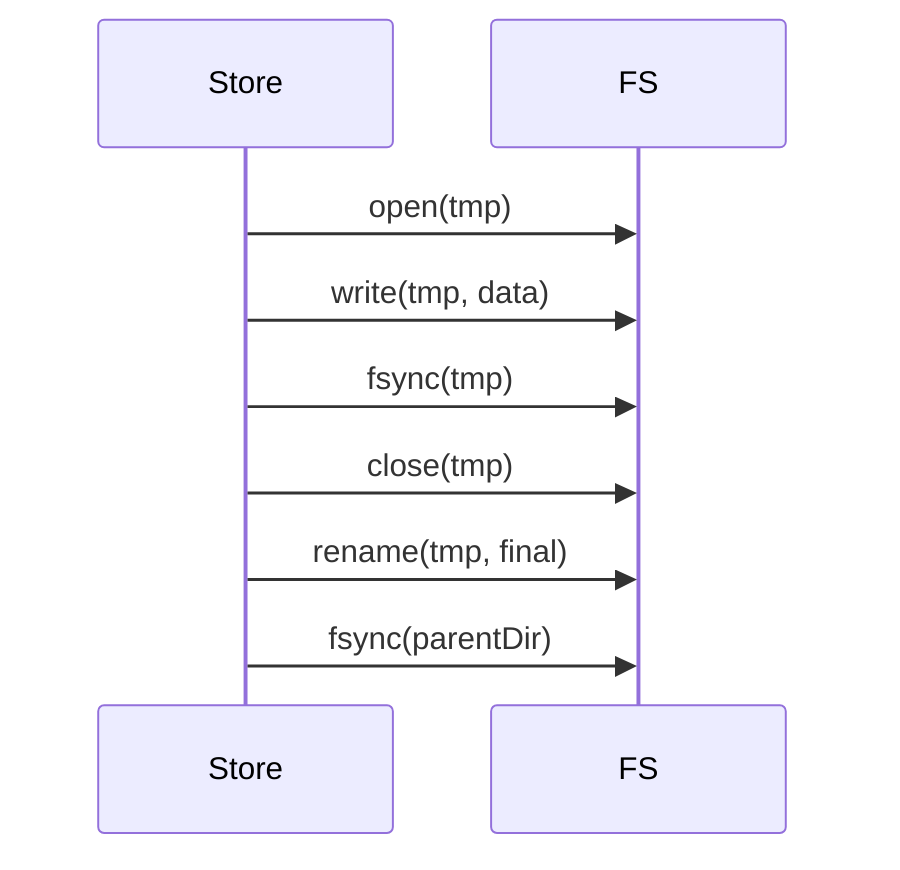
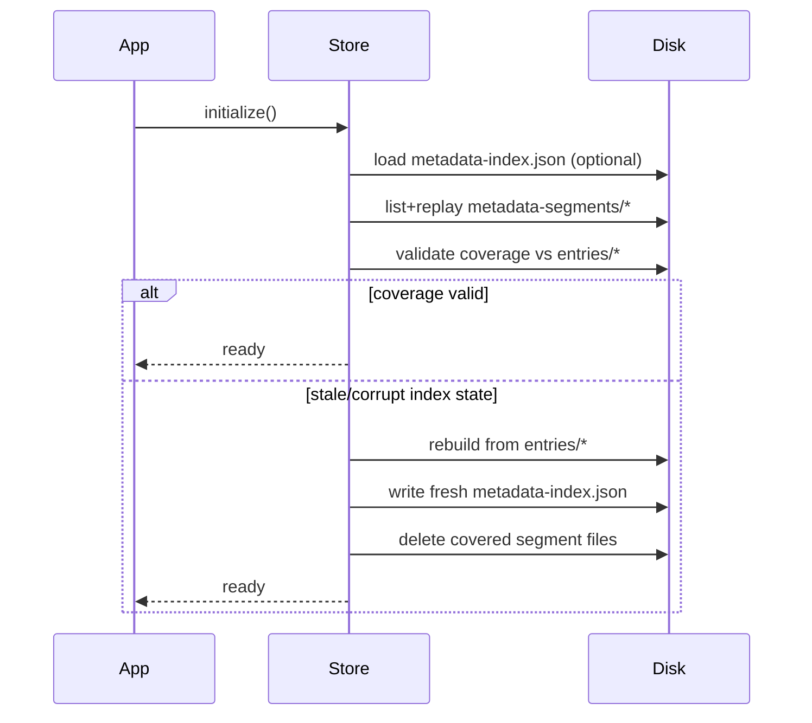
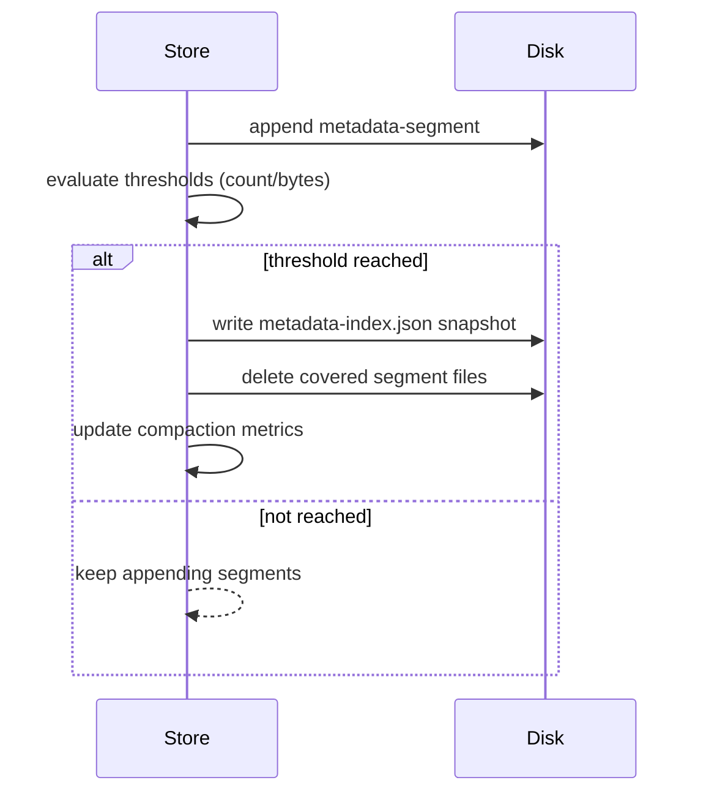

# BasicOnDiskContentAddressedStore (Node.js)

MindooDB is a local-first database: every client holds a full, encrypted copy of its data and can work offline without interruption. For this to work reliably on Node.js, the storage layer must guarantee that committed data survives process crashes, that readers never observe half-written state, and that synchronization with peers remains fast even as the dataset grows. `BasicOnDiskContentAddressedStore` is the Node.js implementation that delivers these guarantees.

This document explains the on-disk layout, write protocol, startup recovery, index compaction, and performance characteristics of this store. If you are integrating MindooDB into a Node.js application, these details will help you understand what happens under the hood and when to tune configuration. If you are evaluating MindooDB for your team, the design goals and tradeoff summary will help you assess adoption risk.

**What this document covers:**

- On-disk structure and file responsibilities
- Write and commit protocol with crash-safety guarantees
- Startup recovery model
- Index segment compaction
- Read and query behavior
- Configuration defaults and tuning guidance
- Consistency, deletion, and GDPR purge semantics
- Performance characteristics and known bottlenecks

---

## 1) Scope and design goals

Most local-first databases delegate persistence to an embedded database engine. MindooDB takes a different approach: it stores encrypted, content-addressed entries directly on the filesystem. This gives the store full control over commit ordering, crash recovery, and deduplication, without introducing a dependency on SQLite, LevelDB, or similar libraries.

`BasicOnDiskContentAddressedStore` is a Node-only `ContentAddressedStore` implementation that stores metadata per `entry.id` and payload bytes per `entry.contentHash`. It is designed around five primary goals:

1. **Strong commit visibility:** Readers must never observe half-written entry state.
2. **Crash resilience:** Data must survive unexpected process termination without corruption.
3. **Good sync performance:** Cursor-based scans and existence checks must remain efficient at scale.
4. **Low write amplification:** The store avoids rewriting the full metadata index on each mutation.
5. **Multi-process practicality:** No central lock file is required for normal append patterns.

These goals make the store a good fit for server-side MindooDB nodes, CLI tools, and background sync agents where persistence and reliability matter more than in-memory speed.

---

## 2) On-disk layout

The store separates metadata from payload data so that synchronization negotiations (which only need metadata) never have to touch large encrypted blobs. Each database ID gets its own directory tree, which makes it straightforward to inspect, back up, or delete a single database without affecting others.

For a given database ID (`dbId`), data is stored under:

```text
<basePath>/<dbId>/
  entries/                # metadata files, one per entry ID
  content/                # payload files, one per unique content hash
  metadata-index.json     # compact ordered metadata snapshot (acceleration structure)
  metadata-segments/      # append-only metadata mutation log (acceleration structure)
```

### File responsibilities

- **`entries/<encodedEntryId>.json`** -- Each file stores the canonical metadata record for a single entry ID. These files are the source of truth for whether an entry exists in the store. The entry ID is URL-encoded in the filename to handle special characters safely.

- **`content/<contentHash>.bin`** -- Each file holds the deduplicated encrypted payload bytes for a given content hash. Multiple entries that share the same `contentHash` (because they contain identical encrypted data) reference the same payload file on disk, saving storage space.

- **`metadata-index.json`** -- A sorted snapshot of all metadata, used to accelerate startup and cursor-based scans. This file is an acceleration structure and can be rebuilt from the entry files at any time.

- **`metadata-segments/*.json`** -- Append-only mutation records (`upsert` or `delete`) that capture incremental changes since the last snapshot. These files allow the store to avoid rewriting the full index on every write. Like the snapshot, they are acceleration structures and can be safely deleted.

### Example directory listing

After storing three entries for a database called `my-app-db` with the default base path, the directory might look like this:

```text
.mindoodb-store/my-app-db/
  entries/
    docA_d_abc123_h1.json
    docA_d_def456_h2.json
    docB_d_ghi789_h3.json
  content/
    sha256-aaa.bin
    sha256-bbb.bin
  metadata-index.json
  metadata-segments/
    1700000000000-12345-x7f.json
```

In this example, two of the three entries might share the same content hash (and therefore the same payload file), which is why there are only two files in `content/`.

---

## 3) Write path and visibility guarantees

A key challenge for any persistent store is making sure that a crash at any point during a write does not leave the store in an inconsistent state. The store addresses this with a strict commit ordering and an atomic file write protocol.

### Commit order (per new entry)

When storing a new entry, the store writes files in this specific order:

1. Write the payload file (only if the content hash is new).
2. Write the metadata file by entry ID.
3. Append a metadata segment record (for index acceleration).

This ordering ensures that an entry only becomes discoverable (via its metadata file) after its payload is already safely on disk. If the process crashes between steps 1 and 2, the orphaned payload file is harmless. If it crashes between steps 2 and 3, the entry is fully committed -- the missing segment record will be detected and corrected at next startup.

### Atomic file write protocol

Every logical file write follows a four-step durability protocol:

1. Write the data to a temporary file path (unique per process and timestamp).
2. Call `fsync` on the temporary file to flush it to durable storage.
3. Perform an atomic `rename` from the temporary path to the final path.
4. Call `fsync` on the parent directory to persist the directory entry update.

This sequence prevents readers from seeing partially written files. The atomic `rename` ensures that the file either appears with its complete contents or does not appear at all.



---

## 4) Startup and recovery model

When indexing is enabled, the store needs to reconstruct its in-memory indexes before it can serve queries. Rather than always scanning every entry file from scratch, the store attempts a fast recovery path first and falls back to a full rebuild only when necessary.

### Startup algorithm

1. Load the `metadata-index.json` snapshot, if it exists.
2. Replay all files in `metadata-segments/` in sorted filename order to apply mutations that occurred after the snapshot.
3. Validate that the index covers exactly the same entry IDs as the `entries/` directory.
4. If validation fails (because the snapshot or segments are stale or corrupted), rebuild the in-memory index from the authoritative `entries/` files, write a fresh snapshot, and clear the covered segment files.



### Source of truth

The `entries/` files are always authoritative for metadata existence. The snapshot and segment files are acceleration structures that speed up startup and reduce write amplification. If they are deleted or become inconsistent, the store rebuilds them transparently on next startup.

---

## 5) Index strategy and compaction

### In-memory indexes (when `indexingEnabled=true`)

When indexing is enabled, the store builds three in-memory data structures at startup, each serving a distinct query pattern:

- **`entries: Map<id, metadata>`** -- Provides O(1) point lookups for `getEntries` and `hasEntries`, and supports dependency graph traversal.
- **`docIndex: Map<docId, Set<id>>`** -- Enables fast document-scoped queries for `findNewEntriesForDoc` without scanning all entries.
- **`orderedMetadata: StoreEntryMetadata[]`** -- A sorted array ordered by `(createdAt, id)` that supports efficient cursor-based scans via binary search.

### Segment compaction

As the store appends metadata segment files with each write, these files accumulate over time. Compaction merges the current in-memory state into a fresh snapshot and deletes the segment files that are already represented, keeping the on-disk footprint manageable and startup replay fast.

Compaction triggers when either threshold is reached:

- **File count threshold** (`metadataSegmentCompactionMinFiles`): triggers when the number of compactable segment files reaches this value. Default: **32 files**.
- **Total bytes threshold** (`metadataSegmentCompactionMaxBytes`): triggers when the combined size of compactable segment files reaches this value. Default: **0** (disabled).

When compaction runs, it:

1. Persists a fresh `metadata-index.json` snapshot from the current in-memory state.
2. Deletes only segment files that are known to be represented in the current state.
3. Updates compaction telemetry counters (observable via `getCompactionStatus()`).



**When to tune compaction:** The defaults work well for most workloads. If your application writes many small entries in rapid succession (such as during a bulk import), you may want to increase `metadataSegmentCompactionMinFiles` to reduce compaction frequency, or set `metadataSegmentCompactionMaxBytes` to trigger compaction based on disk usage instead. For read-heavy workloads with infrequent writes, the defaults are typically optimal.

---

## 6) Read and query behavior

The store supports two operating modes. The choice between them affects query performance significantly, but the store works correctly in both modes.

### Indexed mode (`indexingEnabled=true`, the default)

In indexed mode, most queries are answered from the in-memory indexes without touching the filesystem:

- **`getEntries`, `hasEntries`:** Map lookups in the `entries` index, followed by payload file reads when full entry data is requested.
- **`scanEntriesSince`:** A binary-search lower bound on `orderedMetadata` followed by a linear page walk. This is the primary API used during network synchronization.
- **`findNewEntriesForDoc`:** A lookup in the `docIndex` map, then a filter against the caller's known entry IDs.
- **`resolveDependencies`:** A breadth-first graph traversal over the `entries` metadata map.

### Non-indexed mode (`indexingEnabled=false`)

In non-indexed mode, metadata is read from disk on every query and cursor scans require reading, filtering, and sorting all entry files on demand. This mode is useful for correctness testing and for scenarios where you want deterministic no-index behavior, but it is not suited for production workloads with more than a few hundred entries.

**When to use non-indexed mode:** Use it in test suites where you want to verify that the store behaves correctly without relying on in-memory indexes, or in single-shot CLI tools that read a small store once and exit.

---

## 7) Configuration defaults and quick start

The store is designed to work well out of the box. If you are integrating MindooDB on Node.js for the first time, you do not need to set any of these options -- the defaults are chosen for a good balance of performance and durability.

| Option | Default | Description |
|---|---|---|
| `basePath` | `".mindoodb-store"` | Root directory for all store data. |
| `indexingEnabled` | `true` | Build in-memory indexes for fast queries. |
| `metadataSegmentCompactionMinFiles` | `32` | Compact after 32 segment files accumulate. |
| `metadataSegmentCompactionMaxBytes` | `0` (disabled) | Compact when segments exceed this byte total. |
| `clearLocalDataOnStartup` | `false` | Wipe all local data on startup (for testing). |

For a minimal production setup, you only need to specify the `basePath` if you want data stored somewhere other than the current working directory:

```typescript
const store = new BasicOnDiskContentAddressedStore("my-database", logger, {
  basePath: "/var/data/mindoodb",
});
```

The store creates the directory structure automatically on first use.

---

## 8) Consistency and deletion semantics

MindooDB's append-only design means that entries are normally never modified or removed. However, regulatory requirements like GDPR mandate the ability to erase personal data. The store supports this through a dedicated purge operation.

### GDPR purge (`purgeDocHistory`)

When a GDPR purge is requested for a document, the store performs the following steps:

1. Identify all metadata entries that belong to the specified `docId`.
2. Delete the metadata files for those entries from the `entries/` directory.
3. Recompute the set of content hashes that are still referenced by remaining entries.
4. Delete any payload files whose content hash is no longer referenced (orphan cleanup).
5. Append delete segment records to the metadata segment log (if indexing is enabled).

This operation is intentionally thorough: once a purge completes, no metadata or payload data for the affected document remains on disk.

**When to use:** GDPR purge is triggered through the tenant directory's `requestDocHistoryPurge` API. Clients receiving a purge request from the directory will invoke `purgeDocHistory` on their local stores. You do not typically call this method directly -- the sync protocol handles propagation.

### Important consistency note

Segment replay and compaction are designed for safe forward progress, but metadata and payload remain separate files on disk. If a crash occurs between writing a metadata file and writing its payload, the entry's metadata will reference a missing content file. The store handles this gracefully: `getEntries` logs a warning and skips the incomplete entry. Recovery depends on the committed metadata file set and the index rebuild fallback described in Section 4.

---

## 9) Performance summary

Understanding where time is spent helps you make informed decisions about deployment and configuration.

### Why it is fast in practice

- **Deduplicated payload storage** means identical encrypted data is stored only once, reducing disk usage and I/O.
- **In-memory point indexes and ordered scan index** answer most queries without filesystem access.
- **Cursor-based scan API** (`scanEntriesSince`) avoids transferring large known-ID sets during synchronization, reducing both memory and network overhead.
- **Append-only metadata segments** reduce steady-state index rewrite cost. Instead of rewriting the full snapshot on each mutation, the store appends a small segment file and compacts periodically.
- **Bloom filter summary support** (`getIdBloomSummary`) reduces the number of `hasEntries` round trips during sync by allowing probabilistic existence checks.

### What can still dominate latency

- **Very large payload reads** (`getEntries` for big entries) are I/O-bound and scale with payload size.
- **Non-indexed scans** scale linearly with the total number of metadata files, which can become slow for stores with thousands of entries.
- **Startup replay time** grows with the number of un-compacted segment files. If you observe slow restarts, check `getCompactionStatus()` and consider lowering the compaction threshold.

For best steady-state behavior, keep indexing enabled and use the default compaction thresholds. Monitor compaction metrics via `getCompactionStatus()` to detect segment buildup before it affects startup time.

---

## 10) Validation and hardening

The store is covered by both functional tests and stress tests to ensure correctness under normal and adversarial conditions.

Regular tests verify the full `ContentAddressedStore` contract:

```bash
npm test -- BasicOnDiskContentAddressedStore
npm test -- ContentAddressedStore
```

Hardening tests simulate high-volume and fault-injection scenarios:

```bash
npm run test:stress
npm run test:soak
```

The stress matrix covers:

1. High-volume append + restart consistency (verifying that no entries are lost across restarts).
2. Concurrent writer instances (verifying that multi-process append patterns do not corrupt data).
3. Fault-injection recovery loops (simulating stale snapshots and stale segments to verify that the rebuild path restores correct state).

---

## 11) Related docs

- Main architecture and API spec: [specification.md](specification.md)
- Network sync protocol: [network-sync-protocol.md](network-sync-protocol.md)
- Attachments design: [attachments.md](attachments.md)
