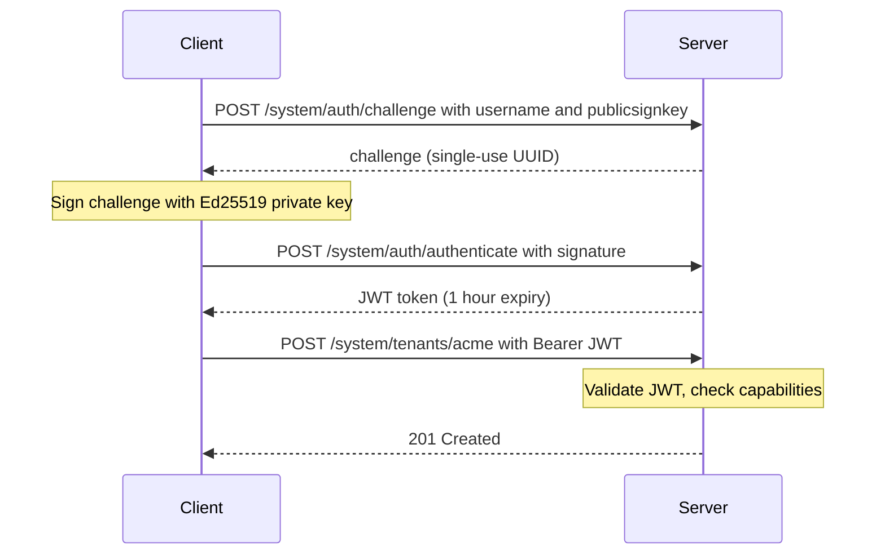

# MindooDB Server Security

## Overview

MindooDB Server uses a **capabilities-based system admin model** to control access to management endpoints (`/system/*`). Instead of a static API key, system admins authenticate via **Ed25519 challenge/response** and receive short-lived **JWTs**. Authorization is determined by a `config.json` file that maps route patterns to allowed principals.

For setup instructions, see [README-server.md](../README-server.md). This document covers the security architecture, design rationale, and operational details of the capabilities system.

## Why capabilities-based auth?

The security model was shaped by four design questions. Understanding the reasoning behind each decision makes it easier to configure and operate the system confidently.

### Why not a static API key?

A single shared secret (API key) gives anyone who obtains it full, unrestricted access. It cannot be scoped per-admin or per-route. If leaked, it must be rotated everywhere simultaneously -- every script, every CI pipeline, every operator's notes.

The capabilities model gives each admin their own **Ed25519 keypair**. Revoking one admin (by removing their public key from `config.json`) does not affect any other admin. Different admins can have different privilege levels -- one might manage all tenants while another can only create tenants with a specific prefix.

### Why Ed25519 challenge/response instead of password auth?

The server never receives the admin's password over the network for `/system/*` requests. The private key stays on the admin's machine, encrypted at rest with PBKDF2 + AES-GCM. Only a **signed challenge token** crosses the wire, proving possession of the key without revealing it.

This means a network attacker who intercepts the authentication exchange cannot replay it (challenges are single-use UUIDs) and gains no reusable credential. Even if the server is compromised, the attacker gets public keys -- not private keys or passwords.

### Why per-route authorization with wildcards?

Real deployments need different privilege levels:

- A **DevOps engineer** who can manage all tenants and server config
- A **team lead** who can only create tenants with a `team-*` prefix
- An **auditor** who can only list tenants (read-only)
- A **CI pipeline** that can only register one specific tenant

Wildcards make these delegation patterns expressible in a **single flat config file** without complex role hierarchies, RBAC tables, or a separate policy engine. The rule format (`METHOD:PATHPATTERN`) maps directly to HTTP semantics, so there is no abstraction gap between what you write in config and what happens at request time.

### Why runtime-updatable config?

In a running production system, restarting the server to add or revoke an admin is disruptive -- especially if the server is syncing data with other servers. `PUT /system/config` applies changes **instantly** with:

- **Automatic backup** -- a timestamped copy is created before overwriting
- **Self-lockout protection** -- the server rejects any config change that would remove the calling admin's own `PUT /system/config` access

## Config reference

### Format

The `config.json` file is loaded at server startup from `<dataDir>/config.json`. It can also be updated at runtime via `PUT /system/config` without restarting the server.

```json
{
  "capabilities": {
    "METHOD:PATHPATTERN": [
      { "username": "<admin-username>", "publicsignkey": "<ed25519-pem>" }
    ]
  }
}
```

### Rules

- **METHOD** -- HTTP method (`GET`, `POST`, `PUT`, `DELETE`, `PATCH`) or `ALL` to match any method
- **PATHPATTERN** -- URL path with optional `*` wildcard (e.g., `/system/*` matches all system routes)
- **username** -- the system admin's username (case-insensitive matching)
- **publicsignkey** -- the system admin's Ed25519 public key in PEM format

### Compact config (single super-admin)

The simplest setup -- one admin with access to everything:

```json
{
  "capabilities": {
    "ALL:/system/*": [
      { "username": "cn=sysadmin/o=myorg", "publicsignkey": "-----BEGIN PUBLIC KEY-----\n...\n-----END PUBLIC KEY-----" }
    ]
  }
}
```

This is what `npm run server:init` generates when you create a system admin during setup.

### Fine-grained config (multiple admins)

```json
{
  "capabilities": {
    "ALL:/system/*": [
      { "username": "cn=admin1/o=mindoo", "publicsignkey": "<key0>" }
    ],
    "POST:/system/tenants/*": [
      { "username": "cn=creator/o=someorg", "publicsignkey": "<key1>" },
      { "username": "cn=creator2/o=someorg", "publicsignkey": "<key2>" }
    ],
    "POST:/system/tenants/asingletenant1": [
      { "username": "cn=scoped/o=someorg", "publicsignkey": "<key6>" }
    ],
    "PUT:/system/tenants/company-*": [
      { "username": "cn=ops/o=company", "publicsignkey": "<key7>" }
    ],
    "GET:/system/tenants": [
      { "username": "cn=readonly/o=someorg", "publicsignkey": "<key3>" }
    ]
  }
}
```

What each rule grants:

- **`ALL:/system/*`** for `cn=admin1` -- **super-admin**: full unrestricted access to all system endpoints (tenant CRUD, trusted servers, config, sync management)
- **`POST:/system/tenants/*`** for `cn=creator` and `cn=creator2` -- **tenant creators**: can create any tenant, but cannot delete, update, list tenants, or manage server config
- **`POST:/system/tenants/asingletenant1`** for `cn=scoped` -- **scoped creator**: can only create the specific tenant `asingletenant1` (useful for bootstrapping a single customer environment from a CI pipeline)
- **`PUT:/system/tenants/company-*`** for `cn=ops` -- **company ops**: can update configuration of any tenant whose ID starts with `company-`, but cannot create or delete tenants
- **`GET:/system/tenants`** for `cn=readonly` -- **auditor**: can list all tenants but has no write access to any endpoint

## Capability matching semantics

On each `/system/*` request the server evaluates capabilities as follows:

1. Extract `method` and `path` from the HTTP request.
2. Validate the JWT signature and expiry; extract `username` and `publicsignkey` from the payload.
3. Find all capability rules where:
   - Rule method is `ALL` or matches the request method.
   - Rule path pattern matches the request path (`*` wildcard matches any remaining characters).
4. **Union** all principal entries from matching rules.
5. **Allow** if and only if any entry has **both** matching `username` AND `publicsignkey`.

Principal identity is the combination of username + publicsignkey. Two admins may share a username but have different keys -- they are treated as distinct principals.

## Authentication flow

System admin authentication uses a two-step Ed25519 challenge/response:



The challenge is a single-use UUID (v7) that expires after 5 minutes. The JWT contains both `sub` (username) and `publicsignkey` so the capability matcher can evaluate per-route access without a second lookup.

In Node you can use `MindooDBServerAdmin` (with your `CryptoAdapter`) instead of implementing the challenge/response flow manually. Besides `getConfig()` / `updateConfig()`, it also provides `grantSystemAdminAccess()`, `revokeSystemAdminAccess()`, and `findSystemAdminAccess()` helpers for common admin-delegation workflows. See the [programmatic usage example](../README-server.md#whats-next) in README-server.md.

## Updating config at runtime

Config changes can be applied at runtime via `PUT /system/config` (no restart needed) or by editing `config.json` on disk and restarting.

`PUT /system/config` accepts a full `ServerConfig` JSON body. Before overwriting, the server creates a timestamped backup (e.g., `config.2026-03-27T16-30-45.123Z.json`) in the same directory. Self-lockout protection rejects any config change that would remove the calling admin's `PUT /system/config` access.

Backup history is exposed read-only through:

- `GET /system/config/backups` to list known backup filenames with parsed timestamps
- `GET /system/config/backups/:backupFile` to read one validated historical snapshot

These endpoints stay inside the same `/system/*` security model: they still require a valid system-admin JWT and matching capability rules, and they only allow files that match the server's `config.<timestamp>.json` naming convention.

Capability checks use the new rules **immediately** after a successful update. In-flight JWTs remain valid (same HMAC secret), but removed principals will fail the capability check on their next request.

For demo-only environments, `config.json` may also contain the special wildcard principal `{ "username": "*", "publicsignkey": "*" }`, but only on `POST:/system/tenants/...` capability rules. That wildcard intentionally means "any username + any signing key may create tenants matching this rule." It is rejected for broader routes such as `GET /system/tenants`, `PUT /system/config`, or `ALL:/system/*`, so it cannot be used as a general-purpose admin bypass.

For the full API endpoint reference (all `/system/*` routes, sync endpoints, health checks), see the [API Reference](../README-server.md#api-reference) in README-server.md.

## Key rotation

To rotate a system admin's keys:

1. Generate a new keypair for the admin (e.g., using `createUserId`)
2. `GET /system/config` to fetch the current config
3. Add the new public key to the appropriate capability rules
4. `PUT /system/config` with the updated config (a backup is created automatically)
5. Verify the new key works
6. Remove the old public key and `PUT /system/config` again

To add a new admin:

1. Generate a keypair (e.g., via the `init` command or programmatically)
2. Add their public key to the desired capability rules via `PUT /system/config` or `MindooDBServerAdmin.grantSystemAdminAccess(...)`

To remove an admin:

1. Remove their public key from all capability rules via `PUT /system/config` or `MindooDBServerAdmin.revokeSystemAdminAccess(...)`
2. Existing JWTs for the removed admin will fail capability checks immediately

## Network restrictions and password handling

### Optional IP allowlist (`MINDOODB_ADMIN_ALLOWED_IPS`)

Independently of JWTs and `config.json`, you can set **`MINDOODB_ADMIN_ALLOWED_IPS`** to a comma-separated list of client IPs and IPv4/IPv6 CIDRs, for example `127.0.0.1,::1,10.0.0.0/8,192.168.1.0/24,2001:db8::/32`. When set, only those addresses may invoke **`/system/*`** (including `/system/auth/challenge` and `/system/auth/authenticate`). CIDRs such as `10.0.0.0/8`, `192.168.1.0/24`, or `2001:db8::/32` represent whole networks, not single hosts. Use `*` or leave unset for no IP filter. This complements cryptographic auth: it limits who can even attempt the system-admin HTTP surface. Behind a reverse proxy, configure Express **`trust proxy`** so `req.ip` reflects the real client.

### Server password: env vs file (`MINDOODB_SERVER_PASSWORD_FILE`)

The server identity password can be supplied as **`MINDOODB_SERVER_PASSWORD`** or, preferably, read from a path in **`MINDOODB_SERVER_PASSWORD_FILE`**. Using a file means the **plaintext password does not appear in the process environment** (which tools like `docker inspect` and `/proc/<pid>/environ` expose). The process still holds the secret in memory after reading.

### Docker secrets

**Docker Swarm secrets** (`docker secret create`, then referenced under `secrets:` in a **stack** / **swarm service** definition) are blobs stored **encrypted at rest on Swarm managers** and delivered to running tasks as **files**, usually under **`/run/secrets/<name>`**. They are **not** passed as `-e` values. That matches how MindooDB expects a password when you set **`MINDOODB_SERVER_PASSWORD_FILE=/run/secrets/your_secret_name`**: the container only needs an env var with the **path**, not the secret string.

**Docker Compose** can declare `secrets:` with a `file:` source (or Swarm-backed secrets when deploying to a swarm). The container still sees a **mounted file**, same integration pattern.

**Plain `docker run` (no Swarm)** has no separate "secret" API: the equivalent is a **read-only bind mount** of a host file into e.g. `/run/secrets/server_password` plus **`MINDOODB_SERVER_PASSWORD_FILE`** -- as in [README-server](../README-server.md) Docker examples. Functionally this is the same **file-based** delivery Swarm secrets use at runtime; Swarm adds **cluster storage, rotation workflows, and RBAC** around who can create secrets.

**Summary:** Docker secrets (in the Swarm sense) **help** by keeping the password **out of the image, build args, and container env block**, while still giving you a predictable file path for **`MINDOODB_SERVER_PASSWORD_FILE`**. They do **not** stop a **root** user inside the container from reading the mounted file or inspecting process memory.
