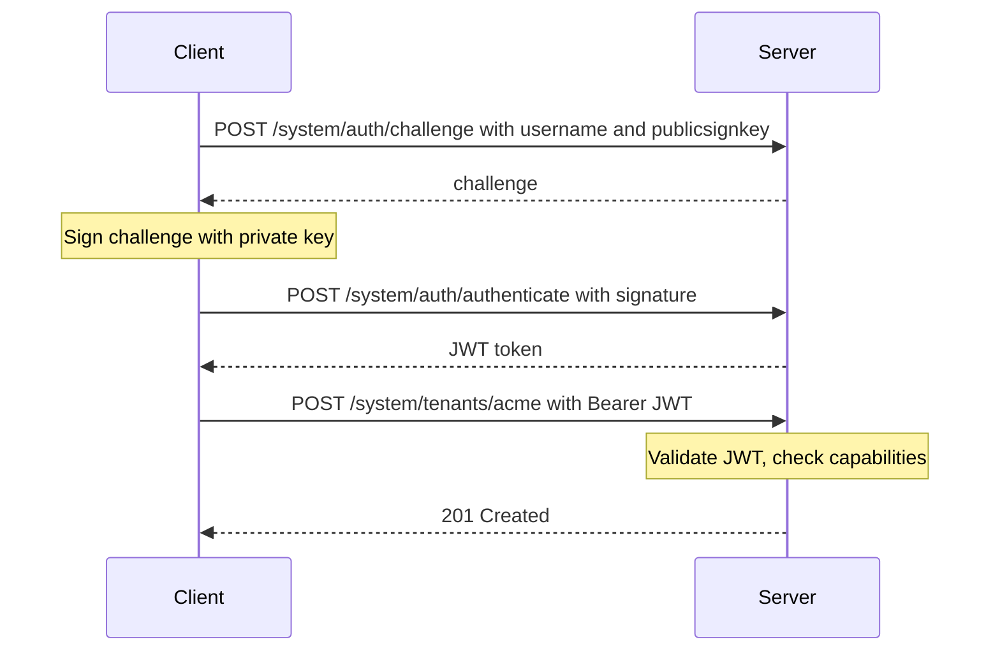

# MindooDB Server Security

## Overview

MindooDB Server uses a **capabilities-based system admin model** to control access to management endpoints (`/system/*`). Instead of a static API key, system admins authenticate via **Ed25519 challenge/response** and receive short-lived **JWTs**. Authorization is determined by a `config.json` file that maps route patterns to allowed principals.

### Benefits

- **No stealable API keys on the server** — authentication is based on cryptographic key pairs
- **Password-protected private keys** — admin identities are encrypted at rest with PBKDF2 + AES-GCM
- **Fine-grained per-route authorization** — restrict admins to specific HTTP methods and URL patterns
- **Multiple admin accounts** — different operators can have different privilege levels
- **Short-lived tokens** — JWTs expire after 1 hour, limiting the window of token misuse

### Optional network restriction (`MINDOODB_ADMIN_ALLOWED_IPS`)

Independently of JWTs and `config.json`, you can set **`MINDOODB_ADMIN_ALLOWED_IPS`** to a comma-separated list of client IPs and IPv4 CIDRs. When set, only those addresses may invoke **`/system/*`** (including `/system/auth/challenge` and `/system/auth/authenticate`). Use `*` or leave unset for no IP filter. This complements cryptographic auth: it limits who can even attempt the system-admin HTTP surface. Behind a reverse proxy, configure Express **`trust proxy`** so `req.ip` reflects the real client.

### Server password: env vs file (`MINDOODB_SERVER_PASSWORD_FILE`)

The server identity password can be supplied as **`MINDOODB_SERVER_PASSWORD`** or, preferably, read from a path in **`MINDOODB_SERVER_PASSWORD_FILE`**. Using a file means the **plaintext password does not appear in the process environment** (which tools like `docker inspect` and `/proc/<pid>/environ` expose). The process still holds the secret in memory after reading.

### Docker “secrets” — what they are and whether they help

**Docker Swarm secrets** (`docker secret create`, then referenced under `secrets:` in a **stack** / **swarm service** definition) are blobs stored **encrypted at rest on Swarm managers** and delivered to running tasks as **files**, usually under **`/run/secrets/<name>`**. They are **not** passed as `-e` values. That matches how MindooDB expects a password when you set **`MINDOODB_SERVER_PASSWORD_FILE=/run/secrets/your_secret_name`**: the container only needs an env var with the **path**, not the secret string.

**Docker Compose** can declare `secrets:` with a `file:` source (or Swarm-backed secrets when deploying to a swarm). The container still sees a **mounted file**, same integration pattern.

**Plain `docker run` (no Swarm)** has no separate “secret” API: the equivalent is a **read-only bind mount** of a host file into e.g. `/run/secrets/server_password` plus **`MINDOODB_SERVER_PASSWORD_FILE`** — as in [README-server](../README-server.md) Docker examples. Functionally this is the same **file-based** delivery Swarm secrets use at runtime; Swarm adds **cluster storage, rotation workflows, and RB** around who can create secrets.

**Summary:** Docker secrets (in the Swarm sense) **help** by keeping the password **out of the image, build args, and container env block**, while still giving you a predictable file path for **`MINDOODB_SERVER_PASSWORD_FILE`**. They do **not** stop a **root** user inside the container from reading the mounted file or inspecting process memory.

## Quick Start

### 1. Initialize the server

```bash
MINDOODB_SERVER_PASSWORD=your-secure-password \
  node dist/node/server/serverinit.js --name server1 --data-dir /var/lib/mindoodb
```

When prompted, create a system admin. This generates:
- `server-identity.json` — the server's keypair (encrypted)
- `config.json` — capabilities configuration with the admin's public key
- `system-admin-<username>.identity.json` — the admin's keypair (password-encrypted)

### 2. Start the server

```bash
MINDOODB_SERVER_PASSWORD=your-secure-password \
  node dist/node/server/server.js --data-dir /var/lib/mindoodb
```

### 3. Use MindooDBServerAdmin to manage the server

```typescript
import { MindooDBServerAdmin, NodeCryptoAdapter } from "mindoodb";
import { readFileSync } from "fs";

const adminIdentity = JSON.parse(
  readFileSync("system-admin-cn-sysadmin-o-myorg.identity.json", "utf-8")
);

const admin = new MindooDBServerAdmin({
  serverUrl: "http://localhost:1661",
  systemAdminUser: adminIdentity,
  systemAdminPassword: "your-admin-password",
  cryptoAdapter: new NodeCryptoAdapter(),
});

// List tenants
const tenants = await admin.listTenants();

// Register a tenant
await admin.registerTenant("my-tenant", {
  adminSigningPublicKey: "...",
  adminEncryptionPublicKey: "...",
});
```

In the browser or React Native, use your package’s browser/RN entry and pass a platform `CryptoAdapter` (for example `createCryptoAdapter()` from `mindoodb/browser`); the `MindooDBServerAdmin` API is the same as in Node.

## Config Reference

### Format

The `config.json` file is loaded at server startup from `--config <path>` or `<dataDir>/config.json`. It can also be updated at runtime via `PUT /system/config` without restarting the server.

```json
{
  "capabilities": {
    "METHOD:PATHPATTERN": [
      { "username": "<admin-username>", "publicsignkey": "<ed25519-pem>" }
    ]
  }
}
```

### Rules

- **METHOD** — HTTP method (`GET`, `POST`, `PUT`, `DELETE`, `PATCH`) or `ALL` to match any method
- **PATHPATTERN** — URL path with optional `*` wildcard (e.g., `/system/*` matches all system routes)
- **username** — the system admin's username (case-insensitive matching)
- **publicsignkey** — the system admin's Ed25519 public key in PEM format

### Compact Config (single super-admin)

```json
{
  "capabilities": {
    "ALL:/system/*": [
      { "username": "cn=sysadmin/o=myorg", "publicsignkey": "-----BEGIN PUBLIC KEY-----\n...\n-----END PUBLIC KEY-----" }
    ]
  }
}
```

### Full Config (fine-grained rules)

```json
{
  "capabilities": {
    "ALL:/system/*": [
      { "username": "cn=admin1/o=mindoo", "publicsignkey": "<key0>" }
    ],
    "POST:/system/tenants/*": [
      { "username": "cn=creator/o=someorg", "publicsignkey": "<key1>" },
      { "username": "cn=creator2/o=someorg", "publicsignkey": "<key2>" }
    ],
    "POST:/system/tenants/asingletenant1": [
      { "username": "cn=scoped/o=someorg", "publicsignkey": "<key6>" }
    ],
    "PUT:/system/tenants/company-*": [
      { "username": "cn=ops/o=company", "publicsignkey": "<key7>" }
    ],
    "GET:/system/tenants": [
      { "username": "cn=readonly/o=someorg", "publicsignkey": "<key3>" }
    ]
  }
}
```

## Capability Matching Semantics

On each `/system/*` request:

1. Extract `method` and `path` from the HTTP request.
2. Validate the JWT signature and expiry; extract `username` and `publicsignkey` from the payload.
3. Find all capability rules where:
   - Rule method is `ALL` or matches the request method.
   - Rule path pattern matches the request path (`*` wildcard matches any remaining characters).
4. **Union** all principal entries from matching rules.
5. **Allow** if and only if any entry has **both** matching `username` AND `publicsignkey`.

Principal identity is the combination of username + publicsignkey (two admins may share a username but have different keys — they are treated as distinct principals).

## Authentication Flow



## API Endpoints

### Authentication

| Method | Path | Auth | Description |
|--------|------|------|-------------|
| POST | `/system/auth/challenge` | None | Request a challenge |
| POST | `/system/auth/authenticate` | None | Submit signed challenge |

### Tenant Management

| Method | Path | Auth | Description |
|--------|------|------|-------------|
| GET | `/system/tenants` | JWT | List all tenants |
| POST | `/system/tenants/:tenantId` | JWT | Create a tenant |
| PUT | `/system/tenants/:tenantId` | JWT | Update tenant config |
| DELETE | `/system/tenants/:tenantId` | JWT | Remove a tenant |

### Trusted Server Management

| Method | Path | Auth | Description |
|--------|------|------|-------------|
| GET | `/system/trusted-servers` | JWT | List trusted servers |
| POST | `/system/trusted-servers` | JWT | Add a trusted server |
| DELETE | `/system/trusted-servers/:serverName` | JWT | Remove a trusted server |

### Tenant Creation Key Management

| Method | Path | Auth | Description |
|--------|------|------|-------------|
| GET | `/system/tenant-api-keys` | JWT | List creation keys |
| POST | `/system/tenant-api-keys` | JWT | Create a creation key |
| DELETE | `/system/tenant-api-keys/:name` | JWT | Remove a creation key |

### Per-Tenant Sync Server Management

| Method | Path | Auth | Description |
|--------|------|------|-------------|
| GET | `/system/tenants/:tenantId/sync-servers` | JWT | List sync servers |
| POST | `/system/tenants/:tenantId/sync-servers` | JWT | Add a sync server |
| DELETE | `/system/tenants/:tenantId/sync-servers/:serverName` | JWT | Remove a sync server |
| POST | `/system/tenants/:tenantId/trigger-sync` | JWT | Trigger sync |

### Server Config Management

| Method | Path | Auth | Description |
|--------|------|------|-------------|
| GET | `/system/config` | JWT | Read the current server config |
| PUT | `/system/config` | JWT | Replace the server config (hot-swap, no restart needed) |

`PUT /system/config` accepts a full `ServerConfig` JSON body. Before overwriting, the server creates a timestamped backup (e.g., `config.2026-03-27T16-30-45.123Z.json`) in the same directory. Self-lockout protection rejects any config change that would remove the calling admin's `PUT /system/config` access.

Capability checks use the new rules immediately after a successful update. In-flight JWTs remain valid (same HMAC secret), but removed principals will fail the capability check on their next request.

## Key Rotation

Config changes can be applied at runtime via `PUT /system/config` (no restart needed) or by editing `config.json` on disk and restarting.

To rotate a system admin's keys:

1. Generate a new keypair for the admin (e.g., using `createUserId`)
2. `GET /system/config` to fetch the current config
3. Add the new public key to the appropriate capability rules
4. `PUT /system/config` with the updated config (a backup is created automatically)
5. Verify the new key works
6. Remove the old public key and `PUT /system/config` again

To add a new admin:

1. Generate a keypair (e.g., via the `init` command or programmatically)
2. Add their public key to the desired capability rules via `PUT /system/config`

To remove an admin:

1. Remove their public key from all capability rules via `PUT /system/config`
2. Existing JWTs for the removed admin will fail capability checks immediately

## Migration from API Key Auth

The old `MINDOODB_ADMIN_API_KEY` environment variable and `/admin/*` routes have been removed. All admin routes are now under `/system/*` and require JWT-based challenge/response authentication.

| Old | New |
|-----|-----|
| `MINDOODB_ADMIN_API_KEY` env var | `config.json` capabilities |
| `X-API-Key` header | `Authorization: Bearer <JWT>` |
| `POST /admin/register-tenant` | `POST /system/tenants/:tenantId` |
| `GET /admin/tenants` | `GET /system/tenants` |
| `DELETE /admin/tenants/:tenantId` | `DELETE /system/tenants/:tenantId` |
| `GET /admin/trusted-servers` | `GET /system/trusted-servers` |
| `/:tenantId/admin/trigger-sync` | `POST /system/tenants/:tenantId/trigger-sync` |
| `PublishToServerOptions.adminApiKey` | `PublishToServerOptions.systemAdminUser` + `.systemAdminPassword` |
