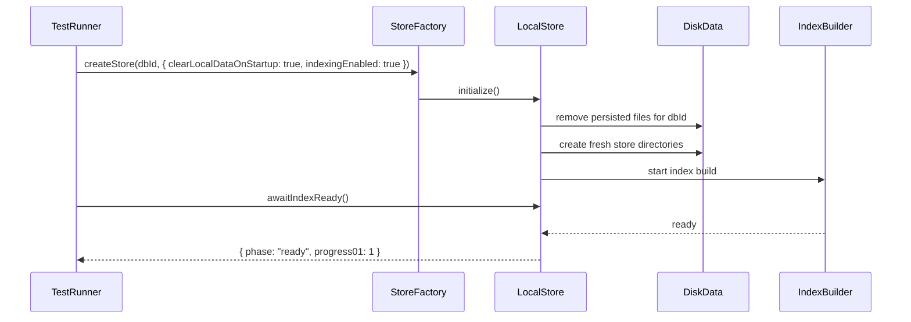
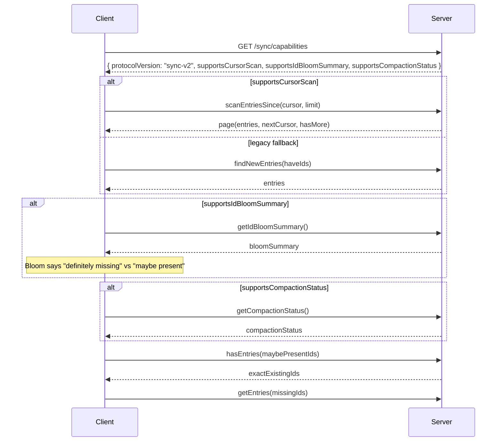

# MindooDB Architecture Specification

## Overview

MindooDB is an **End-to-End Encrypted, Offline-first Sync Database** for secure, distributed document storage. Clients create tenants locally and synchronize through content-addressed stores containing cryptographically signed and encrypted document histories.

**Design Principles:**
- No central authority required—tenants created entirely client-side
- All operations cryptographically verified through digital signatures
- Access control enforced through encryption keys distributed offline
- Trust established through cryptographic proofs, not server authentication

## Architecture at a Glance

```
┌─────────────────────────────────────────────────────────────────────────┐
│                              TENANT                                     │
│  ┌──────────────────────────────────────────────────────────────────┐   │
│  │ Directory Database (admin-only)                                  │   │
│  │  • User registrations (signed by admin)                          │   │
│  │  • Group memberships                                             │   │
│  │  • Tenant/DB settings                                            │   │
│  └──────────────────────────────────────────────────────────────────┘   │
│                                                                         │
│  ┌─────────────────┐  ┌─────────────────┐  ┌─────────────────┐          │
│  │   Database A    │  │   Database B    │  │   Database C    │   ...    │
│  │  (documents +   │  │  (documents +   │  │  (documents +   │          │
│  │   attachments)  │  │   attachments)  │  │   attachments)  │          │
│  └─────────────────┘  └─────────────────┘  └─────────────────┘          │
│                                                                         │
│  Keys: default encryption key, admin signing key, admin encryption key  │
└─────────────────────────────────────────────────────────────────────────┘
```

---

## 1. Tenants

A **tenant** represents an organization or group sharing document access.

**Properties:**
- Contains one or more MindooDB instances (databases)
- Has a mandatory **directory database** for user registry and settings
- Created entirely client-side (no server registration)
- Tenant creator becomes the initial administrator

**Keys:**

| Key | Type | Purpose |
|-----|------|---------|
| **Default Encryption Key** (`default`) | AES-256 (symmetric) | Default encryption when no other key specified |
| **Administration Signing Key** | Ed25519 (asymmetric) | Signs user registrations & admin operations |
| **Administration Encryption Key** | RSA-OAEP (asymmetric) | Encrypts sensitive admin data (usernames in directory) |

---

## 2. Users

Users are identified by cryptographic key pairs and registered in the tenant directory.

**Key Pairs:**

| Key | Type | Purpose |
|-----|------|---------|
| **Signing Key** | Ed25519 | Signs document changes (proves authorship) |
| **Encryption Key** | RSA-OAEP (3072-bit) | Encrypts local KeyBag storage |

**Key Derivation:**
Both private keys are encrypted with a single password using KDF with different salts:
- Signing key: salt = `"signing"`
- Encryption key: salt = `"encryption"`
- Tenant symmetric keys: salt = `"tenant:v1:${tenantId}"`
- Document symmetric keys: salt = `"doc:v1:${keyId}"`

**Registration Flow (Join Request / Response):**

New users join a tenant through a three-step handshake that ensures private keys never leave the originating device:

1. User generates keys locally with `createUserId` and creates a join request containing only public keys (`createJoinRequest`)
2. User sends the join request to the administrator via any channel (it contains no secrets)
3. Administrator approves the request (`approveJoinRequest`), which registers the user in the directory (signed with admin key) and produces a join response containing encrypted symmetric keys
4. Administrator sends the join response and communicates the one-time share password through a separate secure channel
5. User decrypts the keys and opens the tenant (`joinTenant`)
6. Registration syncs to all clients/servers; user can now make trusted changes

See [Section 7: Data Flows](#7-data-flows) for complete code examples.

**Revocation:**
Administrators call `revokeUser()` to add a revocation record. Revoked users:
- Cannot sync with peers/servers
- Future changes are rejected (untrusted signature)
- Previously-accessed data remains readable (E2E encryption trade-off)

**Groups:**
- Defined by administrators in the directory database
- Support nesting (groups containing groups)
- Case-insensitive names (normalized to lowercase)
- Merged automatically when offline clients sync conflicting group docs

---

## 3. Documents

Each document is an [Automerge](https://automerge.org/) CRDT stored in a content-addressed store.

**Properties:**
- Real-time collaborative editing with automatic conflict resolution
- Every change is **signed** (proves authorship) and **encrypted** (protects content)
- Complete history preserved (append-only)
- Time travel: reconstruct any historical state

**Change Storage:**

```typescript
interface StoreEntryMetadata {
  entryType: StoreEntryType;      // doc_create | doc_change | doc_snapshot | doc_delete | attachment_chunk
  id: string;                     // Entry identity (primary key; used in APIs/sync/dependency graphs)
  contentHash: string;            // SHA-256(encryptedData) for payload deduplication/integrity (not the entry ID)
  docId: string;                  // Document ID
  dependencyIds: string[];        // Parent entry IDs (DAG/chaining)
  createdAt: number;              // Unix timestamp (ms)
  createdByPublicKey: string;     // Author's Ed25519 public key (PEM)
  decryptionKeyId: string;        // "default" or named key ID
  signature: Uint8Array;          // Ed25519 signature over encrypted data
  originalSize: number;           // Plaintext size before encryption (bytes)
  encryptedSize: number;          // Encrypted payload size (bytes)
}

interface StoreEntry extends StoreEntryMetadata {
  encryptedData: Uint8Array;      // Encrypted payload (IV/tag embedded)
}
```

**Store entry ID formats:**
- **Document entries** (`doc_create|doc_change|doc_snapshot|doc_delete`): `<docId>_d_<depsFingerprint>_<automergeHash>`
  - `depsFingerprint`: first 8 hex chars of SHA-256 over the **sorted Automerge dependency hashes** joined by commas; `"0"` if there are no dependencies.
  - **Parent linkage**:
    - `depsFingerprint` commits the *set* of Automerge deps into the ID (hash-of-dep-set)
    - `dependencyIds` carries the actual parent entry IDs
- **Attachment chunks** (`attachment_chunk`): `<docId>_a_<fileUuid7>_<base62ChunkUuid7>`
  - `dependencyIds` is `[prevChunkId]` (or `[]` for the first chunk), forming a chain suitable for `resolveDependencies()`.

**Performance Optimization:**
- **Snapshots** generated periodically to avoid replaying full history
- Loading a document: load latest snapshot → apply changes since snapshot
- Snapshots stored as `doc_snapshot` entries

---

## 4. Content-Addressed Store

The unified storage and sync mechanism for document changes and attachment chunks.

**Characteristics:**
- Entries identified by structured **entry IDs** (`id`) with payload deduplication via `contentHash` (SHA-256 of `encryptedData`)
- **Append-only**: entries never modified or deleted
- **Cryptographically chained**: like a blockchain for integrity
- Automatic deduplication

**Entry Types:**
| Type | Description |
|------|-------------|
| `doc_create` | Document creation (first Automerge change) |
| `doc_change` | Document modification |
| `doc_snapshot` | Performance snapshot |
| `doc_delete` | Deletion tombstone |
| `attachment_chunk` | File attachment chunk |

**Core API:**

```typescript
interface ResolveOptions {
  stopAtEntryType?: StoreEntryType; // e.g. "doc_snapshot"
  maxDepth?: number;
  includeStart?: boolean;           // default true
}

interface OpenStoreOptions {
  clearLocalDataOnStartup?: boolean; // test bootstrap: wipe local data before init
  basePath?: string;                 // persistent stores only (node on-disk, future adapters)
  indexingEnabled?: boolean;         // true by default; false forces scan-based mode
  metadataSegmentCompactionMinFiles?: number; // default 32; <= 0 disables compaction
  metadataSegmentCompactionMaxBytes?: number; // default disabled; <= 0 disables byte trigger
}

interface StoreIndexBuildStatus {
  phase: "idle" | "building" | "ready";
  indexingEnabled: boolean;
  progress01: number;
}

interface StoreCompactionStatus {
  enabled: boolean;
  compactionMinFiles: number;
  compactionMaxBytes: number;
  totalCompactions: number;
  totalCompactedFiles: number;
  totalCompactedBytes: number;
  totalCompactionDurationMs: number;
  lastCompactionAt: number | null;
  lastCompactedFiles: number;
  lastCompactedBytes: number;
  lastCompactionDurationMs: number;
}

interface ContentAddressedStore {
  getId(): string;

  // Write
  putEntries(entries: StoreEntry[]): Promise<void>;
  
  // Read
  getEntries(ids: string[]): Promise<StoreEntry[]>;
  hasEntries(ids: string[]): Promise<string[]>;
  getAllIds(): Promise<string[]>;
  
  // Sync
  findNewEntries(knownIds: string[]): Promise<StoreEntryMetadata[]>;
  findNewEntriesForDoc(knownIds: string[], docId: string): Promise<StoreEntryMetadata[]>;
  findEntries(type: StoreEntryType, creationDateFrom: number | null, creationDateUntil: number | null): Promise<StoreEntryMetadata[]>;
  
  // DAG traversal
  resolveDependencies(startId: string, options?: ResolveOptions): Promise<string[]>;
  
  // GDPR
  purgeDocHistory(docId: string): Promise<void>;

  // Optional local lifecycle
  clearAllLocalData?(): Promise<void>;

  // Optional indexing readiness
  awaitIndexReady?(options?: { timeoutMs?: number }): Promise<StoreIndexBuildStatus>;
  getIndexBuildStatus?(): StoreIndexBuildStatus;
  getCompactionStatus?(): Promise<StoreCompactionStatus>;
}
```

### Startup Reset and Index Readiness

To support deterministic integration tests and benchmark baselines, local persistent stores can
be configured with `clearLocalDataOnStartup: true`. This wipes only local persisted state for that
store instance before it becomes readable/writable.

`awaitIndexReady()` allows callers to block until indexes are available, while still permitting
implementations to do fast startup plus background index build. `indexingEnabled: false` forces
scan-based behavior so tests can validate correctness in both indexed and non-indexed modes.

For process-crash resilience, persistent stores use atomic temp-file rename for metadata/content
writes and maintain index state as an appendable metadata-segment stream plus optional snapshot
compaction. On startup, stores replay segments, verify coverage against entry files, and if index
state is stale or inconsistent (for example, crash between entry write and segment/snapshot
persist), they rebuild index state from entry files before serving reads.

To keep startup replay cost bounded, stores SHOULD compact segment logs after a configurable
threshold (for example segment-count or total-bytes), by writing a fresh snapshot and deleting only
segments known to be represented in that snapshot.

### Stress and Soak Validation Matrix

The Node.js on-disk store includes an opt-in stress matrix to validate durability, recovery, and
high-volume behavior beyond regular unit tests:

- `npm run test:stress` runs stress scenarios with moderate load.
- `npm run test:soak` runs long soak scenarios with larger volumes/timeouts.

Covered scenarios:

1. High-volume append + restart + cursor scan consistency.
2. Concurrent writer instances against one store path.
3. Fault-injection loop (stale snapshot and stale-segment corruption) with restart recovery checks.

These tests are intentionally opt-in so regular CI remains fast, while release hardening can run the
full matrix before shipping.

For a full implementation deep-dive of the Node.js persistent store (on-disk structure, write and
recovery flow, compaction, and performance characteristics), see:
`docs/on-disk-content-addressed-store.md`.



### Sync Capability Negotiation and Bloom Optimization

MindooDB sync endpoints can advertise feature support via `GET /sync/capabilities`.
Clients use this to select the fastest compatible path:

- `supportsCursorScan`: use cursor-based metadata paging (`scanEntriesSince`)
- `supportsIdBloomSummary`: pre-filter IDs via Bloom summary before exact `hasEntries` checks
- `supportsCompactionStatus`: fetch remote compaction telemetry (`getCompactionStatus`) for observability

Bloom summaries are an optimization only. Final transfer planning still runs exact existence checks,
so correctness does not depend on probabilistic matching.



**Two-Store Architecture:**
Separate stores for documents and attachments enable flexible deployment:

```typescript
const db = new MindooDB(tenant, docStore, attachmentStore);
```

Use cases:
- Keep docs local, attachments in cloud
- Different sync strategies per store type
- Or use the same store for simple deployments
- Future backends can implement the same store contract (e.g. IndexedDB in browsers)

---

## 5. Encryption Model

### Default Encryption

Documents are encrypted with the `default` key when no other key is specified:
- All registered users can decrypt
- Key ID: `"default"`
- Suitable for general tenant-wide access

### Named Key Encryption (Fine-Grained Access)

Documents encrypted with named symmetric keys for restricted access:
- Only users with the key can decrypt
- Keys distributed offline (email, phone, in-person)
- Supports key rotation (multiple versions per ID, newest tried first)

### Key Distribution Flow

1. Admin creates named key: `createDocEncryptionKey(keyId, password)`
2. Encrypted key sent to authorized users (email, shared folder)
3. Password communicated via secure channel (phone, in-person)
4. User imports: `keyBag.decryptAndImportKey("doc", keyId, encryptedKey, password)`
5. User can now decrypt documents using that key

### KeyBag

Canonical local storage for tenant and document symmetric keys:
- Encrypted on disk using user's encryption key password (PBKDF2)
- Typed API: `get(type, id)`, `set(type, id, key, createdAt)`, `decryptAndImportKey(type, id, encryptedKey, password)`, `encryptAndExportKey(type, id, password)`
- Type/id pairs:
  - tenant default key: `("tenant", tenantId)`
  - named document key: `("doc", keyId)`

### Server Access Control ($publicinfos Key)

Servers need to verify users without accessing business data. The `$publicinfos` key enables this:

**Problem:** Servers must check if a signing key belongs to a trusted user before accepting operations.

**Solution:** Directory access-control documents use `$publicinfos` encryption:
- User registration (`grantaccess`)
- User revocation (`revokeaccess`)  
- Group membership (`group`)

**Privacy-Preserving Identity:**
```typescript
// Directory stores usernames as:
username_hash: string;      // SHA-256(lowercase username) - for lookups
username_encrypted: string; // RSA-encrypted with admin key - only admin can read
```

This allows servers to validate signing keys **without knowing actual usernames**.

---

## 6. Security Model

### Trust Hierarchy

```
┌─────────────────────┐
│  Administration Key │  ← Root of Trust
│  (Ed25519 Keypair)  │
└──────────┬──────────┘
           │ signs
           ▼
┌─────────────────────┐
│  Directory Database │  ← Admin-only, source of truth
│  (user registry)    │
└──────────┬──────────┘
           │ contains
           ▼
┌─────────────────────┐
│  User Registrations │  ← Signed by admin key
│  (public keys)      │
└──────────┬──────────┘
           │ trusts
           ▼
┌─────────────────────┐
│   Registered Users  │  ← Can sign documents in other DBs
└─────────────────────┘
```

**Key Points:**
1. **Directory is admin-only**: Only admin-signed entries accepted
2. **No recursion**: Admin key trusted without directory lookup
3. **Signer validation**: Changes in other DBs validated against directory

### Cryptographic Guarantees

| Mechanism | Guarantee |
|-----------|-----------|
| **Signatures** (Ed25519) | Authenticity (who created it) + Integrity (not tampered) |
| **Encryption** (AES-256-GCM) | Confidentiality (only key holders can read) |
| **Hash chaining** | Tamperproofness (modifications break the chain) |

### Access Control Summary

| Operation | Enforced By |
|-----------|-------------|
| User registration | Admin signature required |
| Document creation | Must have encryption key |
| Document modification | Must have signing key (registered user) + encryption key |
| Document reading | Must have decryption key |

---

## 7. Data Flows

### Creating a Tenant

The `createTenant` convenience method orchestrates the full tenant bootstrap in a single call. It generates the admin and user identities, creates the KeyBag with all required symmetric keys, opens the tenant, and registers the user in the directory.

```typescript
const { tenant, adminUser, appUser, keyBag } = await factory.createTenant({
  tenantId: "acme",
  adminName: "cn=admin/o=acme",
  adminPassword: "admin-pw",
  userName: "cn=alice/o=acme",
  userPassword: "alice-pw",
});
```

Under the hood, this performs five steps:

1. Creates the admin identity (Ed25519 signing key + RSA-OAEP encryption key)
2. Creates the regular user identity (same key types)
3. Creates a KeyBag containing the tenant key (AES-256) and the `$publicinfos` key (AES-256)
4. Opens the tenant using the admin's public keys and the user's private identity
5. Registers the regular user in the admin-signed directory database

For advanced use cases where you need finer control over each step, `openTenant` remains available and accepts individual keys and a pre-configured KeyBag directly.

### Publishing to a Server

Once a tenant is created locally, it can be registered on a MindooDB sync server. The server receives only public keys and the `$publicinfos` key — never private keys or plaintext content.

```typescript
await tenant.publishToServer("https://sync.example.com", {
  registerUsers: [factory.toPublicUserId(appUser)],
});
```

The server uses the `$publicinfos` key to read the directory database and validate incoming sync requests. Pre-registering users is optional but allows them to sync immediately.

### Inviting a User (Join Request / Response)

MindooDB uses a three-step handshake to invite new users. The new user generates keys locally (private keys never leave the device), shares a join request containing only public keys, and the admin responds with encrypted symmetric keys protected by a one-time password.

**Step 1 — New user creates a join request:**

```typescript
const bob = await factory.createUserId("cn=bob/o=acme", "bob-pw");
const joinRequest = factory.createJoinRequest(bob, { format: "uri" });
// → "mdb://join-request/eyJ2IjoxLCJ1c2Vy..."
```

**Step 2 — Admin approves and creates a join response:**

```typescript
const joinResponse = await tenant.approveJoinRequest(joinRequest, {
  adminSigningKey: adminUser.userSigningKeyPair.privateKey,
  adminPassword: "admin-pw",
  sharePassword: "one-time-secret",
  serverUrl: "https://sync.example.com",
  format: "uri",
});
// → "mdb://join-response/eyJ2IjoxLCJ0ZW5h..."
```

This registers the new user in the directory and encrypts the tenant key and `$publicinfos` key with the `sharePassword`. The admin sends the join response URI through any channel (email, chat, QR code) and communicates the share password separately through a secure channel (phone, in person).

**Step 3 — New user joins the tenant:**

```typescript
const { tenant: bobTenant } = await factory.joinTenant(joinResponse, {
  user: bob,
  password: "bob-pw",
  sharePassword: "one-time-secret",
});
```

The `mdb://` URIs are base64url-encoded JSON payloads with a version field for forward compatibility. The join request contains `{ v, username, signingPublicKey, encryptionPublicKey }`. The join response contains `{ v, tenantId, adminSigningPublicKey, adminEncryptionPublicKey, serverUrl, encryptedTenantKey, encryptedPublicInfosKey }`.

### Document Lifecycle

```typescript
// Create
const doc = await db.createDocument();  // Uses "default" key
// or
const doc = await db.createEncryptedDocument("confidential-key");

// Modify
await db.changeDoc(doc, async (d) => {
  d.getData().title = "Project X";
});
// System: sign with user's key → encrypt with doc's key → store entry

// Read
const loaded = await db.getDocument(docId);
console.log(loaded.getData());
```

### Synchronization

Connecting to a server creates a remote store that handles authentication, encryption, and capability negotiation automatically:

```typescript
const remote = await tenant.connectToServer("https://sync.example.com", "todos");

// Push local changes to the server
await db.pushChangesTo(remote);

// Pull remote changes into the local store
await db.pullChangesFrom(remote);

// Merge pulled changes into in-memory documents
await db.syncStoreChanges();
```

For advanced scenarios, the low-level store-to-store API is also available:

```typescript
const localIds = await localStore.getAllIds();
const missing = await remoteStore.findNewEntries(localIds);
const entries = await remoteStore.getEntries(missing.map(m => m.id));
await localStore.putEntries(entries);
```

### Settings Management

Tenant and database settings stored in directory as special documents:

```typescript
// Read settings
const tenantSettings = await directory.getTenantSettings();
const dbSettings = await directory.getDBSettings("invoices");

// Update settings (admin only)
await directory.changeTenantSettings(
  (doc) => { doc.getData().maxAttachmentSize = 100_000_000; },
  adminKey,
  adminPassword
);
```

---

## 8. Attachments

Files attached to documents, stored in chunks.

**Features:**
- Chunked (256KB default) for efficient streaming
- Encrypted with same key as parent document
- Deterministic IV for tenant-wide deduplication
- Separate store enables flexible deployment

**API:**

```typescript
// Write (within changeDoc callback)
await doc.addAttachment(fileData, "report.pdf", "application/pdf");
await doc.addAttachmentStream(asyncIterable, "video.mp4", "video/mp4");
// For logs, adds chunks to existing attachment:
await doc.appendToAttachment(attachmentId, moreData);
// Delete attachment reference from document 
await doc.removeAttachment(attachmentId);

// Read (anywhere)
const attachments = doc.getAttachments();
const data = await doc.getAttachment(attachmentId);
const range = await doc.getAttachmentRange(attachmentId, 0, 1024);
for await (const chunk of doc.streamAttachment(attachmentId)) { ... }
```

See: [Attachments Documentation](./attachments.md)

---

## 9. Performance

### Snapshots

Automerge documents accumulate changes over time. Snapshots prevent performance degradation:

1. System generates periodic snapshots (`doc_snapshot` entries)
2. Loading: fetch latest snapshot → apply only subsequent changes
3. `resolveDependencies()` stops at snapshots via `stopAtEntryType`

### Incremental Sync

- `findNewEntries()` returns only entries the requester doesn't have
- Small ID list comparison enables efficient sync over slow connections
- Bulk operations (`getEntries`, `putEntries`) reduce round-trips

### Incremental Queries

```typescript
// First query: get all documents
let cursor: ProcessChangesCursor | null = null;
for await (const { doc, cursor: currentCursor } of db.iterateChangesSince(cursor)) {
  // Process document
  cursor = currentCursor; // Save cursor for resuming
}

// Subsequent queries: only changed documents
for await (const { doc, cursor: currentCursor } of db.iterateChangesSince(cursor)) {
  // Process changed documents
  cursor = currentCursor;
}
```

---

## 10. Limitations & Trade-offs

### Revocation Limitations

Due to append-only architecture:
- ✅ Revoked users cannot decrypt **future** changes
- ⚠️ Revoked users retain access to **previously decrypted** data that is locally synced
- ✅ Revoked users' **future changes** are rejected and sync with clients and servers is blocked

**Mitigations:**
- Use named keys for sensitive documents (smaller blast radius)
- Rotate keys when users leave
- Accept that historical access cannot be retroactively revoked

See: [Revocation Timestamp Protection](./revocation-timestamp-protection.md)

### Key Management Complexity

Multiple keys per user (signing, encryption, named symmetric keys) require:
- Secure distribution of named keys
- Coordination for key rotation

**Mitigations:**
- Single password unlocks all keys (KDF with different salts)
- KeyBag provides unified key storage
- Clear key ID system

---

## 11. Use Cases

| Use Case | How MindooDB Helps |
|----------|-------------------|
| **Multi-Tenant SaaS** | Each customer is a tenant with encrypted data |
| **Collaborative Editing** | Automerge CRDTs + signed changes |
| **Secure File Sharing** | Named keys for need-to-know access |
| **Audit-Compliant Systems** | Append-only, signed, timestamped history |
| **Offline-First Apps** | Full functionality without network |

---

## 12. Future Enhancements

- **Session Persistence API**: Single-call `exportSession` / `restoreSession` to persist and restore user identity, KeyBag, and tenant metadata as one encrypted blob
- **Forward Secrecy**: Key rotation preventing future decryption
- **Key Escrow**: Secure key recovery mechanisms
- **Advanced Access Control**: Role-based access with key hierarchies
- **Attachment Lazy Loading**: Fetch chunks on-demand from remote peers
- **LRU Caching**: Size-based local cache for attachments
