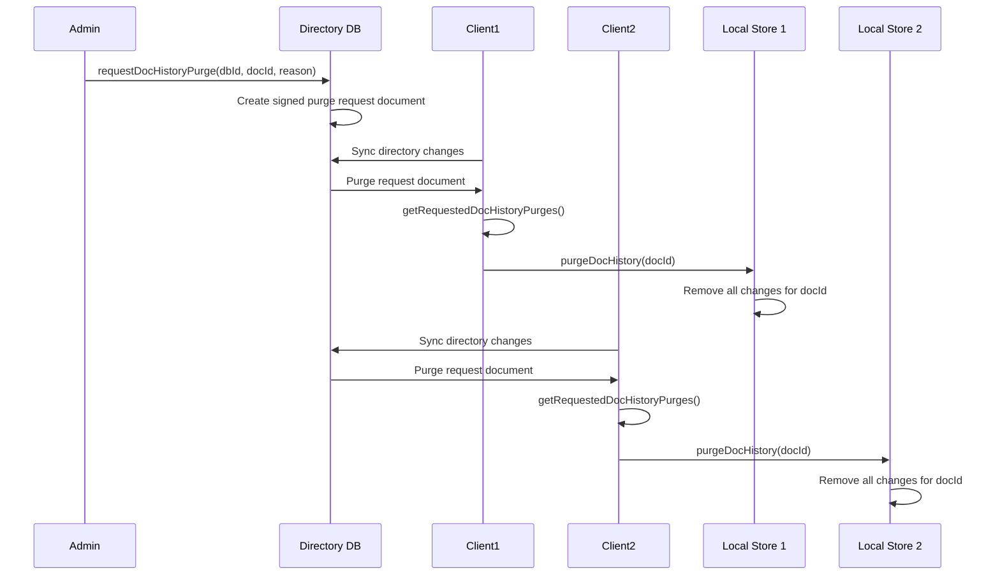

# Compliance Patterns

## Overview

Regulatory compliance requires complete audit trails, data protection, access controls, and retention policies. MindooDB's append-only architecture, end-to-end encryption, and cryptographic integrity make it ideal for meeting compliance requirements.

## Key Regulations

### GDPR (General Data Protection Regulation)

**Requirements:**
- Right to be forgotten
- Data portability
- Access logging
- Data protection by design

### HIPAA (Health Insurance Portability and Accountability Act)

**Requirements:**
- Patient data protection
- Access controls
- Audit trails
- Data encryption

### SOX (Sarbanes-Oxley Act)

**Requirements:**
- Financial audit trails
- Immutable records
- Access controls
- Data retention

### PCI-DSS (Payment Card Industry Data Security Standard)

**Requirements:**
- Payment card data protection
- Access controls
- Audit trails
- Encryption

## GDPR Compliance

### Right to Be Forgotten

**Pattern**: Mark data as deleted while preserving audit trail

```typescript
class GDPRCompliance {
  async deleteUserData(userId: string) {
    // Mark documents as deleted (append-only limitation)
    const db = await this.tenant.openDB("user-data");
    
    // Iterate through all documents using iterateChangesSince
    for await (const { doc } of db.iterateChangesSince(null)) {
      const data = doc.getData();
      
      // Skip if already deleted or doesn't belong to this user
      if (data.deleted || data.userId !== userId) {
        continue;
      }
      
      // Mark as deleted and anonymize
      await db.changeDoc(doc, (d) => {
        const data = d.getData();
        data.deleted = true;
        data.deletedAt = Date.now();
        data.deletedForGDPR = true;
        // Anonymize sensitive data
        data.email = null;
        data.name = "Deleted User";
      });
    }
    
    // Log deletion
    await this.logGDPRDeletion(userId);
  }
  
  async logGDPRDeletion(userId: string) {
    const auditDB = await this.tenant.openDB("audit-logs");
    const logDoc = await auditDB.createDocument();
    await auditDB.changeDoc(logDoc, (d) => {
      const data = d.getData();
      data.type = "gdpr-deletion";
      data.userId = userId;
      data.timestamp = Date.now();
      data.reason = "Right to be forgotten";
    });
  }
}
```

**Note**: Append-only limitation means data cannot be truly deleted, but can be marked and anonymized.

#### Document History Purge (Recommended)

**Pattern**: Use directory-based purge requests to remove document change history from all client stores

MindooDB provides a more complete solution for GDPR "right to be forgotten" through directory-based purge requests. Administrators can request that document change history be purged from all client stores, which clients process when they sync directory changes.

**Architecture Flow**:



**Implementation**:

```typescript
// Administrator requests purge
const directory = await tenant.openDirectory();
await directory.requestDocHistoryPurge(
  "user-data",
  "doc-123",
  "GDPR right to be forgotten",
  adminPrivateKey,
  adminPassword
);

// Clients process purge requests (typically after directory sync)
const purgeRequests = await directory.getRequestedDocHistoryPurges();
for (const request of purgeRequests) {
  const db = await tenant.openDB(request.dbId);
  const store = db.getStore();
  await store.purgeDocHistory(request.docId);
  console.log(`Purged document ${request.docId} from ${request.dbId}`);
}
```

**Benefits**:
- **Coordinated deletion**: Purge requests propagate to all clients via directory sync
- **Cryptographically verified**: Admin signatures ensure only authorized purges
- **Complete removal**: All change history is removed from local stores
- **Audit trail**: Purge requests themselves are stored in the directory (append-only)

**Note**: This breaks append-only semantics for the purged document's changes, but the purge request itself remains in the directory for audit purposes. Network stores (proxies) don't support purging directly - clients should purge local stores after syncing from remote.

### Data Portability

**Pattern**: Export user data in portable format

```typescript
async function exportUserData(userId: string): Promise<any> {
  const db = await this.tenant.openDB("user-data");
  const userDocs: MindooDoc[] = [];
  
  // Iterate through all documents
  for await (const { doc } of db.iterateChangesSince(null)) {
    const data = doc.getData();
    if (data.userId === userId && !data.deleted) {
      userDocs.push(doc);
    }
  }
  
  const exportData = {
    userId,
    exportedAt: Date.now(),
    documents: userDocs.map(doc => ({
      id: doc.getId(),
      data: doc.getData(),
      createdAt: doc.getData().createdAt,
      lastModified: doc.getLastModified()
    }))
  };
  
  return exportData;
}
```

## HIPAA Compliance

### Patient Data Protection

**Pattern**: End-to-end encryption with access controls

```typescript
class HIPAACompliance {
  async createPatientRecord(patientData: any): Promise<MindooDoc> {
    // Use patient-specific encryption key
    const patientKeyId = `patient-${patientData.patientId}-key`;
    const db = await this.tenant.openDB("patient-records");
    const doc = await db.createDocument();
    await db.changeDoc(doc, (d) => {
      const data = d.getData();
      Object.assign(data, patientData);
      data.type = "patient-record";
      data.createdAt = Date.now();
    });
    return doc;
  }
  
  async logAccess(userId: string, patientId: string, action: string) {
    const auditDB = await this.tenant.openDB("audit-logs");
    const logDoc = await auditDB.createDocument();
    await auditDB.changeDoc(logDoc, (d) => {
      const data = d.getData();
      data.type = "hipaa-access-log";
      data.userId = userId;
      data.patientId = patientId;
      data.action = action;
      data.timestamp = Date.now();
      data.ipAddress = this.getClientIP();
    });
  }
  
  async getAccessHistory(patientId: string): Promise<MindooDoc[]> {
    const auditDB = await this.tenant.openDB("audit-logs");
    const matchingLogs: MindooDoc[] = [];
    
    // Iterate through all audit logs
    for await (const { doc } of auditDB.iterateChangesSince(null)) {
      const data = doc.getData();
      if (data.patientId === patientId && data.type === "hipaa-access-log") {
        matchingLogs.push(doc);
      }
    }
    
    return matchingLogs;
  }
}
```

## SOX Compliance

### Financial Audit Trails

**Pattern**: Immutable transaction records

```typescript
class SOXCompliance {
  async createFinancialTransaction(transaction: any): Promise<MindooDoc> {
    // Time-sharded for efficient archival
    const year = new Date().getFullYear();
    const quarter = Math.floor(new Date().getMonth() / 3) + 1;
    const dbId = `transactions-${year}-Q${quarter}`;
    
    const db = await this.tenant.openDB(dbId);
    const doc = await db.createDocument();
    await db.changeDoc(doc, (d) => {
      const data = d.getData();
      Object.assign(data, transaction);
      data.type = "financial-transaction";
      data.timestamp = Date.now();
      // Immutable - never modify, only append corrections
    });
    
    // Log transaction creation
    await this.logTransaction(transaction.id, "create");
    
    return doc;
  }
  
  async createCorrection(originalTransactionId: string, correction: any): Promise<MindooDoc> {
    // Create new transaction for correction (never modify original)
    const db = await this.tenant.openDB("transactions-current");
    const doc = await db.createDocument();
    await db.changeDoc(doc, (d) => {
      const data = d.getData();
      data.type = "correction";
      data.originalTransactionId = originalTransactionId;
      Object.assign(data, correction);
      data.timestamp = Date.now();
    });
    
    await this.logTransaction(correction.id, "correction");
    return doc;
  }
  
  async logTransaction(transactionId: string, action: string) {
    const auditDB = await this.tenant.openDB("audit-logs");
    const logDoc = await auditDB.createDocument();
    await auditDB.changeDoc(logDoc, (d) => {
      const data = d.getData();
      data.type = "sox-audit-log";
      data.transactionId = transactionId;
      data.action = action;
      data.timestamp = Date.now();
      data.userId = this.getCurrentUserId();
    });
  }
}
```

## PCI-DSS Compliance

### Payment Card Data Protection

**Pattern**: Encrypt payment data with restricted access

```typescript
class PCIDSSCompliance {
  async storePaymentCard(cardData: any): Promise<MindooDoc> {
    // Use restricted encryption key
    const paymentKeyId = "payment-card-key";
    const db = await this.tenant.openDB("payment-cards");
    const doc = await db.createDocument();
    await db.changeDoc(doc, (d) => {
      const data = d.getData();
      // Store only last 4 digits in metadata (for display)
      data.last4 = cardData.number.slice(-4);
      data.cardType = cardData.type;
      // Full card data encrypted in payload
      data.encryptedCardData = this.encryptCardData(cardData);
      data.type = "payment-card";
      data.createdAt = Date.now();
    });
    
    // Log storage
    await this.logPaymentCardAccess(cardData.id, "store");
    
    return doc;
  }
  
  async logPaymentCardAccess(cardId: string, action: string) {
    const auditDB = await this.tenant.openDB("audit-logs");
    const logDoc = await auditDB.createDocument();
    await auditDB.changeDoc(logDoc, (d) => {
      const data = d.getData();
      data.type = "pci-access-log";
      data.cardId = cardId;
      data.action = action;
      data.timestamp = Date.now();
      data.userId = this.getCurrentUserId();
    });
  }
}
```

## Audit Trails

### Complete Change History

**Pattern**: Log all changes for compliance

```typescript
class ComplianceAuditTrail {
  async logChange(
    entityType: string,
    entityId: string,
    action: string,
    details: any
  ) {
    const auditDB = await this.tenant.openDB("audit-logs");
    const logDoc = await auditDB.createDocument();
    await auditDB.changeDoc(logDoc, (d) => {
      const data = d.getData();
      data.type = "audit-log";
      data.entityType = entityType;
      data.entityId = entityId;
      data.action = action;
      data.details = details;
      data.userId = this.getCurrentUserId();
      data.timestamp = Date.now();
      data.ipAddress = this.getClientIP();
    });
  }
  
  async getAuditTrail(entityType: string, entityId: string): Promise<MindooDoc[]> {
    const auditDB = await this.tenant.openDB("audit-logs");
    const matchingLogs: MindooDoc[] = [];
    
    // Iterate through all audit logs
    for await (const { doc } of auditDB.iterateChangesSince(null)) {
      const data = doc.getData();
      if (data.entityType === entityType && 
          data.entityId === entityId &&
          data.type === "audit-log") {
        matchingLogs.push(doc);
      }
    }
    
    // Sort by timestamp
    return matchingLogs.sort((a, b) => {
      const aTime = a.getData().timestamp || 0;
      const bTime = b.getData().timestamp || 0;
      return aTime - bTime;
    });
  }
}
```

## Data Retention

### Retention Policies

**Pattern**: Archive data based on retention requirements

```typescript
class DataRetention {
  async archiveOldData(retentionPeriod: number) {
    const cutoffDate = Date.now() - retentionPeriod;
    const db = await this.tenant.openDB("main");
    const oldDocs: MindooDoc[] = [];
    
    // Find old documents
    for await (const { doc } of db.iterateChangesSince(null)) {
      const data = doc.getData();
      if (data.createdAt && data.createdAt < cutoffDate) {
        oldDocs.push(doc);
      }
    }
    
    // Move to archive database
    const archiveDB = await this.tenant.openDB("archive");
    for (const doc of oldDocs) {
      // Note: getAllChangeHashesForDoc doesn't exist - would need to use
      // store methods or track changes differently
      // This is a simplified example
      const changeHashes = await db.getStore()
        .findNewChangesForDoc([], doc.getId());
      const changes = await db.getStore()
        .getChanges(changeHashes);
      
      for (const change of changes) {
        await archiveDB.getStore().append(change);
      }
    }
  }
}
```

## Access Logging

### Who Accessed What and When

**Pattern**: Complete access logging

```typescript
class AccessLogging {
  async logAccess(
    resourceType: string,
    resourceId: string,
    action: string
  ) {
    const auditDB = await this.tenant.openDB("access-logs");
    const logDoc = await auditDB.createDocument();
    await auditDB.changeDoc(logDoc, (d) => {
      const data = d.getData();
      data.type = "access-log";
      data.resourceType = resourceType;
      data.resourceId = resourceId;
      data.action = action;
      data.userId = this.getCurrentUserId();
      data.timestamp = Date.now();
      data.ipAddress = this.getClientIP();
      data.userAgent = this.getUserAgent();
    });
  }
  
  async getAccessHistory(resourceId: string): Promise<MindooDoc[]> {
    const auditDB = await this.tenant.openDB("access-logs");
    const matchingLogs: MindooDoc[] = [];
    
    // Iterate through all access logs
    for await (const { doc } of auditDB.iterateChangesSince(null)) {
      const data = doc.getData();
      if (data.resourceId === resourceId) {
        matchingLogs.push(doc);
      }
    }
    
    // Sort by timestamp
    return matchingLogs.sort((a, b) => {
      const aTime = a.getData().timestamp || 0;
      const bTime = b.getData().timestamp || 0;
      return aTime - bTime;
    });
  }
}
```

## Best Practices

### 1. Complete Audit Trails

- Log all access and changes
- Include user, timestamp, IP address
- Store in append-only audit log
- Never modify audit logs

### 2. Data Protection

- Use end-to-end encryption
- Implement access controls
- Regular security reviews
- Key rotation

### 3. Retention Policies

- Implement retention schedules
- Archive old data
- Maintain compliance with regulations
- Document retention policies

### 4. Regular Compliance Reviews

- Review access logs regularly
- Audit key distribution
- Verify encryption
- Test compliance procedures

## Related Patterns

- **[Access Control Patterns](access-control-patterns.md)** - Fine-grained security
- **[Backups and Recovery](backups-and-recovery.md)** - Compliance backup requirements
- **[Data Modeling Patterns](data-modeling-patterns.md)** - Organizing compliant data

## Conclusion

MindooDB supports compliance through:

1. **Complete Audit Trails** via append-only architecture
2. **Data Protection** through end-to-end encryption
3. **Access Controls** with fine-grained permissions
4. **Immutable Records** for financial compliance
5. **Access Logging** for all compliance requirements

By following these patterns, organizations can meet regulatory requirements while maintaining data security and integrity.
